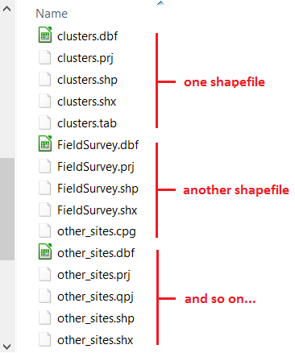
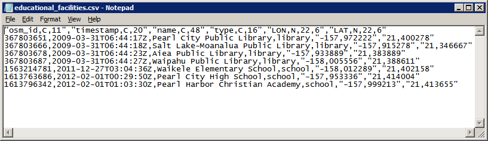

.. _gis-formats:

Common GIS File Formats
=======================

.. warning:: 
   The information contained on this section **IS NOT part of the assessments** in this course. We do not expect you know all this. It is provided as reference for practical reasons. 

Vector GIS File Extensions
--------------------------

*Shapefiles (.shp)*
^^^^^^^^^^^^^^^^^^^

The most common file type amongst vector data is the Shapefile (.shp). It is maintained by ESRI and because its specification is public, shapefiles have become a de facto standard towards spatial information storage. Most of the time you will be working with shapefiles, therefore it’s important to understand what exactly are they. 

The shapefile is in fact a collection of files and not a single file. Some of these files are mandatory, others are optional. The first thing you have to remember is that for shapefiles to work properly all mandatory files have to be in the same directory and share the same name (only the extension changes). Remember this when copying shapefiles from one folder to another – ALL the files with the same name are components of a given shapefile and therefore have to be together for the shapefile to work properly.  

\

When you create a new shapefile, your GIS software will automatically create all or at least the mandatory components of a shapefile (the following is based on Wikipedia entrance on the shapefile format): 

Mandatory files:
        + ``.shp`` — shape format; the feature geometry itself 
        + ``.shx`` — shape index format; a positional index of the feature geometry  
        + ``.dbf`` — attribute format; columnar attributes for each shape, in dBase IV format 

Optional files (most common): 
        + ``.prj`` — projection format; the coordinate system and projection information. 
        + ``.sbn`` and ``.sbx`` — a spatial index of the features.
        + ``.cpg`` — for identifying the character encoding to be used. 

Another important characteristic of the shapefile is that it only supports one type of geometry for shapefile and the possibilities are point, line or polygon. That is to say that if you have a shapefile with polygons representing, say houses, you cannot have features represented by a line or by a point.  

*Geopackage (.gpkg)*
^^^^^^^^^^^^^^^^^^^^
Geopackage is essentially a mini database in the form of one single file. It can contain several layers of different geometries, and also raster layers. In addition to that it offers some of the capabilities of databases like relantionships, advanced constraints and triggers. It is a format based on an open standard maintained by the `Open Geopspatial Consortium <https://en.wikipedia.org/wiki/Open_Geospatial_Consortium>`_ (OGC). 

Currently, this is the default vector format of QGIS and it is the vector format we will use during the course. Because of the advantages it offers in comparison with shapefiles, it is possible that geopackage will become as common as shapefiles.

*Keyhole Markup Language (.kml)*
^^^^^^^^^^^^^^^^^^^^^^^^^^^^^^^^

KML is a XML file that was originally developed for use within Google Earth back in 2004. In 2008, it became an Official Open Geospatial Consortium Standard (OGC), and since then it became a widely adopted format especially for use with Google Earth and web mapping applications. 

KML allows to store more than one geometry per file, and even rasters if we use the compressed version of it – KMZ. Contrary to shapefiles, a KML file is composed of only one file, but on the other hand the alphanumeric information associated to the geometries (i.g.  the attribute table) is not as easy to manage as in the case of shapefiles. 

 
*GPS eXchange Format (.gpx)*
^^^^^^^^^^^^^^^^^^^^^^^^^^^^

Another common GIS data format is the GPS eXchange Format (.gpx), also an XML schema designed specifically for exchange data between GPS devices. Due to the increasing popularity and availability of GPS devices, GPX format became a very common format. Although not an official standard, due to its wide adoption to carry GPS log data, this format became a de facto standard. The latest specification is 1.1 and it was released in 2004. 

GPX has two particularities. The first is that it only stores points and lines and with these geometries you can have waypoints, routes, route points, tracks and track points. The second is that the attribute table associated to the features has a fixed structure, determined by the XML schema that describes the GPX format. 

*Comma Separated Values (.csv)*
^^^^^^^^^^^^^^^^^^^^^^^^^^^^^^^

Comma Separated values (.csv) is not a format specific to GIS but rather a general purpose format that allows to carry data in tabular format using commas or other pre-defined separator like semi-colon or Tab to delimitate columns. If you open the file educational_facilities.csv in a text editor (do not use Word or similar programs) this is what you will see: 

The first line is called the ‘header’ of the CSV and it is the equivalent to column names in a regular table. The following lines represent different rows just like you would see in a regular excel-like table. 

Raster GIS file extensions
--------------------------

*Tagged Image File Format (.tif)* 
^^^^^^^^^^^^^^^^^^^^^^^^^^^^^^^^^
 
Although not the most efficient, Tagged Image File Format (``.tif``), is one of the most widespread raster formats. The TIFF specification is public and therefore largely supported by every software package. The latest version was released in 1992 and maintained by Adobe. What makes TIFF so popular to distribute GIS data is its flexibility. It is not in the scope of this exercise to cover technical details, but here is quick overview of TIFF capabilities: 

+ Supports 8 to 16 bit (1 or 2 bytes) colour range per band, meaning a range of values of 0 to 255 or 0 to 32768 respectively; 
+ In a multi-band raster, the above capability allows TIFF to store a range of values that stretches to the millions. 
+ Allows negative and decimal values. 
+ Supports loss and lossless compression. 
+ Can store tags with alphanumeric information. 
+ The tags can be used to store georeferencing information. When that happens the TIFF is called GeoTIFF.  

*Other Raster and Vector formats*
^^^^^^^^^^^^^^^^^^^^^^^^^^^^^^^^^

The list of GIS formats is very extensive. The formats we covered so far are the ones that you are more likely to encounter. In the case of QGIS, the complete list of supported formats depends on the formats supported by the GDAL library. You can check the complete list of supported formats in the links below: 

+ Raster formats - http://www.gdal.org/formats_list.html  
+ Vector formats - http://www.gdal.org/ogr_formats.html  

In addition there are closed proprietary formats that are also fairly common, however because they are closed they do not ensure data interoperability. If you come across these formats you might need a special license to read them or convert them to one of the GDAL supported formats. The most important formats among these include: 

+ DGW (drawing) – a proprietary vector format native of AutoCAD 
+ .MrSID (Multiresolution Seamless Image Database) – a proprietary raster format owned by LizTech, possibly the most efficient format to store raster data; 
+ ECW (Enhanced Compression Wavelet) – another proprietary format for rasters developed by Hexagon Geospatial. 

.. caution:: 
    **Do not overload yourself in knowing all these formats and their details.** The main point here is to understand that different file formats provide different possibilities. Whenever you come across a data format you are not familiar with, do a little research on it to know if that format is adequate for your analysis needs. 

.. sectionauthor:: Andre Mano Da Silva