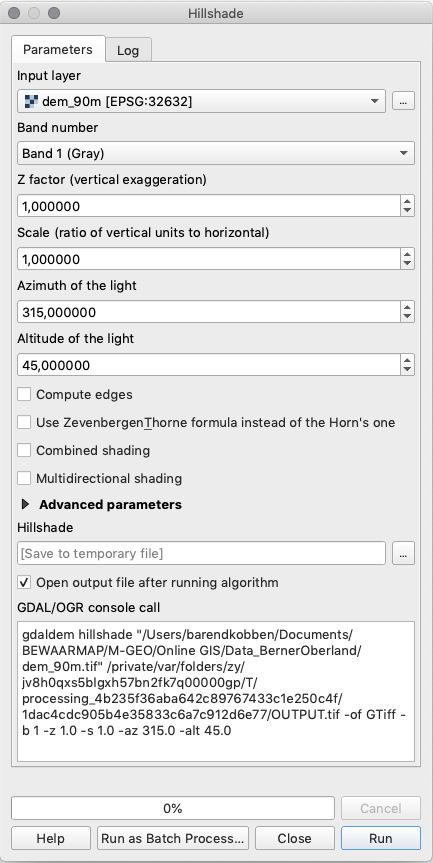

.. _shaded-models:

Shaded Terrain Models
=====================

Depicting a DEM as Layer Tints
------------------------------

In QGIS a DEM will be shown as a grey-scale map by default, with black for the lowest and white for the highest values. In a map, we prefer to classify the heights and show them in so-called layer tints. You do this in the **Layer Properties > Symbology** dialog:

#. As *Render Type* choose “Singleband pseudocolor”; and **Interpolation** = Linear ;
#. Choose a nice **Color ramp**, e.g. the “Greens”, as shown below. Make it go from dark for the lowest values to light for the highest values. For this, you have to click the menu button on the right of the *“color ramp”*, and choose the *“Invert colour ramp”* item.
#. Experiment with the colours, the classification steps, and other settings to get a nice layer tinting. After changing settings, do not forget to click the *“Classify”* button.

Using a DEM to Create a  Hillshade
----------------------------------

You can make a hillshade from the DEM as follows. Go to **Raster > Analysis > Hillshade** menu. See the image below. The tool will create a hypothetical illumination of a surface model by determining illumination values for each cell in an elevation raster. The shadows are modelled using the position of a light source, and considering the direction and steepness of the terrain. A hillshade can greatly enhance the visualisation of a surface for analysis or graphical display. By default, shadow and light are visualised as shades of grey associated with integer values from 0 to 255 (from black to white).

You can experiment with some of these options:

+ The *Z factor* settings provide an optional exaggeration of the heights.
+ The *Scale* option should be used if the height data units are not the same as the horizontal coordinate units. In our case, both are in meters. Still, if for example, one would have a DEM in meters and a projection in latitude-longitude decimal degrees, one should use a :math:`scale = 111120`.
+  *ZevenbergenThorne, Combined and Multidirectional* are different algorithms to produce shadows.

.. note:: 
   In QGIS, the DEM Terrain models are part of the GDAL toolbox. Therefore the best place to find help and information about the hillshade option is at http://www.gdal.org/gdaldem.html.

.. sectionauthor:: Barend Köbben & Andre Mano Da Silva