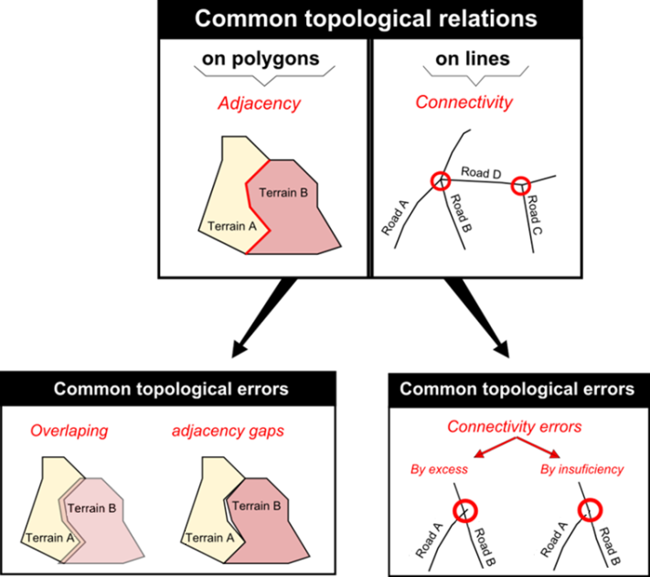
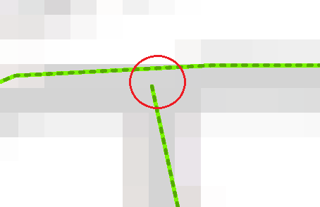
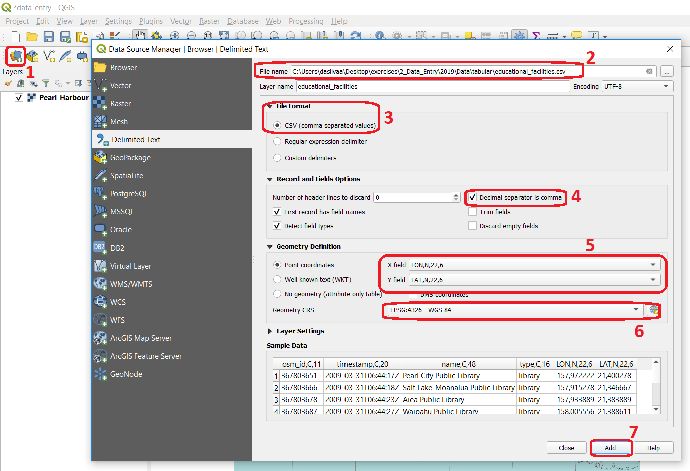

.. _sec-data-entry:

Data Entry
=====================

Direct Spatial Data Acquisition 
-------------------------------

The |ltb| `acquisition of spatial data <Spatial data acquisition_>`_ can be done from several sources. There has been an increase in data acquired (or produced) using |ltb| `remotely sensed sources <Remote sensing_>`_, such as satellite imagery. 

Other sources of spatial data include |ltb| `Aerial survey`_, |ltb| `Terrestrial survey`_ and  |ltb| `Crowdsourcing`_. The use of different spatial data sources implies that how suitable (strengths and weaknesses) each particular source is for a particular analysis, depends on the acquisition methods. In this section we focus on methods for direct or **primary** data acquisition.

.. attention:: 
   **Question.**
   What are possible the advantages and disadvantage of using the data sources listed in the table below? Fill in at least one advantage and one disadvantage.

    ==================      =========   ============
    Data Source             Advantage   Disadvantage 
    ==================      =========   ============
    Remote sensing          \           \
    Aerial survey [#]_      \           \
    Terrestrial survey      \           \
    Crowdsourcing           \           \
    ==================      =========   ============

    .. [#] It should be noted that aerial surveys are a form of remote sensing, but not from space. 

-----------------------------

Indirect Spatial Data Acquisition 
---------------------------------

Although spatial data can be acquired from third-party sources like government agencies or specialised companies, there will always be the need to acquire your own data. This usually means ‘digitising’ also known as ‘vectorisation’ – the process of capturing objects from a raster base layer like a map or an aerial photograph as points, lines and polygons. In this section, we focus on methods for indirect or **secundary** data acquisition. Specifically, the main techniques used for *vectorisation*. 

.. attention:: 
   **Question.**
   Read and observe the relation between  |ltb| `Digitizing`_ and |ltb| `Scanning`_. Is Digitising the only way to turn a scanning into Spatial data?

.. important:: 
   **Resources.**
   You will require the latest LTR version of `QGIS (A Coruna 3.10) <https://qgis.org/en/site/forusers/download.html>`_, plus the dataset `data_entry.zip <data_entry_>`_ which you can download from CANVAS.  When you unzip the dataset, you will find the following files inside: 

   + ``data_entry.qgs`` – a QGIS project file; 
   + ``checking_errors.qgs`` – a QGIS project file; 
   + ``Pearl_Harbour_topographic_map_(1999).tif`` – a raster map; 
   + ``Educational_facilities.csv`` – tabular data; 
   + ``Polygons.gpk`` – a polygon vector layer. 

.. _`sec-digitising`:

Digitising 
^^^^^^^^^^

Extracting the data, you need from a raster base map to a vector layer starts with creating a new dataset (i.e. layer), where the features that are about to be created will be stored. Technically speaking, it is a simple task; however, you should always take a moment to assess the requirements before proceeding with the actual software operation. 

Capturing elements from a base map is an abstraction exercise; this abstraction depends on the scale and purpose for which the data will be used. For example, think of airports; will you represent them (abstract them) as points or as polygons? The answer to this question will depend on how you are going to use the data. If you want to publish a world map of the major airports, probably you could depict them as points. But if you're going to map the accessibilities to a given airport, a larger scale will be needed; therefore, polygons might be better.  

The |ltb| `attributes associated <Associating attributes_>`_ with the geometries are another important aspect to consider. The choice of attributes depends not only on the scale and intended use, but it also depends on the availability of the data (e.g. what is the capacity of the airport? How does it rank on security? How many international connections does it serve? – would these be information you need to have? And if so, do you have access to this data?) 

Task 1
   Start QGIS and open the ``data_entry.qgs`` project. Among others, you will see a layer named ``Pearl_Harbour_topographic_map_(1999).tif`` Observe the map and complete the table below, considering the following requirements: 

   + Think of at least three vector layers that can be acquired from the raster base map;  
   + Make sure all geometric types – Polygon, Line, Point are represented;  
   + For each layer think of at least two attributes. 

   ===========     ===============   ===========     ===========
   LayerName       Geometric Type    Attribute 1     Attribute 2 
   ===========     ===============   ===========     ===========
   water_lines     line                Id              length 
   \               \                   \               \
   \               \                   \               \
   \               \                   \               \
   \               \                   \               \
   \               \                   \               \
   \               \                   \               \
   ===========     ===============   ===========     ===========

Task 2
   Now that you know what you want to extract and how are you are going to abstract it, proceed with the creation of the new layers. Digitise at least three features per layer. 

   For this task, you may want to watch the video tutorial on `basic digitizing <https://player.vimeo.com/external/316725601.hd.mp4?s=c6af68bb5180619816eb0b847933d22d0f2972f2&profile_id=175>`_:

.. raw:: html
    
   
<iframe src="https://player.vimeo.com/video/316725601?color=007e83&portrait=0" style="position:absolute;top:0;left:0;width:100%;height:100%;" frameborder="0" allow="autoplay; fullscreen" allowfullscreen></iframe>

\

.. note:: 
   **QGIS.**
   Refer to `Editing <https://docs.qgis.org/3.10/en/docs/user_manual/working_with_vector/editing_geometry_attributes.html>`_ for a detailed description of vector editing with QGIS.

.. _sec-topology-con:

Topological Consistency 
^^^^^^^^^^^^^^^^^^^^^^^

|ltb| `Topology`_ refers to the spatial relationships that should exist among the geometries of a vector dataset, and it is based on the |ltb| `Topological data model`_. Topology can be a complex subject, but we will take a very pragmatic approach and show you how to maintain the most common topological relationships |ltb| `topological relationships <Topological relationship_>`_: adjacency in polygons and connectivity of lines.  

   Common topological relations on polygons, lines, and points

In the previous task, for the layer of geometry type ‘Line’ you probably digitised something that is supposed to be a network like roads or water lines. The key characteristic of a network is *connectivity*. However, if you happen to have digitised lines that are supposed to be connected and you zoom in to the point where the intersection is supposed to be, you will see that lines are not connected. Instead, you will see connectivity issues either by excess or by insufficiency (also known as *overshoots* and *undershoots* respectively). 

   Connectivity issues between lines. The case of undershooting

To ensure |ltb| `Topological consistency`_ between geometries, e.g., that line segments get properly connected while digitising, we have to set a snapping tolerance, which tells the GIS software to connect lines that are within certain distance automatically. Otherwise, it will be challenging to ensure that our lines are connected.  

Task 3
   In QGIS, go to :guilabel:`Project` > :guilabel:`Spaning Options` and enable :guilabel:`Snapping mode`. Enter a tolerance of :math:`20 px` for every layer of lines that you may have. 

   If you may want to watch the video tutorial on  `advance editing <https://vimeo.com/showcase/5716094/video/316725579>`_ :

.. raw:: html

   
<iframe src="https://player.vimeo.com/video/316725579?color=007e83&portrait=0" style="position:absolute;top:0;left:0;width:100%;height:100%;" frameborder="0" allow="autoplay; fullscreen" allowfullscreen></iframe>

\

Task 4
   Digitise some new lines making sure they are topologically connected.  You will notice during digitising; if you go closer than a certain distance of an existing feature; the line would be automatically ‘pulled’ towards the nearest vertex or segment of the closest feature. You are thus ensuring connectivity. 

   In the case of polygons, it is also possible to ensure that adjacent polygons do not overlap. 

.. attention:: 
   **Question.**

   + How to define a snapping tolerance? 
   + What do the options ‘Enable topological editing’ and  ‘Enable snapping on intersection’ allow you to do? Try to think of situations where these options might be useful. 

 
.. note:: 
    **Reflection.**
    Ensuring the topological consistency of your vector data is usually not that difficult if you are in control of the data acquisition technique (vectorisation) from the moment the dataset is created. Problems often arise when you receive datasets from third parties. When that happens, you should always do check to make sure the dataset maintains the basic topological relations. 

Task 5
   Start QGIS and open the ``checking_errors.qgs`` project. You will see one layer (polygons). Find a way to check if there are overlapping or adjacency errors automatically. Tip: you may want to install and activate the **Geometry Checker** plugin. Once it is activated,  it should be reachable from the Vector menu.

   .. image:: _static/img/geometry-checker.png

In some cases, detecting and fixing topological errors is not that simple. Just keep in mind that you should always check the integrity of the data you receive, especially if you do not know the source and lineage of the data.  

.. _spatialising-data:

Spatialising Data
^^^^^^^^^^^^^^^^^ 

Another way to acquire spatial data is by means of spatialising data. In other words, associate a geographic location with objects. This is a very common procedure when you get, for example, a spreadsheet or some sort of tabular data. 
 
You can spatialise your data in two ways. By means of a *join* (a concept that will be explored later ahead in the course), or by means of building point geometries given that the tabular data contains X and Y coordinates.  

Task 6
   Spatialising data. Open the ``data_entry.qgs`` project and create a point layer using the ``educational_facilities.csv`` file. Follow the steps depicted in the screenshot below.

   Step to create a point layer from the 'educational_facilities.csv' file

.. attention:: 
   **Question.**
   If all went well, you should have ended up with a layer of points in your project. Does that mean that the ``educational_facilities.csv`` is spatial data?

In the Appendices section, you find a list of :ref:`gis-formats`. 

.. sectionauthor:: André da Silva Mano & Manuel Garcia Alvarez  
