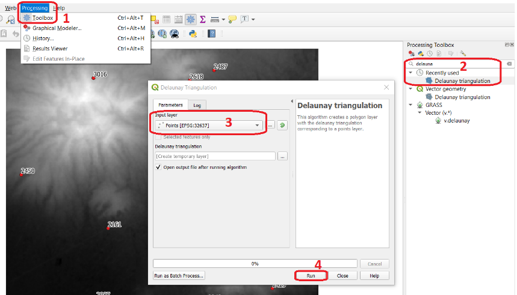
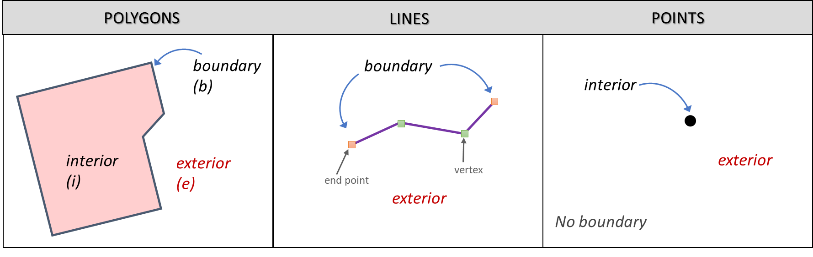

.. Links to the LTB are defined in in assets/ltb-links-gis.rst
.. Links to the datasets are defined in in assets/data-links-gis.rst

Modelos de Datos Espaciales
============================

Fenómenos geográficos
-----------------------

|ltb|  `Fenómeno geografico <Geographic phenomena_>`_ es un término para todos los fenómenos con una dimensión espacial, como la cobertura del suelo o la contaminación del aire. Un fenómeno es geográficos (espacial) cuando:

* Puede ser nombrado o descrito;
* Puede ser georreferenciado (tiene una ubicación en la superficie de la Tierra);
* Se le puede asignar un intervalo de tiempo.

Los fenómenos geográficos se pueden dividir en |ltb| `objetos geográficos <Geographic object_>`_ y |ltb| `campos geográficos <Geographic field_>`_. Los campos geográficos pueden representar fenómenos geográficos como |ltb| `campos discretos <Discrete field_>`_ o |ltb| `campos continuos <Continuous field>`_.

.. attention::
    **Pregunta.**
    Dé algunos ejemplos de fenómenos para los que falta uno de los tres elementos anteriores. ¿Se pueden utilizar en un SIG?
 
Objetos y Campos
^^^^^^^^^^^^^^^^^^

Práctica 1
   Complete la siguiente tabla indicando si el fenómeno de la izquierda es un objeto o campo y si es discreto o continuo.

   +-----------------------+------------------+-------------------------+
   | Fenómeno              | Campo u Objecto  | Discreto o Continuo     |
   +=======================+==================+=========================+
   | Dirección del viento  | \                |    \                    |
   +-----------------------+------------------+-------------------------+
   | Temperatura           | \                |             \           |
   +-----------------------+------------------+-------------------------+
   | Caminos               | \                |    \                    |
   +-----------------------+------------------+-------------------------+
   | Edificios             | \                |    \                    |
   +-----------------------+------------------+-------------------------+
   | Ubicación de pozos    | \                |    \                    | 
   +-----------------------+------------------+-------------------------+
   | Uso del suelo         | \                |    \                    |
   +-----------------------+------------------+-------------------------+
   | Tenencia del suelo    | \                |    \                    |
   +-----------------------+------------------+-------------------------+

Parámetros de Objetos Geográficos
^^^^^^^^^^^^^^^^^^^^^^^^^^^^^^^^^^^

Práctica 2
   ¿Qué parámetros de ubicación se pueden utilizar para describir objetos geográficos? No todos los parámetros que se pueden identficar son esenciales para todos los objetos.
   ¿Cuáles de los parámetros de localización son importantes para los siguientes objetos geográficos?

   +---------------------+----------------+---------------+----------------+--------------+
   | Objeto              | Parámetro 1    | Parámetro 2   | Parámetro 3    |  Parámetro n |
   +=====================+================+===============+================+==============+
   | Casa                | \              | \             |  \             |  \           |
   +---------------------+----------------+---------------+----------------+--------------+
   | Camino              | \              | \             |  \             |  \           |
   +---------------------+----------------+---------------+----------------+--------------+
   | Pozo                | \              | \             |  \             |  \           |
   +---------------------+----------------+---------------+----------------+--------------+
   | Lago                | \              | \             |  \             |  \           |
   +---------------------+----------------+---------------+----------------+--------------+
   | Río                 | \              | \             |  \             |  \           |
   +---------------------+----------------+---------------+----------------+--------------+

Límites Definidos y Difusos
^^^^^^^^^^^^^^^^^^^^^^^^^^^^^^
   
Otra noción que es importante para describir los fenómenos geográficos es la de |ltb| `límites <Boundaries_>`_. Distinguimos dos tipos de límites: *límites bien definidos y límites difusos*.

.. attention:: 
   **Pregunta.**
   ¿Puede dar un ejemplos de fenómeno geográficos con límites bien definidos y con límites difusos?

Autocorrelación
^^^^^^^^^^^^^^^
Hay un concepto más que requiere una introducción; la  |ltb| `autocorrelación espacial <Spatial autocorrelation_>`_. La autocorrelación espacial se basa en la primera ley de geografía de Tobler.

Práctica 3
   Defina con sus propias palabras qué es la autocorrelación espacial.

Aunque todas las representaciones informáticas (representaciones en una computadora) almacenan datos como representaciones finitas, es importante que se dé cuenta de que algunos fenómenos muestran autocorrelación.

-------------------------

Representaciones informáticas
-------------------------------

Las prácticas anteriores no utilizaron ningún software. Esto no debería haberte sorprendido porque el enfoque hasta ahora estaba en comprender los fenómenos geográficos y sus características. En esta sección, nos centraremos en mostrar cómo las computadoras representan los fenómenos geográficos. *Una buena comprensión de los fenómenos geográficos le ayudará a elegir una representación informática adecuada.*

Ahora explorará diferentes tipos de representaciones informáticas para fenómenos geográficos disponibles en un SIG y cómo seleccionar la representación más adecuada para un fenómeno específico.

.. important:: 
   **Recurso**
   Necesitará una versión reciente de `QGIS (Hannover 3.16) <https://qgis.org/downloads/QGIS-OSGeo4W-3.16.10-1.msi>`_, y el data set `data_modeling.zip <data_modeling_>`_.   Cuando descomprima el data set, encontrará los siguientes archivos dentro:
  
   + ``Cities.csv`` – un archivo de valores separados por comas con nombres de ciudades;

   + ``Spatial_data_modelling.qgs`` – Un proyecto QGIS precargado con  datos;

   + ``elevation.tif`` – un modelo de elevación digital;

   + ``points.gpkg`` – un conjunto de datos vectoriales que representa puntos de elevación. 

Teselaciones 
^^^^^^^^^^^^

Las teselaciones son una forma de representar fenómenos geográficos en un SIG. Una teselación divide el espacio geográfico en pequeñas celdas de tal manera que cubren un área completa. Son como baldosas en el suelo o en la pared. En la mayoría de los casos, las teselaciones usan celdas cuadradas. Cuando todas las celdas tienen el mismo tamaño y forma, las denominamos teselaciones regulares.

En una |ltb| `teselación regular <Regular tesselation_>`_, **todas las celdas tienen el mismo tamaño** y cada celda está asociada con un valor (valor de la celda). Este valor tiene un tipo de datos, por ejemplo:  entero (integer) o  punto flotante (float).

Un tipo de datos *entero* es un número que no contiene decimales. A menudo se utilizan para indicar códigos en un campo discreto (por ejemplo, una clase de uso de la tierra). Un tipo de datos flotante o de coma flotante es un número que puede contener decimales. Cuando un tipo de datos de punto flotante puede almacenar números muy grandes (64 bits) se se dice que tiene "precisión doble" y a menudo se denomina "Doble (double)". La siguiente tabla muestra una lista de tipos de datos comunes que se utilizan en un SIG.

===============   =============================================================
 SHORT INTEGER    Valor numérico sin decimales dentro de un rango específico. 
                  
                  Aplicación: almacenar valores codificados.
 LONG INTEGER     Valor numérico sin decimales dentro de un rango específico. 
                  
                  El rango de valores es más grande que un número entero corto.
 FLOAT            Valores numéricos con decimales dentro de un rango específico.
                  
                  Precisión simple (32 bits). 
 DOUBLE           Valores numéricos con decimal dentro de un rango específico.
                  
                  Precisión doble (64 bits). 
 TEXT             Nombres u otras cualidades textuales.
 DATE             Fechas y horarios.
===============   =============================================================

Práctica 4
   ¿Qué tipo de datos usaría para representar un campo discreto cuando se desea usar ona teselación? ¿Y para cuanod se trata de un campo continuo?

Práctica 5
   Los límites en las capas ráster son tanto artificiales como fijos (discretos). Esto tiene  sus ventajas y desventajas. ¿Puede dar algunos ejemplos de las ventajas y desventajas de los límites artificiales y fijos en capas ráster?

Práctica 6
   Abra el proyecto  *'spatial_data_modelling'* en QGIS  y explore las propiedades de la teselación que representa la elevación del terreno (``elevation.tif``).

   ¿Cuántas filas/columnas tiene el data set elevación.tif? ¿Son los valores de tipo entero o de punto flotante? ¿Cuáles son los valores mínimos y máximos de elevation que contiene el data set?

   *Sugerencia: desde el panel de capas, haga clic derecho en la capa para acceder a las*   :guilabel:`Propiedades...`. *Una vez en el diálogo de propiedades, busque en el diálogo* :guilabel:`Information`.

   .. image:: _static/img/layer-properties.png 
      :align: center

.. attention:: 
   **Pregunta.**
   ¿Cuál es la diferencia entre un ráster y un 'grid' (cuadrícula)?

También hay |ltb| `teselaciones irregulares <Irregular tesselation_>`_. En teselaciones irregulares, un área geográfica se divide en celdas que **no tienen el mismo tamaño**.

.. attention:: 
   **Pregunta.**
   A menudo se afirma que las teselaciones irregulares son más adaptables en comparación con las teselaciones regulares. ¿Qué se quiere decir exactamente con esto?
   
Práctica 7
   Aunque existen múltiples ejemplos de teselaciones irregulares, solo tienes que estudiar un ejemplo: “el Quadtree”. Si aún no está familiarizado con Quadtrees, consulte `Quadtree <https://en.wikipedia.org/wiki/Quadtree>`_ . La mejor manera de aprender cómo funcionan los Quadtrees es construir uno manualmente.

   Construya el Quadtree para la capa ráster que se muestra a continuación.

   .. image:: _static/img/quad-tree.png 

..   .. attention:: 
..    **Pregunta.**
..    El uso de Quadtrees para representar un fenómeno geográfico mejora el rendimiento de los cálculos (los cálculos son más rápidos). ¿Entiendes cómo funciona esto?

.. Task 8
..    Calculate the area of the green, blue and white cells in the Quadtree in each level of the Quadtree. Assume the size of each original cell is :math:`100 \times 100 \ m`.

Modelo de datos vectoriales
^^^^^^^^^^^^^^^^^^^^^^^^^^^^

La principal diferencia entre nuestro primer modelo de datos (teselación) y el modelo de datos vectoriales es que las teselaciones no almacenan explícitamente la georreferenciación de los fenómenos, pero el modelo de datos vectoriales sí. Esto significa que con cada objeto espacial, se almacenan las coordenadas del mismo. En esta sección, discutiremos cuatro ejemplos de representaciones de datos vectoriales: redes irregulares trianguladas (TIN), polígonos, líneas y puntos.

Epezaremos con las |ltb| `redes irregulares trianguladas <TINs_>`_. (TINs) porque tienen algunas características en común con las teselaciones.

.. attention:: 
   **Pregunta.**
   ¿Qué características tienen en común los TIN y los teselados?

Práctica 9
   Usando los puntos dados en siguente imagen, cree  un TIN manualmente.

   .. image:: _static/img/make-tin.png 
      :align: center

.. attention:: 
   **Pregunta.**
   Puede que se sorprenda, pero no todas las triangulaciones son igualmente buenas. La triangulación estándar en un TIN es una triangulación de Delaunay. ¿Ha usado una triangulación Delaunay en la práctica anterior?

Práctica 10
   En su proyecto QGIS, hay una capa con puntos. Genere una triangulación de Delaunay y compare el resultado con la teselación que hizo en la práctica anterior.  

      
   Pasos para crear una triangulación de Delaunay en QGIS

También se puede utilizar una triangulación para generar una superficie teselada continua mediante interpolación. En cuyo caso, a cada celda en la teselacione se asignará un valor aproximad que depende de la distancia de una celda a los puntos de anclaje en TIM.

Práctica 11
    Cree una teselación con la herramienta **Interpolación TIN**; use como datos de entrada los puntos de anclaje que tiene en su proyecto QGIS. Luego, use la herramienta **Identificar objetos espaciales** para inspeccionar los valores de las celdas.

      
   Pasos para crear una teselación a partir de un TIN en QGIS

.. We can, however, get familiar with the computations behind an ‘on the fly interpolation' with a simple paper and pencil exercise. 

.. Task 2.9 
   Place a point on the TIN (on one of the triangles) below and manually calculate the value at this point. What you are performing is and “On the Fly Interpolation”. 
   **picture goes here**
   The best way of doing this is to draw a line through one of your anchor points and the point you selected. You first identify the value at which the line crosses the edge of your triangle. You can do this by measuring along the edge.  
   **picture goes here**

.. attention:: 
   **Pregunta.**
   ¿Cuáles son exactamente las ventajas de un TIN en comparación con una teselación?

Práctica 12
   Entre los datos, encontrará una tabla ``Cities2.csv``. Intente usar esta tabla para crear una capa de puntos en QGIS. Inicie un nuevo proyecto QGIS y agregue la capa a QGIS usando la opción :guilabel:`Texto delimitado`.

      
   Pasos para crear una capa de puntos usando un archivo CSV en QGIS

De la práctica anterior, debe tenerse claro que **puntos** son las geometrías más simples. Puntos tienen coordenadas Y y X que los anclan al marco espacial en el que está trabajando.

Otra forma de representar un fenómeno geográfico en el modelo de datos vectoriales es utilizando  |ltb| `Líneas <Line representation_>`_. Una **línea** no es más que dos o más puntos conectados.

.. attention:: 
   **Pregunta.**
   ¿Cuál es la diferencia entre nodos y vértices, y cómo podemos saber la dirección de una línea?

La última representación en el modelo de datos vectoriales es **polígonos**. Los polígonos son uno de los modelos de datos vectoriales más conocidos y utilizados. Hay dos partes importantes cuando se usa un modelo de datos poligonales: el modelo de límites y el modelo topológico.

El modelo de límites explica cómo se representan las áreas y almacena el límite cerrado que define un área. Un límite cerrado está definido por una línea cerrada (que consta de nodos y vértices, donde los vértices inicial y final se intersectan). Cuando se representa  el perímetro de un edificio o las fronteras entre países, el límite de cada objecto espacial (edificio/país) se almacena individualmente.

El modelo topológico se discute en la siguiente sección sobre :ref:`sec-topology`. 

Práctica 13
   Lea la sección |ltb| `Area representation`_ y describa con sus propias palabras los problemas que pueden surgir al utilizar el modelo de límites sin topología.

.. _sec-topology:

Topología
^^^^^^^^^^

El tercer tema de este ejercicio es |ltb| `Topología <Topology_>`_. Primero deberrá comprender qué es la topología antes de aprender diferentes formas de usarla. Las propiedades topológicas son propiedades geométricas y relaciones espaciales que no se ven afectadas por el cambio continuo de forma y tamaño de una capa de datos vectoriales (puntos, líneas o polígonos).

Práctica 14
   Imagina que estás mirando un mapa (toma cualquier mapa que te guste). Liste cinco ejemplos visibles de topología espacial en el mapa, y cinco ejemplos de propiedades del mapa que no son topológicas (use la tabla a continuación).

   ===============  ===============  ==================
   Ejemplo             Topoloógico     No-topológico 
   ===============  ===============  ==================                 
   1                 \                  \                           
   2                 \                  \
   3                 \                  \
   4                 \                  \
   5                 \                  \
   ===============  ===============  ==================

tomando polígonos como ejemplo, podemos definir todas sus posibles relaciones topológicas. Para hacerlo, debemos describir cada polígono en términos de su límite y su interior (el área dentro del límite). Lee |ltb| `relaciones topológico <Topological relationship_>`_.

   El límite, interior y exterior de polígonos, líneas y puntos.

.. attention:: 
   **Pregunta.**
   ¿Cuál es la expresión matemática correcta (teoría de conjuntos) que describe la relación *Cubre (covers)*? ¿En qué se diferencia esta expresión la relación *cubierto por*?

A estas alturas, debe comprendería qué es la topología, pero es posible que se pregunte cómo se puede utilizar. Durante los próximos ejercicios, verá algunos usos.

La topología también se puede utilizar para garantizar la coherencia de las geometrías en una capa vectorial. Hay cinco reglas o normas de |ltb| `consistencia topológica <Topological consistency_>`_, que deberías conocer.

Práctica 15
   Para cada ejemplo en la siguiente table, identifique qué regla-norma de coherencia topológica se infringe.

    ================================================ =============
    Ejemplo                                          Regla/Norma    
    ================================================ =============
    El límite de un polígono no está cerrado.         \
    Dos líneas se cruzan sin intersección.            \
    Hay un espacio entre dos polígonos contiguos.     \
    Dos polígonos se superponen.                       \
    ================================================ =============

   Los usos adicionales de la topología se discutirán más adelante. En este curso, **solo necesita comprender la topología en un nivel conceptual.**

Dimensión Temporal
^^^^^^^^^^^^^^^^^^
   
En muchas situaciones, no es suficiente describir los fenómenos geográficos solo en términos de espacio, sino también en términos de tiempo porque muchos fenómenos geográficos cambian con el tiempo. El cambio puede ser relativamente rápido (como las nubes en el cielo, los huracanes y el tráfico) o lento (como el movimiento de un glaciar).

Para incluir el tiempo en la representación de datos espaciales, hablaremos de un |ltb| `Modelo de datos spacio-temporal <Spatial-temporal data model_>`_. Este modelo define diferentes tipos de cambio: *cambio de atributos*, *cambio de ubicación* (movimiento) y *cambio de forma* (crecimiento) o una combinaciones de estos tres.

Práctica 16
   A continuación, verá una lista de diferentes tipos de cambios y algunas combinaciones. ¿Puede escribir un ejemplo para cada tipo?

   ============================= ========
   Tipo de cambio                Ejemplos
   ============================= ========
   Atributo                       \
   Atributo y ubicación            \
   Atributo y forma                \
   Ubicación                      \
   Ubicación y forma               \
   Atributo, ubicación y forma    \
   ============================= ========

.. attention:: 
   **Pregunta.**
   Las siguientes premisas se refieren diferentes tipos de tiempo en el contexto de fenómenos geográficos (continuo, discreto, tiempo válido, tiempo ramificado). ¿Cuál es tu opinión sobre ellas? ¿Son las premisas verdaderos o falsos?

    + Aunque el tiempo es de naturaleza continua, en un SIG siempre se representa de manera discreta.
    + Hay muchos ejemplos de fenómenos espaciales para los que simplemente se desconoce el tiempo válido.
    + El tiempor ramificado debe mirar hacia el futuro, ya que el pasado ya se conoce y tiene una sola rama.
    + El concept de "granularidad temporal"  es comparable al concepto espacial de resolución.

.. note:: 
   **Reflexión.**

   1. En esta sección, hemos utilizado la representación vectorial para área geográficas almacenadas como Shapefiles. ¿Pueden los shapefiles almacenar topología? En otras palabras, ¿Usan los shapefiles un modelo de datos topológicos?

   2. En este ejercicio, nos hemos centrado principalmente en ejemplos de modelado de datos  en 2D. Sin embargo, el mundo real es 3D. ¿Conoce algún ejemplo en el que se necesitaría un modelo de datos en 3D? ¿Existirá también una topología 3D?
   
   3. Además de las celdas rectangulares, se las celdas pueden tener otras formas. ¿Cuáles son las ventajas de utilizar celdas hexagonales?
   
   4. Haga una comparación entre modelos de datos raster y vectoriales y enumere las ventajas y desventajas de cada uno.

.. sectionauthor:: Ellen-Wien Augustijn, André da Silva Mano, Manuel Garcia Alvarez & Amy Corbin
