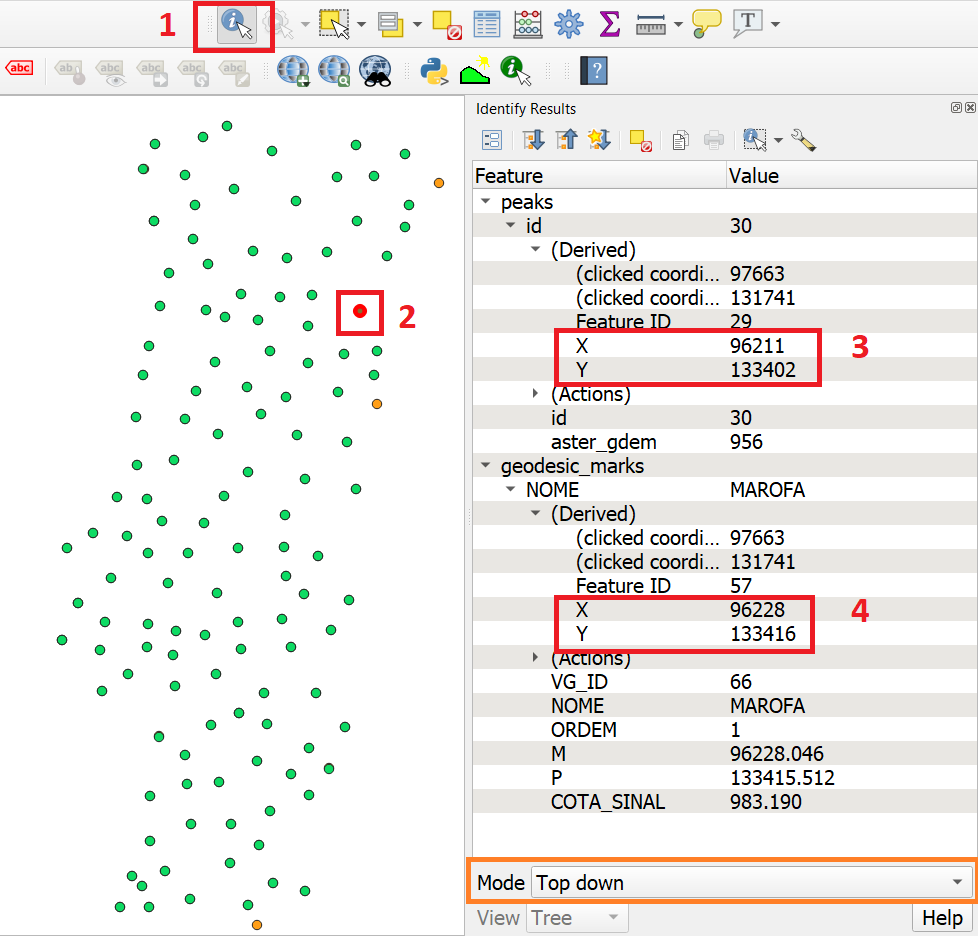
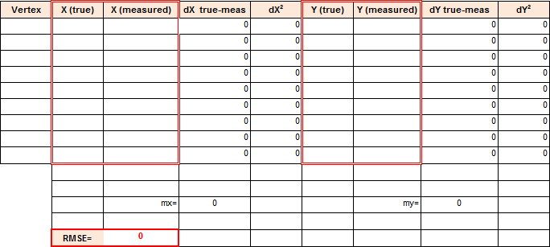
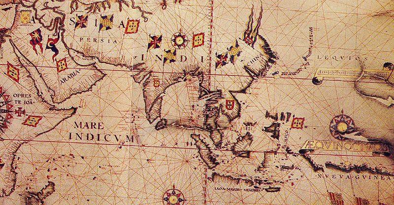
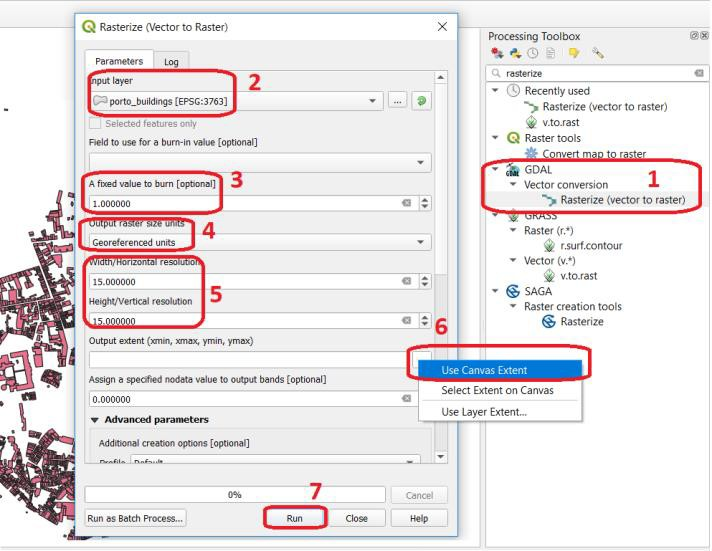
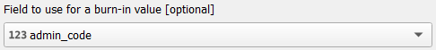
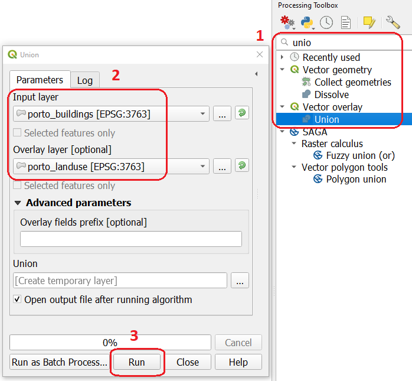
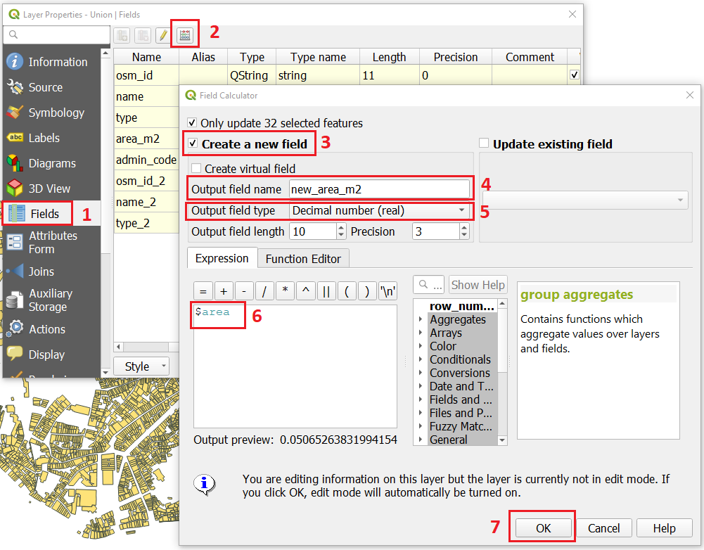
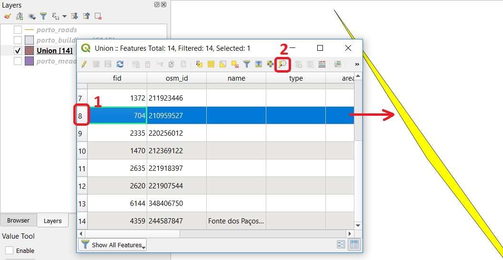
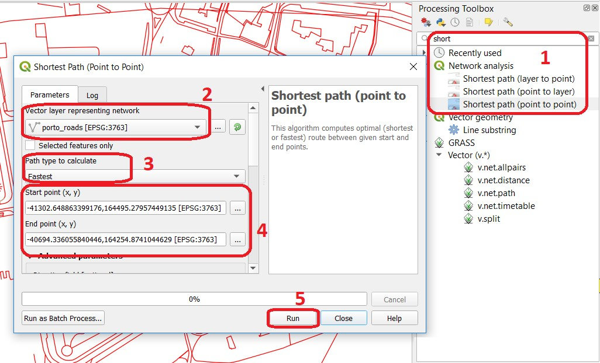

Data Quality
============

Accuracy
--------

The main goal of this exercise is to provide you with the first-hand experience on how to identify and quantify errors in spatial data.  We will also emphasise the common causes of the deterioration of the quality.

.. important:: 
   **Resources.**
   You will require the latest LTR version of `QGIS (A Coruna 3.10) <https://qgis.org/en/site/forusers/download.html>`_, plus the dataset `data_quality.zip <data_quality_>`_ which you can download from CANVAS.  For this section, you will need the following files: 

    + ``accuracy.qgs`` – a QGIS project preloaded with the datasets described below;
      
      + ``geodesic_marks.gpgk`` – peaks signaled by geodetic marks;
      + ``peaks.gpgk`` – geomorphological features (peaks);
    + ``rmse.xls`` – a spreadsheet to calculate the rmse.

Positional Accuracy
^^^^^^^^^^^^^^^^^^^

For the first part of this exercise, we will explore the concepts of |ltb| `Accuracy`_, |ltb| `Precision`_ and bias. One of the ways of assessing the quality of a dataset is by determining how accurate the data is. Accuracy might be measured with regards to |ltb| `Positional accuracy`_ or attribute correctness, but in any case, we can only measure accuracy if we have a second data source of higher accuracy that we can regard as true or more close to the truth than the one we are assessing.

.. attention:: 
   **Question.**
   How is accuracy different from precision?

In this exercise, the *'geodesic_marks'* dataset has higher accuracy than the *'peaks'* dataset. These datasets are from Portugal. **'Geodesic_marks'**  is a very high accuracy dataset from a topographic survey.  **'Peaks'** represents the altitude of mountain peaks extracted from a digital elevation model obtained using remote sensing  – ASTER Global Digital Elevation Model.

.. note:: 
    The ASTER Global Digital Elevation Model (ASTER GDEM) is a `product` developed and made available to the public by the Ministry of Economy, Trade, and Industry (METI) of Japan and the United States National Aeronautics and Space Administration (NASA). It is produced using data from the Advanced Spaceborne Thermal Emission and Reflection Radiometer (ASTER), a space-borne remote sensor.
    
    The ASTER GDEM covers the Earth's surfaces between :math:`83°N` and :math:`83°S`. The ASTER GDEM  surveys the Earth's surface and collects 22,600 tiles; each tile covers :math:`1°` per side. Only tiles that contain at least :math:`0.01 \ %` of land area are included in the dataset. The ASTER GDEM is stored in GeoTIFF format with geographic lat/long coordinates and a one arc-second (aprox. :math:`30 \ m`) grid of elevation postings (vertical resolution). It is referenced to the WGS84/EGM96 geoid http://www.jspacesystems.or.jp/ersdac/GDEM/E/4.html

A way of assessing the positional accuracy of a dataset is calculating the Root Means Square Error (|ltb| `RMSE`_). 

Task 1
   Open the project ``accuracy.qgs``.  The project has two layers:
   *'geodesic_marks'* and *'peaks'*.  Use the  **Identify Features** |identify| to find the coordinates of two points that fall close to each other, :numref:`fig-find-coor`. You can draw a small rectangle over the features you want, or you can click.
   Make sure that in the Identify window that will pop up, the option Mode is set to Top-down.
   You may need to resize or rearrange your panels to make room for the **Identify Results** window.

.. _fig-find-coor:

   Use of the identity tool to find coordinates in a point layer
 
Task 2
   Copy the coordinates from the Identity Results dialog and paste them in the spreadsheet ``rmse.xls`` :numref:`fig-rmse` 
   You will need Microsoft Excel or Libre Office to open the file. Remember that true values are the ones associated with the *'geodesic_marks'* layer and that the measured values are the ones associated with the *'peaks'* layer. Repeat this process for more points (minimum 4, maximum 8). The RMSE will be computed automatically a the bottom of the table.

.. _fig-rmse:

   Spreadsheet for calculating the RMSE

.. attention:: 
   **Question.**
    
    + What does the RMSE that you obtained represents?
    + Is the error systematic?
    + Is the error acceptable?

Attribute Accuracy
^^^^^^^^^^^^^^^^^^

Accuracy doesn't refer solely to positioning; it can also refer to attributes, in which case we call it |ltb| `Attribute accuracy`_. The two layers in your project contain altitudes of geomorphological features, i. e. *'peaks'*. The true values when it comes to attributes are also stored in the geodesic_marks layer.

Task 3 
   Using the Identify Tool like in the previous task. Make a quick comparison of the difference between the altitudes stored in the attribute **COTA_SINAL**  of the *'geodesic_marks'* layer, and the altitudes in the attribute **aster_gdem** of the *'peaks'* layer.

.. attention:: 
   **Question.**
   Could you use RMSE to assess attribute accuracy? If yes, what would the error you obtain will represent?

Note that you can also measure the attribute accuracy of qualitative attributes, such as land cover. In that case, we use an   |ltb| `Error matrix`_. We will be discussed in more detail in the Course on Earth Observation.

Biased Data
^^^^^^^^^^^

Another possible problem with your data is **bias**. Biased data is systematically inaccurate data, usually for technical reasons. A classic example of biased data is the case of features that were digitised over a badly georeferenced base map. *Because the digitising process comes after georeferencing; any displacements introduced during the georeferencing propagate to all the features that are digitised.*

.. important:: 
   **Resources.**
   You will require the latest LTR version of `QGIS (A Coruna 3.10) <https://qgis.org/en/site/forusers/download.html>`_, plus the dataset `data_quality.zip <data_quality_>`_ which you can download from CANVAS.  For this section, you will need the following files: 

   + ``bias.qgs`` – a QGIS project preloaded with the datasets described below;
    
      + ``road.gpkg`` – a vector dataset representing a road;
      + ``aereal_photo.tif``;

Task 4
   Open the project ``bias.qgs`` and use the satellite image to digitise the highway that crosses the image. Refer to the section :ref:`sec-digitising` if need to. 
   When you are done with digitising, turn on the *'road'* layer and compare the results.
 

.. attention:: 
   **Question.**
   You will see a significant shift between the road you just digitised and the in the road layer. Can you explain why? Use the **Quick Map services plugin** to add additional satellite imagery to help you find an answer.

Bias can also have political reasons. Maps can be statements of power and there are countless examples of using maps to project power or to lobby for a hidden agenda. Although that is not a typical case a GIS professional is exposed to, it is still worth mentioning. A classic example of political bias are the maps from the Age of Discoveries (XV to XVII centuries A.D.). In this XVI century map, :numref:`fig-old-map`, Asia is represented as being a possession of Portugal, but that was never the case. The Portuguese Empire in Asia consisted of commercial outposts protected by fortresses and a war navy, but at no moment did the Portuguese had control over the vast inland areas.

.. _fig-old-map:

   Anonymous map c.1550 of Eastern Africa, Asia and Western Oceania

-------------------------------------------

Data Acquisition Errors
-----------------------

A common source of errors occurs during the spatial acquisition phase. Errors originating in this phase |ltb| `propagate <Error propagation_>`_ if not corrected immediately.

.. important:: 
   **Resources.**
   You will require the latest LTR version of `QGIS (A Coruna 3.10) <https://qgis.org/en/site/forusers/download.html>`_, plus the dataset `data_quality.zip <data_quality_>`_ which you can download from CANVAS.  For this section, you will need the following files: 

    + ``acquisition_errors.qgs`` – a QGIS project preloaded with the datasets described below;
        + ``porto_buildings.gpgk``– the footprint of urban buildings from Porto (Portugal);
        + ``porto.tif`` – a raster base layer covering the streets of Porto.

Conversion Operations Leading to Quality Loss
^^^^^^^^^^^^^^^^^^^^^^^^^^^^^^^^^^^^^^^^^^^^^

Conversion can have different meanings in the GIS world. In the scope of this exercise **conversion** refers to format conversion (raster to vector and vice-versa). Vector and raster data are usually associated with the representation of discrete and continuous phenomena, respectively. Having to convert between formats is a common operation in the GIS world, however, these operations always imply some type of compromise regarding what we get and what we lose, especially in the case |ltb| `Rasterisation`_.

Task 5
   Open the project ``acquisition_errors.qgs``. From the Processing Toolbox, use the **Rasterise tool** to convert the *'porto_buildings'* layer to a raster using a resolution of :math:`15 \ m`. :numref:`fig-rasterisation`

.. _fig-rasterisation:

   Using the rasterisation tool

\

   The result is not very impressive. Besides, we lost the attribute table and with a :math:`15 \ m`  resolution, we also lost information on the shape of the buildings.

.. attention:: 
   **Question.**
   Convert the *'porto_buildings'* layer to a raster once more; this time use a resolution of :math:`2 \ m`.
    
   + Does the :math:`2 \ m` resolution raster has enough quality?
   + What do you lose and what do you gain when you rasterise?
   + Does the :math:`2 \ m` resolution raster preserves all the original vector features,  i.e. at least one pixel per building? How can you tell?

Converting from vector to raster usually means to give up of your semantic information, the attribute table. Nevertheless, having an attribute table associated with a raster is possible with certain software products. Still, in such cases, the attribute table can only be used from within that specific software product.  In other words, it is software dependent.

A compromised solution to preserve attribute information is to create a raster layer using the numeric values of a single attribute in the vector layer. In such a case, attribute values are converted to pixel or cell values in the resulting raster layer. For example, in a vector layer representing land cover, usually, every type of land cover has a unique numeric code (e.g. :math:`forest = 100, road = 400, water= 700`). If you set an attribute when converting to a raster layer, cells inherit the values from that attribute.  Then, the cell values have an implicit semantic meaning; for this example, that is the type of land cover.
  
Task 6
   Repeat the vector to raster conversion for the *'porto_buildings'* layer. This time feed the attribute fid into the option **Field to use for a burn-in value.** :numref:`fig-burn-values`

.. _fig-burn-values:

   Rasterisation with burn-in values

.. note:: 
   **Reflection.**
   As a result of the previous task, you will get a map like the one shown in :numref:`fig-ras-porto`. Make sure you understand the map and how it relates to the *'porto_builfings'* vector dataset.

   .. _fig-ras-porto:
   .. figure:: _static/img/ras-porto-buildings.png
      :alt: raster porto buildings
      :figclass: align-center

      The 'porto_buildings'  layer rasterised using burn-in values

Digitising Operations Leading to Errors
^^^^^^^^^^^^^^^^^^^^^^^^^^^^^^^^^^^^^^^

A common cause of errors has its origin in data acquisition through digitisation. When digitising features from a base map the resulting accuracy is related to the scale that is being used at the moment of digitising, this is related to the concept of |ltb| `Perkal band`_. The basic principle is that the smaller the scale, the less accurate the digitalisation will be.

Task 7
   Digitise some streets at scale *1:15000* using the "porto.tif "layer as the base map.
   If you zoom in to your streets, you would realise that not only they tend to shift from the underlying reference map roads (i.e. meaning a large perkal band). They are not topologically connected.

.. attention:: 
   **Question.**
   Read about the |ltb| `Data checks and repairs`_. What are the clean-up operations that you would need to perform on the streets layer you created in the previous task?.

You would avoid many problems with these errors, if you properly set your **snapping** and **topological edition** options, as discussed in  Data Entry. But before start working with a new dataset, you should always check its quality.

--------------------------------------------

Error Propagation
-----------------

When |ltb| `combining spatial data from multiple sources <combining data from multiple sources>`_, and especially when |ltb| `merging two datasets <Merging datasets_>`_ or more layers,  errors like sliver polygons may occur due to |ltb| `differences in accuracy <Accuracy differences_>`_. Sliver polygons are very narrow polygons that usually appear along the border of other polygons. They do not necessarily represent a problem. They may be legitimate features resulting from a geoprocessing routine, or they can be errors exposing accuracy issues.

.. important:: 
   **Resources.**
   You will require the latest LTR version of `QGIS (A Coruna 3.10) <https://qgis.org/en/site/forusers/download.html>`_, plus the dataset `data_quality.zip <data_quality_>`_ which you can download from CANVAS.  For this section, you will need the following files: 

    + ``error_propagation.qgs`` – a QGIS project preloaded with the datasets described below;

      + ``porto_buildings.gpkg``  – footprint of urban buildings from Porto (Portugal);
      + ``porto_landuse.gpkg`` – landuse (meadows) of Porto;
      + ``porto_roads.gpkg`` – road network of Porto;

Errors Generated by Geoprocessing Routines
^^^^^^^^^^^^^^^^^^^^^^^^^^^^^^^^^^^^^^^^^^

The project ``error_propagation.qgs`` has a layer named *'porto_landuse'* that contains areas classified as **'meadows'**; and another layer named *'porto_buildings'* We want to merge these two layers so that:

   #. We obtain a layer whose polygons represent either buildings or meadows, and 
   #. Look for inconsistencies – areas that are both building and a meadow.
  
  
Task 8
   Open the project ``error_propagation.qgis``. From the :guilabel:`Processing Toolbox`, use the :guilabel:`Union tool` to create a  new layer which merges the *'porto_buildings'* and *'porto_landuse'* layers. :numref:`fig-union`.

.. _fig-union:

   The Union Tool

Now, we could filter the union-layer to find out if any of the resulting polygons are classified as both *'meadow'* and *'building'.* But, before that we will focus on finding **sliver polygons.**

.. attention:: 
   **Question.**

   + Can you think of a filter that identifies silver polygons in the union-layer? 
   + Do you think you could also find silver polygons before the union operation? How?

Task 9
   Sliver polygons are usually very small. In the layer that resulted from the union operation; go the layer :guilabel:`Properties..` > :guilabel:`Fields` > :guilabel:`Field Calculator` . Add a new field to comptue the area of the polygons using the **Field Calucator** :numref:`fig-field-calculator`.

.. _fig-field-calculator:

   Adding a field to the attribute table using the field calculator

.. note:: 
   **QGIS.**
   When you press :guilabel:`OK` (step 7), QGIS will automatically enter into edit mode to commit the changes into the attribute table of the vector layer. You can toggle off editing mode using the button |edit| . You will be asked to save the edits - make sure you do.

Task 10 
   Using the field you just created. Filter the polygons whose area is less than :math:`x`;  where  :math:`x` can be any value as long it is suitable for a particular case. For this case use :math:`2 \ m^2`, polygons smaller than this are potentially sliver polygons. Refer to section :ref:`sec-select-attrib` if you need to.
   Once the filter is applied, browse the attribute table and zoom to specific features to take a close look at the sliver polygons. :numref:`fig-sliver`

.. _fig-sliver:

   Browsing the filtered attribute table to find sliver polygons

In this case, you would probably proceed to delete those polygons and clean the dataset. But keep in mind that knowing if a sliver polygon is an error or not is, it is a tricky question because it depends on what your data is supposed to represent. Having very small polygons can simply represent a very small feature! Therefore depending on the nature and scale of the data, a particular sliver might be an error or not. In cadastral datasets, for example, sliver polygons are most likely errors.

.. attention:: 
   **Question.**
    
   + What problems might occur if our data has sliver polygons? 
   + Can you think of other methods to detect sliver polygons?

Conceptual Errors
^^^^^^^^^^^^^^^^^

Conceptual errors are errors that arise not from acquisition or processing but from logically erroneous thinking. These type of errors are associated with the way reality is being modelled, and they have a direct relation with |ltb| `Logical consistency`_ and |ltb| `Completeness`_ of datasets and analytical approaches.

Example. 
   You are making a map to support biologists who want to study a particular species of amphibious that thrives on any small pond. 
   With that in mind, you produced a raster map of water ponds of the study are using a cell size of :math:`20 \ m`; i.e. that will mean that the minimum size for an object to be properly represented in your dataset is :math:`400 \ m^2`.

   However, when you show the map to the biologists, they remind you that this species has been found in pounds much smaller than :math:`400 \ m^2`. *If you insist on using such raster dataset for further analysis, the final result may not be valid for the biologists.*

To explore the idea of conceptual errors, we will use a simple example that applies network analysis. In this example, we want to estimate the fastest route from point :math:`A` to point :math:`B`.

Task 11
   From the Processing Toolbox, use the **Shortest path (Point to Point)** tool to calculate the fastest route between any origin-destination over the *porto_roads* layer. :numref:`fig-shortest-path`.

.. _fig-shortest-path:

   Using the shortest path tool for network analysis

.. attention:: 
   **Question.**

   + This analysis of the previous task has some conceptual problems that make it very prone to errors. Can you identify some of them?
   + |ltb| `Uncertainty`_ is related to the |ltb| `Sources of errors`_. Can you describe how the sources of errors influence uncertainty?

------------------------------------

Data Management and Metadata
----------------------------

GIS projects can require massive amounts of data. As the project complexity increases the effort to manage the necessary data starts to need more time.

We will not cover this topic entirely here. Still, we will state some simple guidelines to improve data and project management. In particular, we will focus on:

#. Workspace organisation
#. Naming conventions
#. Metadata

It is essential to organise your input and output data in such a way that you can easily continue your work later. This will save you a lot of time, and it will prevent confusions when working with tens of datasets.

.. important:: 
   **Resources.**
   You will require the dataset  `data_quality.zip <data_quality_>`_ which you can download from CANVAS. 

Task 12 
   Take a look at the contents of the ``data_quality.zip``. Put attention to the file structure and naming conventions.

   + Are the files named consistently?
   + Is the folder structure adequately organised?
   + Is it easy to distinguish between different types of data?
   + Are the datasets stored using well-known data formats or standards?
   + Would you have organised the data for this exercise differently? How?

Task 13
   As you moved along the exercises you might have produced some output files, some of them have experimental results, others have definitive results.

   + Have you saved them in a proper and accessible folder?
   + Can you trace back the changes you made during every processing attempt from the file names?

A relevant topic for data quality is **Metadata**,  often defined as *"data about the data"*. Metadata provides additional or auxiliary information about a geospatial dataset that may not be easily obtainable from the dataset itself. For example, sometimes you can read the coordinates of a geometry in a vector data set. Still, you may not be able to determine the spatial reference system from the coordinate values alone. Ideally, metadata includes details related to the |ltb| `Lineage`_ and |ltb| `Completeness`_ of the data.
There are standards and directives for metadata of spatial data. In Europe, an important directive is the `INSPIRE <https://inspire.ec.europa.eu/>`_ initiative.

From a practical point of view, it is not easy to maintain all necessary metadata, mainly if you aim at being :math:`100 \%` compliant with a particular standard or recommendation. Additionally, each software package has its metadata management system, which makes the interoperability of metadata difficult.

This is not the same as saying that we should not care about metadata. However, we can be pragmatic and consider at least the following principles:

#. Save metadata in a format that is not software-dependent (a simple *Readme* file is often enough).
#. Include the lineage of the data:

   + how was the data aggregated? 
   + Where to find the original data? 
   + What geoprocessing operations were performed? 

#. Include contact information of the author or owner of the dataset, if you expect others to use the dataset.
#. Historical information. Is the dataset representing a geographic phenomenon in 2013 or in 2020?
#. Licensing: copyrights and restriction on using the data.

.. attention:: 
   **Question.**
   
   + How can metadata be useful? 
   + Would you add something else to the list of principles above?

.. sectionauthor:: André da Silva Mano, Ellen-Wien Augustijn & Manuel Garcia Alvarez
