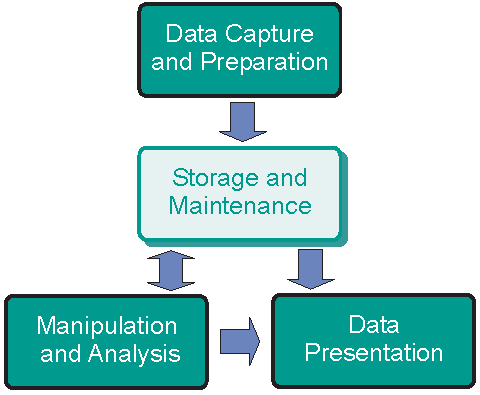
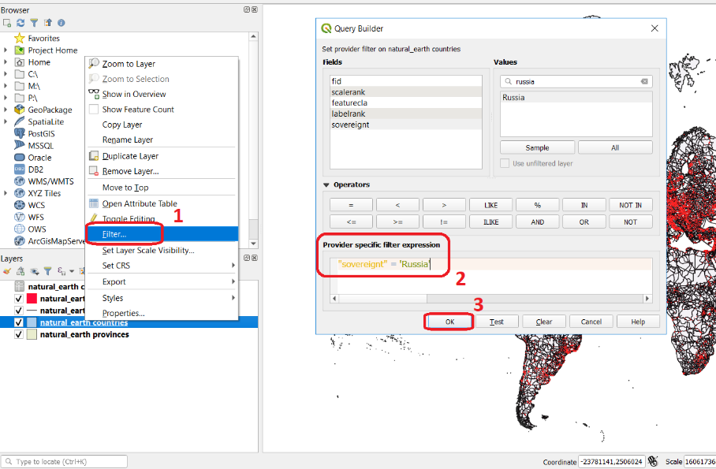
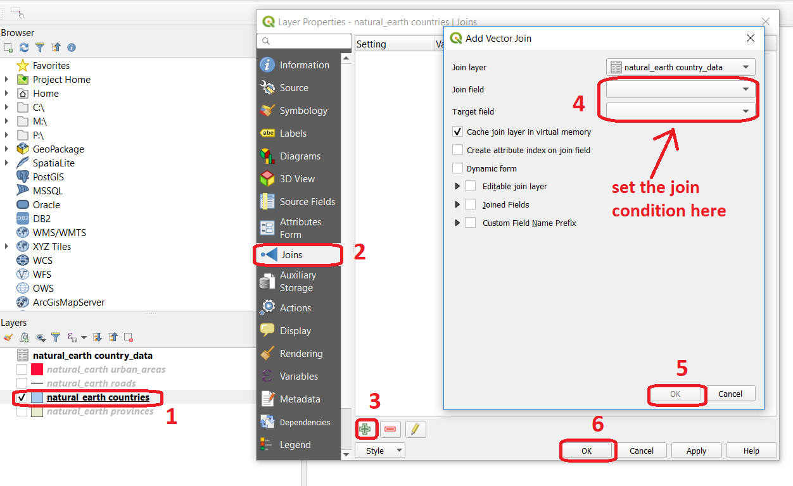
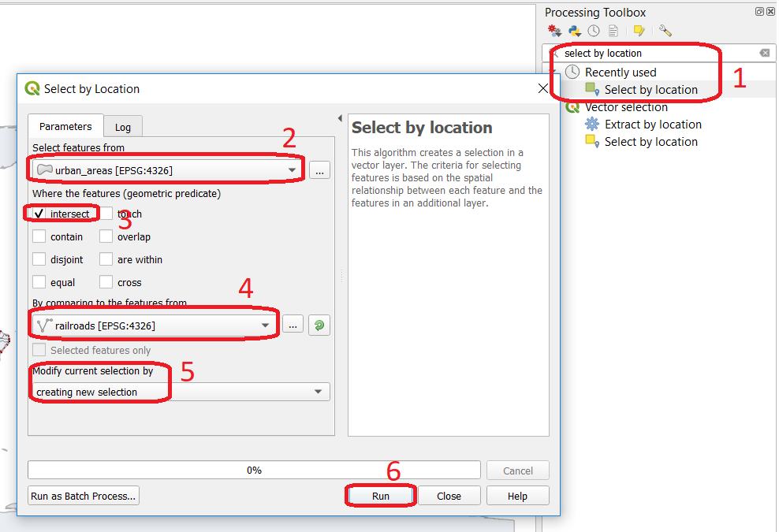
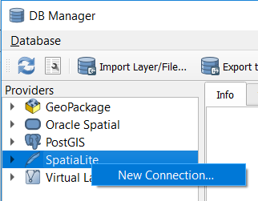
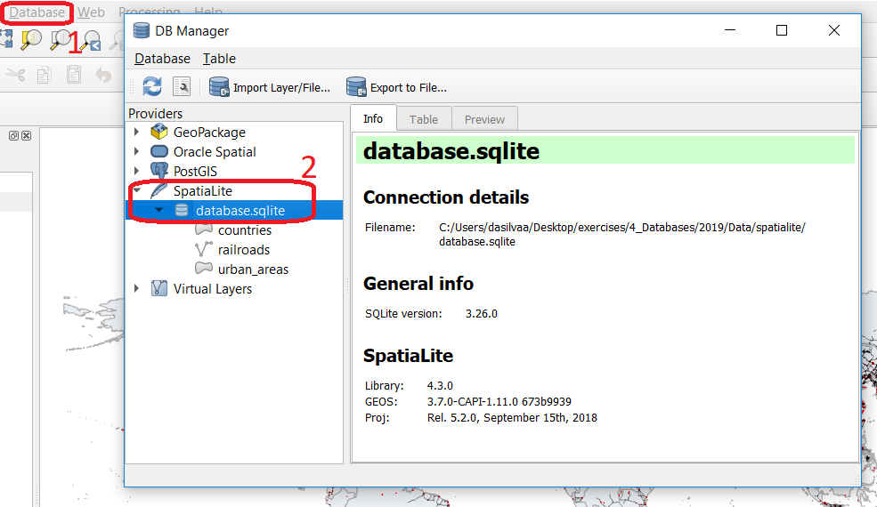
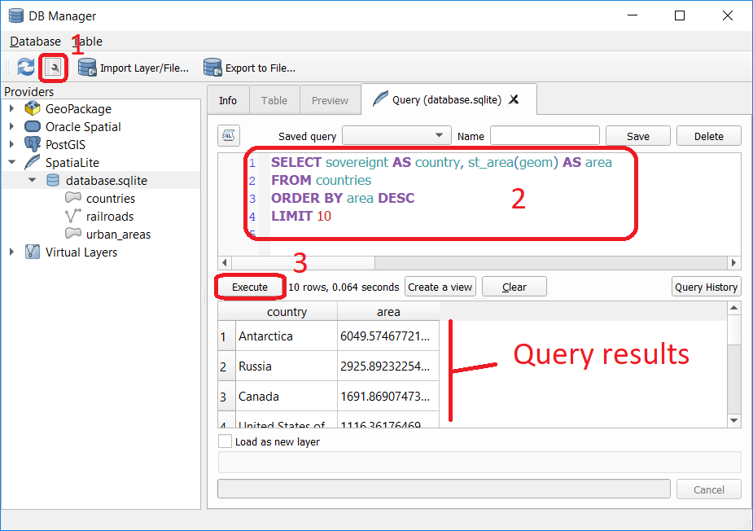

Databases
==========

Database Management Systems
---------------------------

Begin by reading about |ltb| `Database`_ and  |ltb| `Database management system`_ (DBMS) in the Living Textbook.

Task 1
   In the following table, you find the definitions for some of the most frequently used terms in database technology.  Such as Database, Data, Dataset, Database management system (DBMS) and a Database system.  Fill in the terminology column with the term that matches each definition. 

==============     ============================================================================================
 Terminology       Definition                                                      
==============     ============================================================================================
 \                  | It is a resource held on paper or in digital format that serves to record or administrate 
                    | some facts and description of phenomena of interest
 \                  A homogeneous collection of data usually describing a single kind of phenomenon.
 \                  | A collection of interrelated data sets properly structured by means of,  and stored 
                    | through a DBMS. (A file containing datasets)
 \                  | A software package that is designed to manage databases. This means, 
                    | it allows to set-up, maintain and exploit one or more databases.
 \                  Combination of a database and its DBMS.
==============     ============================================================================================

.. attention:: 
   **Question.**
   What would be the benefits of having a DBMS in your professional field? Can you also think of any disadvantages?  

GIS and Spatial Databases
^^^^^^^^^^^^^^^^^^^^^^^^^

A |ltb| `Geographic Information System <GIS_>`_ should not be called GIS if any of these four components are missing:

   The four components of a Geographic Information System

Behind the user interface of a GIS Software, there are things like application logic and data storage. Data can be stored as GIS files or in an (external) database. GIS software can use its DBMS or be connected to another DBMS such as PostgreSQL, Oracle, etc. 

In GIS, in addition to the tabular data, we work with Spatial Objects. This requires a database that supports “spatial data”, which means that a database is capable of storing geometry data type. |ltb| `Spatial databases <Spatial database_>`_ provide spatial data handling in terms of storage, manipulation and analysis. A spatial database is not constrained by the need to present data visually.

A Spatial DBMS is a software package that:

+ can work with underlying DBMS;

+ supports spatial data models (vector, field), spatial data types, e.g. point, line, or polygon;

+ provides functionality to |ltb| `Query`_ and manipulate spatial data using |ltb| `Structured Query Language (SQL) <Querying SQL_>`_;

+ supports spatial indexing (efficient algorithms for processing spatial operations) and domain-specific rules for query optimization.

.. attention:: 
   **Question.**
   Which are some of the most popular Spatial DBMS? 

---------------------------------------------------------

Relational Databases
--------------------

Databases use data models for handling that data that they store. One of the most common models is the |ltb| `Relational data model`_.
In this section of the exercise, you will explore the main building components of a relational database: |ltb| `Relation`_, |ltb| `Tuple`_, and |ltb| `Attribute`_. Then you will learn how a relational schema is represented in the form of a relation.

.. attention:: 
   **Question.**
   Which are some of the most popular Spatial DBMS? 
   Using the concept map in the |ltb| `Living Textbook`_, reflect on the relationships connecting the concepts associated with Relational database. Can you elaborate a short explanation of that representation?

Task 2 
   Below, you find part of the instance of a relation in a database. Fill in the blanks with the names of the components indicated by the arrows. Choose from: attribute, domain, relation, tuple. 

   .. image:: _static/img/task-components-db.png 
      :align: center

Task 3 
   Draw a relation based on the relation schema defined below. Fill it with three examples  (rows) of data that match the attribute domains.

   .. code-block:: miniscript

      Courses={ID:integer, Title:varchar(50), StartDate:date, Location: varchar(50)}

.. attention:: 
   **Question.**
   What other relevant attributes can be added to the course relation above? Think about a reason (requirement) to model courses in your database and modify the attributes according to your requirements. 

Keys
^^^^

|ltb| `Primary keys and foreign keys <Keys_>`_ enforce database integrity. By having a primary key in each relation, you make sure that there are no duplicated tuples in a relation. A **primary key** can be one attribute or a combination of attributes as far as it is unique and minimal. This means that if a unique combination of values can be achieved with two attributes, more attributes should not be used. 
You can read more about primary keys in your Living Textbook (page: Keys)

Task 4
   In the instance of the relation below, which attribute(s) can be possible candidates for primary keys? Which attribute(s) would you choose to set a primary key? Explain your reasons or the choice you made.

   ==    ============      ============   =============
   ID    name              surname        date_of_birth
   ==    ============      ============   =============
   42    john              smith          15/05/1977
   43    ruby              jason          04/08/1987
   44    sara              patil          09/12/1984
   45    jason             moller         27/07/1981
   46    john              alvarez        23/10/1986
   ==    ============      ============   =============

   Now, imagine that the table (relation) above actually contains hundreds of tuples. *Would your choice for a primary key still be a safe pick to ensure all the tuples have a primary key that it is unique?*

Relations in a relational data model are linked to each other through a common attribute. A foreign key is a set of attributes that are used to refer to tuples in another relation. A **foreign key** must correspond with the values of a primary key in another relation. A foreign key behaves like a ’logical pointer’.

Task 5
   In the figure below, you see the instances of two relations in a database. One holds data about countries; the other holds data about the production of crops productions in different countries and for various years. The countries and production relations should be related through a common attribute. Mark the primary key and the foreign key attributes and draw an arrow from the primary key pointing to the foreign key.

   .. image:: _static/img/task-keys.jpg 
      :align: center

Task 6
   Think of at least three relations (including courses) that can model a universe of discourse for managing courses in a university. Define the attributes and attribute domains for each of these relations and ensure your database integrity by specifying primary keys, foreign keys and any other given constraint. 

   + Hint1: *Typically, you may think of Students and Courses. You can replace any of these relations and add as many more as you think is necessary for capturing the data you need.*

   + Hint2: *Bear in mind that a student can take multiple courses and a course can have multiple students. How can you ensure the unique combination of students and courses?* 

   A similar example is mentioned in this `website <http://valentina-db.com/docs/dokuwiki/v5/doku.php?id=valentina:products:adk:v4rev:howto:databases_from_zero:what_is_in_a_database_and_why_excel_isnt_a_database>`_.

-----------------------------------

Data Retrieval
--------------

So far, you have got acquainted with the concepts of the relational database and its components. Now, you will interact with a database and perform simple queries to retrieve data stored in the database.  

In this exercise, you will not interact with an RDBMS but with a Spatialite database which can be described as a file-based database. This is good enough to show you how a GIS organizes and queries data, without the technicalities behind a specific RDBMS.  You will also understand how the data in a GIS can be interrelated by using joins. By learning this, you should not have problems if you need to interact with data in a fully-fledged RDMS. 

.. note:: 
   **Reflection.**
   Even though it is a good practice to store and organize your data in a database, it is not always necessary. In personal projects,  you can use a file structure in your GIS or a file-based database instead of an external database. A database is not necessary when you do not have multiple users, and the amount of data is not very large or the queries you will define are not complex. But in large projects, in which various users will work with hundreds or thousands of files and perform advanced queries; you should design and implement a database before starting analyzing and visualizing your data in a GIS. 

Having the necessary datasets is the starting point to be able to extract relevant information. Querying data is an important skill of a GIS analyst. To accomplish this, we use SQL – Structured Query Language.

.. important:: 
   **Resources.**
   You will require the latest LTR version of `QGIS (A Coruna 3.10) <https://qgis.org/en/site/forusers/download.html>`_, plus the dataset  `database_queries.zip <database_queries_>`_ which you can download from CANVAS.  When you unzip the dataset, you will find the following files inside:

   + ``Database_queries.qgs`` – a QGIS project preloaded with the dataset described below;
   + ``country_Data`` – a table with additional information on the countries of the world;
   + ``database.sqlite`` – a SpatiaLite database containing:

      + ``countries`` – polygons of the boundaries of the countries of the world;
      + ``railroads`` – lines representing the main railroads of the world;
      + ``urban_areas`` – polygons of the boundaries of the main urban areas of the world 

Task 7
   Read about |ltb| `querying a spatial database with SQL <Querying SQL_>`_. You should understand what |ltb| `Tuple selection`_ means; what is  |ltb| `Attribute projection`_; and how can we |ltb| `join <Join_>`_ two or more than two relations.  Such understanding is necessary for solving query-formulation problems, using a |ltb| `Join condition`_. 

.. _`sec-select-attrib`:

Selection by Attributes
^^^^^^^^^^^^^^^^^^^^^^^^

The first approach we will discuss for querying data is tuple selection based on attributes,  (i.e. ignoring spatial relationships). Tuple selection works like a filter; it retrieves tuples that meet a particular condition.

A tuple selection written in SQL has the following structure:

.. code-block:: postgresql
   :linenos:
   
   SELECT *                /* attributes to be projected */
   FROM Parcel             /* relation(s) to be queried */
   WHERE area_m2 > 1000    /* condition(s) */

SQL has a very clear structure. Line 1 (**select**) defines the attributes to be projected (shown in the result of the query), Line 2 (**from**) defines the relations that will be used. Line 3 (**where**) contains the condition(s) that will be applied to filter the data.

In SQL, you can use comparison operators (``>, < ,=, !=, >=, <=``)  and logical operators (``AND, OR, Like, NOT``) to define conditions for filtering data. 

When you query data in a GIS (and not a DBMS), the way you express your attribute selection may be slightly different, but it usually follows the SQL syntax. The following task shows you how to query a data layer. 

Task 8 
   Open the QGIS project *'database_queries'*. :guilabel:`Right-click` on the layer countries > :guilabel:`Filter..`, define the simple query below, and click :guilabel:`OK`.   
   See :numref:`figquerysimple`
   
   .. code-block:: postgresql
      
      "sovereignt" = 'Russia'  

.. _figquerysimple:

   Filtering data using a simple query in the query builder

\

   You should see now that your dataset only shows the countries that belong to Russia. 

Joins
^^^^^

Often the information you need to retrieve is stored in two different relations. When this happens, you have to use joins. The pre-requisite to joining relations is to declare a join condition. The condition has to be met by both relations in the same manner. This is usually a common attribute that relates tuples in both relations. 

In SQL, a join can be defined by structuring statements in the following way:

.. code-block:: postgresql
   :linenos:

   SELECT *
   FROM TitleDeed, Parcel
   WHERE TitleDeed.Plot = Parcel.ID

.. attention:: 
   **Question.**
   In the SQL statement above, you immediately notice that it is using two relations instead of one. Can you tell which common attributes are being used in this example?
 
 
Task 9
   Examine the attribute tables of ``countries.shp`` and  ``countries_data.shp``. You will certainly note that the data contained in the attribute table of *'countries_data'* data layer complements the data provided by *'countries'* data layer.
 
Task 10 
   Write a joining condition for the datasets above. The following SQL statement will help get you started.

   .. code-block:: postgresql   
      :linenos:

      SELECT *
      FROM countries, countries_Data
      WHERE /* Here goes your condition */

QGIS (and other GIS packages) provides a graphical interface from where you can define a join without having to type the SQL statements.

Task 11
   Use QGIS to apply the join defined in the *previous task*. :numref:`fig-join` shows how it is done.

.. _fig-join:

   The definition of a join in QGIS

.. note:: 
   **QGIS.**
   *Joins only exist in the scope of a project*. Notice that the countries dataset is now richer in attributes as long as the table *'countries_data'* is in the same project, and as long as the join condition remains active. If you open the countries in a different QGIS project, you will see that the attribute table does not include the attributes from the *'countries'* table. To make the results of a join permanent, you have to create a dataset by exporting the joined dataset to a new file. This procedure is common to any GIS software. *Also, be aware that filtering will not take into account the joined attributes, unless you the results to a new dataset,  or create a virtual field (check the next task).*

Now that the attribute table of the *'countries'* layer is extended, we can revisit **Task 8** and make more interesting queries. 

Task 12
   :guilabel:`Right-click` on the layer countries > :guilabel:`Filter...`. The message depicted in below will pop up. Click :guilabel:`Yes`. 

   .. image:: _static/img/virtual-layer.png
      :align: center

   \

   Once you are in the filter menu, formulate  queries to answer the following questions. Remember to click the :guilabel:`Clear` button before proceeding to the next query problem. 

   .. attention:: 
      **Question.**

      #. How many countries start with the letter ‘E’?
      #. List all the countries belonging Africa and Europe that have more than :math:`100.000.000` inhabitants.
      #. How many countries whose official name includes ‘Republic’ are classified as   ‘6. Developing region’?

Selection and Joins by Spatial Relationship
^^^^^^^^^^^^^^^^^^^^^^^^^^^^^^^^^^^^^^^^^^^

GIS handles spatial data, and this means that:

   *"Everything is related to everything else, but near things are more related than distant things."* 

The implications of Tobler’s first law of Geography are what allow us to search for information based on spatial relationships while ignoring the semantics associated with the features. The key idea to remember is that all the objects represented in the same coordinate space have at least one thing in common - space itself! This means that we can filter our data based on several Topological relationships like disjoint, meets, equal to, inside, covers etc.

Task 13
   suppose we want to find out how many urban areas are connected to railroads.  Use the :guilabel:`Select by location` tool from the **Processing toolbox** to find out. Figure :numref:`figselectlocation`

.. _figselectlocation:

   The 'select by location' tool in the Toolbox

\

   If all went well, you should see some features in the *'urban_areas'* layer highlighted with yellow. This means that such features intersect a railroad.

   .. note:: 
      **Reflection.**
      What your GIS did was to perform a join on the fly based on a spatial predicate – Intersects. The difference is that attributes were not joined; instead, features were selected, but the principle is the same.

      In SQL terms, what happened was something like this:

      .. code-block:: postgresql   
         :linenos:

         SELECT u.*                             /* project only the attributes of relation u */
         FROM urban_areas as u, railroads as r  /* relation aliases */
         WHERE st_intersects(u.geom, r.geom)    /* spatial relation: intersection */

.. _sec-spatialsql:

Using Spatial SQL
^^^^^^^^^^^^^^^^^

If our data is in a spatial database, we can access all sort of spatial functions using SQL, and obtain answers to simple or complicated questions in a straightforward manner. 

To explore spatial functions using SQL, we will use the capabilities of *SpatiaLite*, a file-based database engine. This means you don’t need to install any database software. All data is contained in a single file that can be copied from one computer to another without losing information.

Task 14
   Connect to the Spatialite database.

   If your ``database.sqlite`` is not listed under the **Spatialite** section, you have to connect to it first. Simply *right-click* over  :guilabel:`Spatialite` > :guilabel:`New Connection...`, then point to the folder where you have the ``database.sqlite`` file. :numref:`fig-connect-sqlite` 

.. _fig-connect-sqlite:

   Connecting to a SpatialLite database

\

   Then, go to :guilabel:`DB Manager` > :guilabel:`Spatialite` > :guilabel:`database.sqlite`  to get a list of the relations inside the ``database.sqlite``. Note that layers in the database are already loaded into your project, *do not load them again.*

.. _fig-browse-sqlite:

   Browsing a SpatiaLite database in the DB Manager

\

   Now open :guilabel:`Query`  window, copy the SQL code below,  click :guilabel:`Execute` :numref:`fig-query-dbmanager`

   .. code-block:: postgresql   
      :linenos:

      SELECT sovereignt AS country, st_area(geom) AS area
      FROM countries
      ORDER BY area DESC
      LIMIT 10

.. _fig-query-dbmanager:

   Executing a query in the DB Manager

\

   .. attention:: 
      **Question.**
      Analyze the SQL code and try to understand how it works.
      Although syntactically correct, the results produced by the query above cannot be trusted. Can you explain why?

Task 15
   To finish this section, we will give you another demonstration of the capabilities of a spatial database. Suppose you want to know what is the total area next to the railroads of Australia given a certain distance. The distance could represent a buffer zone restricted to the public for security reasons. 

   Here is a way to do it using SQL:

   .. code-block:: postgresql   
      :linenos:

      SELECT r.id, st_area(st_buffer(r.geom, 0.1)) AS area                                       
      FROM countries AS c, railroads AS r
      WHERE c.sovereignt = 'Australia' AND st_intersects (r.geom, c.geom)

   .. attention:: 
      **Question.**
      This is a  variation of the previous SQL query. Can you tell what is the difference and why the query below is better?

      .. code-block:: postgresql   
         :linenos:
         
         SELECT r.id, st_area(st_union((st_buffer(st_transform(r.geom,3577), 50))))/1000000 
                AS area_km2
         FROM countries AS c, railroads AS r
         WHERE c.sovereignt = 'Australia' AND st_intersects (r.geom, c.geom)

.. important:: 
   This exercise is not meant to provide training on SQL, and we do not expect you to become proficient in it. The main point is that spatial databases are powerful tools and that if you want to take advantage of it, you will have to learn a bit of SQL. If you never had contact with SQL, it might seem intimidating at first, but it is not very hard to learn the basics. A good resource for learning is https://www.w3schools.com/sql 

.. sectionauthor:: Andre da Silva Mano, Parya Pasha & Manuel Garcia Alvarez
