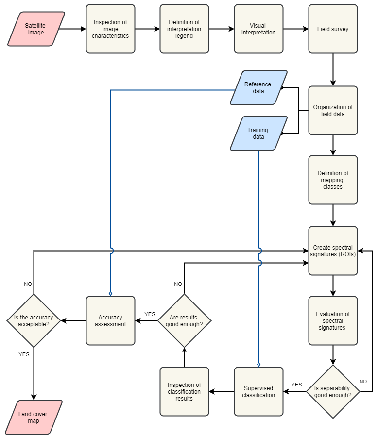

.. _sec-dic:

Digital Image Classification
============================

In this exercise, we use a **Sentinel-2** satellite image covering Enschede and its surroundings from September, 2016. Before going forward with the exercise read about |ltb| `<Digital Image Classification_>`_.

.. important:: 
   **Resources.**
   You will require the latest LTR version of `QGIS (A Coruna 3.10) <https://qgis.org/en/site/forusers/download.html>`_, plus the dataset `digital_image_classification.zip <data_digital_image_classfication_>`_ which you can download from CANVAS.  When you unzip the dataset, you will find the following files inside: 
  
   + ``s2_25_sept_2016.tif``, a Sentinel-2 satellite image of Enschede.
   + ``Training_areas.shp``, containing the sites visited during a fieldwork.
   + ``digital_image_classification.qgs``, a project containing the files above.
   + ``Field_Photos_201``, a folder containing photos of the surroundings of training areas.

The methodology for mapping land cover  using satellite images consist of the following general steps:

1.	Interpretation of satellite image 
2.	Field data collection
3.	Field data analysis
4.	Supervised Classification
5.	Accuracy assessment

In this exercise, you will conduct the steps mentioned above except for the **Field data collection**. However, we briefly explain that step in the sections :ref:`field-survey` and :ref:`field-data`.   
The workflow in :numref:`fig-dic-workflow`  summarized the process of applying *digitial image classification* for land cover mapping.

.. _fig-dic-workflow:

   A workflow of the process of digital image classification for land cover mapping

-----------------

Inspection of Image characteristics
-----------------------------------

The first step is to get familiar with the dataset by reviewing the characteristics of the image dataset.
We will use only some of the spectral bands of the Sentinel image because of their differences in spatial resolution. 

Task 1
   Inpect Table 3.1., open ``s2_25_sept_2016.tif`` in QGIS and get familiar with this dataset. Notice that the bands in the image refer to the numbers under the column **Exercise Band**.

.. table:: Spectral bands of Sentinel-2. The bands used in this exercise appear in bold.

   ======================  =============================    ==========================    =============================   =====================
   Band                    Wavelength  (:math:`\mu m`)      Bandwith (:math:`\mu m`)       Resolution  (:math:`m`)        Exercise Band 
   ======================  =============================    ==========================    =============================   =====================
   Band 1 (VIS)            0,443                            0,02                          60                              :math:`-` 
   **Band 2  (VIS)**	      **0,49**	                           **0,065**	                        **10**	                  **1**
   **Band 3  (VIS)**	      **0,56**	                           **0,035**	               **10**	                        **2**
   **Band 4  (VIS)**	      **0,665**	                     **0,03**	                     **10**	                        **3**
   **Band 5  (RE)**	      **0,705**	                     **0,015**	                  **20**	                           **4**
   **Band 6  (RE)**	      **0,74**	                        **0,015**	                    **20**	                        **5**
   **Band 7  (RE)**	      **0,775**	                     **0,02**	                     **20**	                        **6**
   **Band 8  (NIR)**	      **0,842**	                     **0,115**	                    **10**	                        **7**
   Band 8A  (NIR)	            0,865	                          0,02	                        20	                           :math:`-`
   Band 9  (NIR)            0,94	                           0,02	                        60	                              :math:`-`
   Band 10  (SWIR)         1,375	                              0,02	                         60	                        :math:`-`
   **Band 11  (SWIR)**	   **1,61**	                         **0,09**	                    **20**	                        **8**
   **Band 12  (SWIR)**	   **2,19**	                        **0,18**	                        **20**	                     **9**
   ======================  =============================    ==========================    =============================   =====================

--------------------------------

Legend & Visual Interpretation
--------------------------------

The interpretation process  involves to visually examine the image dataset that will be use in the classification, and define a set of classes of interest. In this case we will focus on the definition of classes of land cover. For example, *forest, buil-up areas, water bodies, grass fields, etc.*

Interpretation Legend
^^^^^^^^^^^^^^^^^^^^^
The interpretation legend defines a list of *legend units* in terms of the characteristics of the image dataset. For example, one unit can be define as *all black and dark-blue pixels* in the image. 

Task 2
   Start QGIS and open the ``s2_25_sept_2016.tif``, display it  with the band combination **7,8,3**.

   Define between 5 to 10 legend units for this dataset. After  we established a legend, we can start with the  visual interpretation.

Visual Interpretation
^^^^^^^^^^^^^^^^^^^^^

One the purposes of |ltb| `Visual image interpretation`_ is to identify objects in the image dataset. For this we use the legen units defined in above and the ability of the human eye to recognize certain objects. For example, a legend unit defined as *black and dark-blue pixels* can be recognized, after considering the size, shape and texture of the objects , as **water**.

.. attention:: 
   **Question.**
   Base on your knowledge on the image characteristics and EM radiation, **which classes of land cover can you name and identify?**. If your now sure use the **QuickMapService** to load the standard map from Open Street Maps.

------------------

.. _field-survey:

Field Survey
------------

The purpose of the fiel survey or *fieldwork* is to conduct a survey to determine what the *legend units*  based on theimage characteristics are in reality. In this case, what type of land cover and land use they represent. 

During the survey we have to visit and check different locations for all the legend units. Then, we record our observations at each location. *The locations for the survey should be chosen in such a way that all legend units are covered.* 

In this course, it is not  possible to conduct a fieldwork. Instead, we provide you with a dataset  with observations made during a fieldwork for interpreting the Sentinel-II image in Enschede, NL. The datasets contains locations and photos for each visited site. If  you  were to conduct a field surves, you should collect similar data.

Task 3
   Add the ``training_areas.shp`` to QGIS. Use the **Identify tool** to inspect the location of visited sites during the fieldwork over the  *'s2_25_sept_2016'* image.  Put attention to the  attributes **TA_ID**, it tells the file name of the photo(s) that belong to that location; for example. *AV_1*. If more than one photo is available for a location, files names contain also a literal; for example *AV_1a* and *AV_1b*. See :numref:`fig-field-data` 

.. _fig-field-data:
.. figure:: _static/img/dic_training_areas_inspection.gif
   :alt: field data
   :figclass: align-center

   Field data: training data and photos.

---------------------

.. _field-data:

Organising Field data
---------------------

After fieldwork, we have to structure the fieldwork data, define classes and relate  such classes to the image. Thus we have to define **field classes**  using the fieldwork data. Filed classes are classes recognizable in the field based on certain criteria. In our case the creteria is related to land cover and land use. Field classes should define at same level of detail. 

Task 4
   Compare the field classes, as defined in the attribute **Landcvr** of the *'training_areas'* layer, with the colours on the satellite image when displaying bands 7,8,3. Make a list of up to 10 map classes you would like to classify, and write down which colour(s) corresponds them. See the example in the table below.

   ======   ====================
   Class       Colour (7-8-3)	
   ======   ====================
   Water       Black/dark blue
   \           \
   \           \
   \           \
   ======   ====================

------------------------

Defining Mapping Classes
------------------------

In the previous task, you practiced how to define  field classes and associate colours. However,  for the remainder of this exercise, we will use the following list of macroclasses (MC_info) and ID codes (MC_ID). 

=========   ==================
MC_ID	      MC_Info 
=========   ==================
1	         water
2	         maize
3	         evergreen
4	         grass
5	         bare
6	         buildings
7	         tarmac
8	         heath
9	         deciduous
10	         rapeseed
=========   ==================

It is *fundamental* that you follow the nomenclature above, because the accuracy assessment assumes that the classification results contain such classes.

-----------------

Defining Spectral Signatures (ROIs)
------------------------------------

.. note:: 
   **QGIS.**
   The QGIS **Semi-automatic Classification** plugin uses the term ‘Region of Interest’ (ROI) instead of ‘training sample’ which is the term you will see in the reading materials. *These terms are equivalent and have exactly the same meaning.* 

Task 5
   Install the plugin **Semi-automatic classification**. If necessary, open the ``s2_25_sept_2016.tif``.

Task 6 
   Use the **Semi-automatic classification** plugin to create the first training sample. While you are at it,  follow these recommendations:

      +  Make sure that you take samples from homogenous areas, and that the *standard deviation* is kept low (check the statistics of the ROI).
      +  It is advisable to make several subclasses for the same macroclass. For example, you will notice that not all pixels with water have exactly the same colour. Some areas with water have black pixels and some others have dark-blue pixels. Instead of collecting samples under the macroclass *water*, it is better to split water in two subclases, for examples *water_black* and *water_blue*, and take samples for each subclass separatly. The set of all pixels associated to an specific class is what we call a **spectral signature**. 

      +  Give subclases distinct class names (*e.g. grass_yellow, grass_orange*).

   Watch the video tutorial on `Creating training sets <https://vimeo.com/showcase/5716094/video/340426030>`_ to know how to complete this task in QGIS.

.. raw:: html

   
<iframe src="https://player.vimeo.com/video/340426030?color=007e83&portrait=0" style="position:absolute;top:0;left:0;width:100%;height:100%;" frameborder="0" allow="autoplay; fullscreen" allowfullscreen></iframe>

\

.. note:: 
   **QGIS.**
   We will apply a classification based on macroclasses (information class), and not on subclasses (spectral classes).
   When we classify according to macroclasses, the classification algorithm will group subclasses and label the results according to macroclass. However, *the classification algorithm will not merge the spectral signatures.*

.. attention:: 
   **Question.**
   Why is it advisable to make separted (spectral) subclasses when taking training samples?
 
Task 7
   Define ROIs for all macroclasses in the table above and for all relevant subclases. Remember to group  subclases with the correct macroclass.

----------------------

Evaluation of Spectral Signatures 
-----------------------------------

You can visualise spectral signatures (ROI) statistics. One option to evaluate signatures (ROI) are |ltb| `feature space images <Feature Space_>`_ , which are two-dimensional histograms. 

Task 8
   Create and analyze feature spaces. Click on :guilabel:`Add highlighted items to scatterplot` as shown in minute 11:15 onwards of the video tutorial on `Creating training sets <https://vimeo.com/showcase/5716094/video/340426030>`_.
   Insepect the feature spaces and evaluate the separability of your ROIs. 

.. attention:: 
   **Question.**
   What band combination creates a suitable feature space to evaluate the separability of your training samples? 

To evaluate the quality of the training samples, we  can the standard deviation as reference.

Task 9
   Analyse the standard deviation for each of your ROI. Click on :guilabel:`Add highlighted signatures to spectral signature plot` > :guilabel:`Signature details`.

When you are satisfied with the signatures (ROI) of your training samples, you can move to perfom a digital image classification.

-------------------

Supervised Image Classification
-------------------------------

In this exercise, we will use the **Maximum Likelihood** classifier for the supervised classification, but we encourage you to experiment with other classifiers and compare the results.

Task 10
   Use the **Semi-automatic classification** plugin to test your first training sample set. Configure the *'Classification algorithm'*  as shown in :numref:`fig-setting_maximum_likelihood`.
   Then use the  **Active classification preview pointer** |previewPointer|  to generate a temporary classification. Then,  visually inspect the classification results. 

   .. _fig-setting_maximum_likelihood:
   .. figure:: _static/img/task-semi-auto-classification.png 
      :align: center
      :width: 360px

      Setting a classifier

   Watch the video tutorial on `Running a supervised classification  <https://vimeo.com/340426053>`_ to complete this task.

.. raw:: html

   
<iframe src="https://player.vimeo.com/video/340426053?color=007e83&portrait=0" style="position:absolute;top:0;left:0;width:100%;height:100%;" frameborder="0" allow="autoplay; fullscreen" allowfullscreen></iframe>

\

Inspect Results & Improve the Classification
^^^^^^^^^^^^^^^^^^^^^^^^^^^^^^^^^^^^^^^^^^^^

Task 11
   Based on the visual inspection of your first classification results, add additional ROIs that capture areas where the algorithm fails to classify the image correctly.

   Then, inspect the classification results again, and if necessary add more ROIs until you are satisfied with the results. 

Task 12 
   Run the final classification, by clicking on the button |runSCP|

Task 13
   Generate a shapefile from the ROIs you used to classify the image. [HOW? GIVE SOME HINT?]

Task 14 
   Make sure you save your training samples for later use. In the **Semi-automatic classification** plugin, this is done automatically.

----------------------------

Accuracy assessment
--------------------

.. important:: 
   **Resources.**
   In this section, you will will require the dataset `reference_data.zip <reference_data_>`_, which you can download from CANVAS.  This dataset contains the following file: 
  
   + ``reference_data.shp``, dataset containing the locations and types of land cover for the accuracy assessment.

Data for Accuracy Assessment
^^^^^^^^^^^^^^^^^^^^^^^^^^^^

For this exercise, the data for the accuracy assessment have been collected for you. The ``reference_data.shp`` contains the **ground truth** information of 187 locations, that we will use in assessing the accuracy of the supervised classification. 

The areas in the ``reference_data.shp`` were randomly selected. Areas which fell on the edge of two or more classes were considered.

 Task 15
   Add reference_data.shp to QGIS and open its attribute table. Make sure the values for **MC_ID** and **MC_Info** attributes match the ones you used for the macroclasses during the supervied classification of the *'s2_25_sept_2016'* image.

Accuracy Report
^^^^^^^^^^^^^^^

In the accuracy assessment, we generate an |ltb| `Error matrix`_ between the classification results and the reference data.  The accuracy report will provide the *overall accuracy* of the classification, as well as  *user and producer accuracies*.  

 Task 16
   Perform the accuracy assessment. Watch the video tutorial on `Accuracy assessment of supervised classuification <https://vimeo.com/340426011>`_.

.. raw:: html

   
<iframe src="https://player.vimeo.com/video/340426011?color=007e83&portrait=0" style="position:absolute;top:0;left:0;width:100%;height:100%;" frameborder="0" allow="autoplay; fullscreen" allowfullscreen></iframe>

\

Improve Accuracy
^^^^^^^^^^^^^^^^
 
The accuracy of the classification can be improved by  identifying the sources of errors in the process of supervised classification, and then minizing their effects on the classification results.

Task 17
   Locate and inspect areas which you suspect are soruces in your classification result. Then, try to improve the *overal accuracy* by adding or excluding ROIs from your training dataset.

   Once the accuracy of the supervised classification is *acceptable*, you have completed the digital image classification process and generated a **land cover map**. Save all your results.

.. attention:: 
   **Question.**
   What determines if the accuracy of the digital image classification is acceptable or not?

.. important:: 
   **Assignment Submission**

   Read the instructions of the `Digital Image Classification Assignment <https://canvas.utwente.nl/courses/6641/assignments/43605>`_, and submit your results before **7th October 23:59 (GMT+2)**.

.. sectionauthor:: Monika Kuffer, Andre Mano & Manuel Garcia Alvarez

