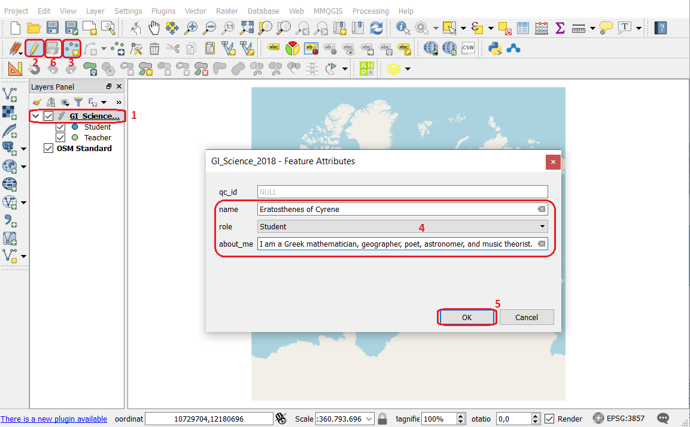

Intro to QGIS
=============

This exercise will introduce you to QGIS, and at the same time, you will discover more about other people in this course.  If you are already a QGIS user, you can skip **Tasks 1-3**, but answer the questions. Then go to the section :ref:`sec-getting-know`.

.. important:: 
   **Resources.**
   You will require the dataset `introduction_data.zip <introduction_data_>`_ which you can download from CANVAS.  When you unzip the dataset, you will find the following files inside: 

   + ``GI_Science_2020.qgs`` – a QGIS project file;
   + ``Introduction_to_QGIS.qgs`` – a QGIS project file;
   + ``World_raster.tif`` – a world map raster map
   + ``Countries.shp`` – a vector dataset representing countries borders.

-------------------------

The QGIS Interface
------------------

If you are entirely new to QGIS, watch the video tutorial on `getting started with QGIS <https://vimeo.com/showcase/5716094/video/313813125>`_. Notice that in this course, you have to install `QGIS (A Coruna 3.10) <https://qgis.org/en/site/forusers/download.html>`_. The tutorial uses a different version, but the installation steps are the same.

.. raw:: html

   
<iframe src="https://player.vimeo.com/video/313813125?color=007e83&portrait=0" style="position:absolute;top:0;left:0;width:100%;height:100%;" frameborder="0" allow="autoplay; fullscreen" allowfullscreen></iframe>

\

Task 1
   Start QGIS and open the project ``Introdudction_to_QGIS.qgs`` Quickly inspect each of the Menu, such as *’Projects’*, *’Edit ’*, *’Layer’*, etc. And the ToolBar buttons, such as **Identify feature** and **Zoom**.

   .. attention:: 
      **Question.**
      How many GIS terms and tools in QGIS are you already familiar? Make a list to assess your knowledge of GIS.

Task 2
   Control the visibility of the layer in the project. Make the layers visible, and by clicking on the **checkboxes** next to them.  Click a second time to turn off their visibility. Move the layers up and down to see how you can change the order in which they are displayed.
  
  
   .. attention:: 
      **Question.**
      How does changing the order affect what is displayed in the Map View?

Task 3 
   Zoom in and out of the map by scrolling over the map view or the Zoom Toolbar. Then, move your mouse pointer over the map and notice how the coordinates change on the lower-right of the window.

   .. attention:: 
      **Question.**

      + How do the coordinates change when you move the mouse pointers? 
      + Are they in decimal format or degrees, minutes, and seconds? 
      + How does zooming in or out affect the scale?

------------------------------

.. _sec-getting-know:

Getting to Know Others
----------------------

In this section, you will introduce yourself and get acquainted with other participants in the course.
  
Task 4
   Install the plugin **Quick Map Services**. Refer to the section   `Installing Plugins <https://docs.qgis.org/3.10/en/docs/training_manual/qgis_plugins/fetching_plugins.html>`_   of the QGIS training manual. Alternatively, you can watch the tutorial on `Installing Plugin in QGIS <https://vimeo.com/showcase/5716094/video/201997421>`_.

.. raw:: html

   
<iframe src="https://player.vimeo.com/video/201997421?color=007e83&portrait=0" style="position:absolute;top:0;left:0;width:100%;height:100%;" frameborder="0" allow="autoplay; fullscreen" allowfullscreen></iframe>
 

\

Task  5 
   Open the ``GI_Science_2020.qgs`` project in QGIS. You should see a map similar to this:

   .. image:: _static/img/task-student-location.png 
      :align: center

\

   The project contains two layers: one is an *Open Street Map* base map, the other is a point layer generated by a Geo-web service. The point layer holds information about teachers and students that participate in this course. The information includes the **location** where the person is from, his or her **name**, its **role** (teacher or student), and an *about* field for general information (max. 160 characters).

Task 6
   Add your location to the map. See :numref:`fig-add-point2layer`  
   
   #. Click on the  *'GI_Science_2020'* layer so that it highlights;
   #. Go to :guilabel:`Toggle editing` |edit|;
   #. Click on :guilabel:`Add  Point Feature` |capturePoint|;
   #. Navigate the map until you find the city where you come from. Click over the map to add a point. A dialog will pop-up, fill in your info;
   #. Press :guilabel:`OK` to dismiss the dialog;
   #. Click :guilabel:`Save layer edits` |saveEdits| to commit your edits into the server.

.. _fig-add-point2layer:

   Add a point to a layer to indicate the location of your city

\

   The information you provided is being saved in a remote server. Therefore the map is always up today; you only need to refresh the view from time to time to see if any of your course mates have already plot something else on the map.
   You may also see the map through your web browser by accessing this page.

   .. attention:: 
      **Question.**
      Fill in the table below with the information concerning the course mate that is closer to you. 

      ====  ====  =======  =====
      Name  City  Country  About
      ====  ====  =======  =====
      | \   \     \        \
      ====  ====  =======  =====

Task 7
   Now that you know a bit more about your course mates. Go to this `Discussion Board <https://canvas.utwente.nl/courses/6640/discussion_topics/63945>`_ and exchange more details on your interests and expectations in this course.

.. sectionauthor:: Andrá da Silva Mano, Amy Corbin & Manuel Garcia

