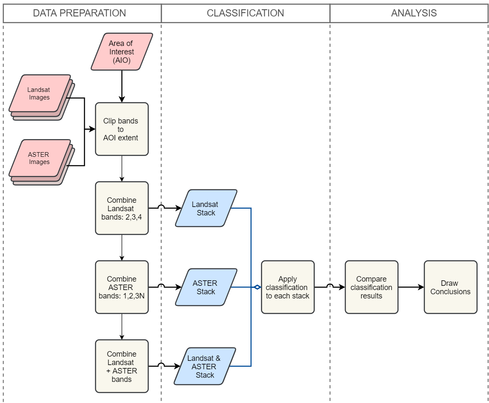
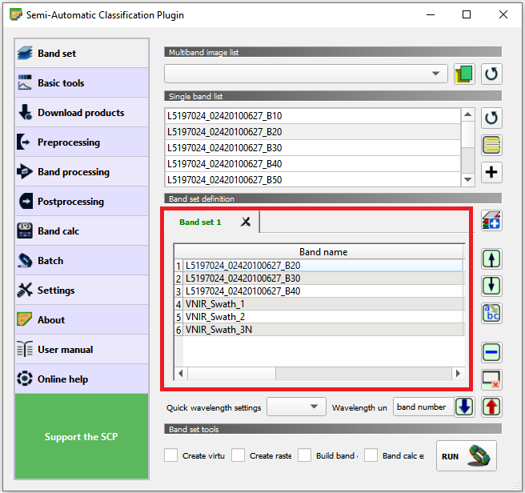
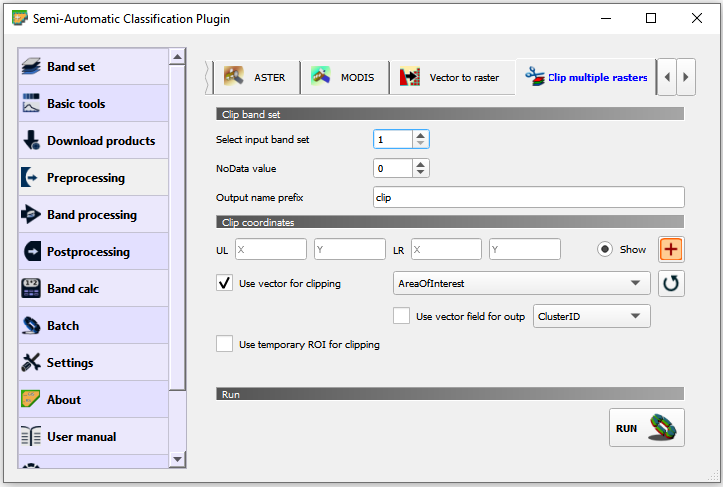
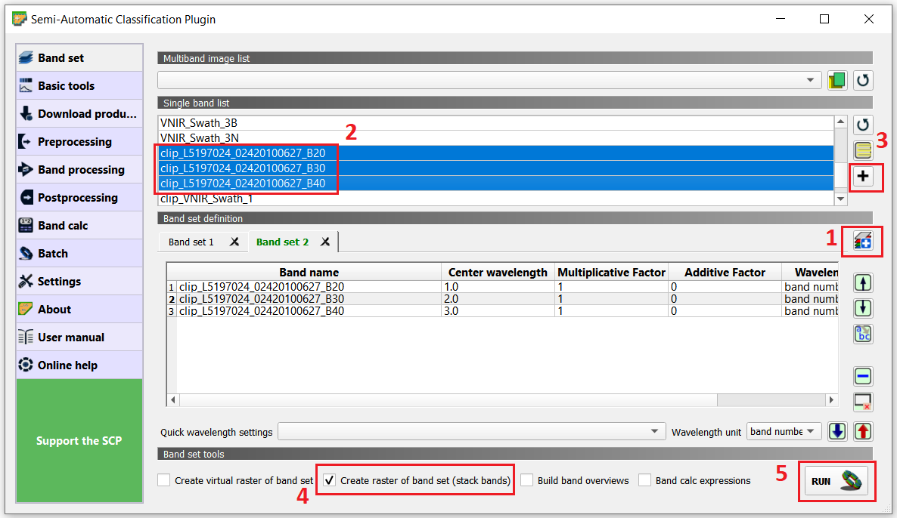
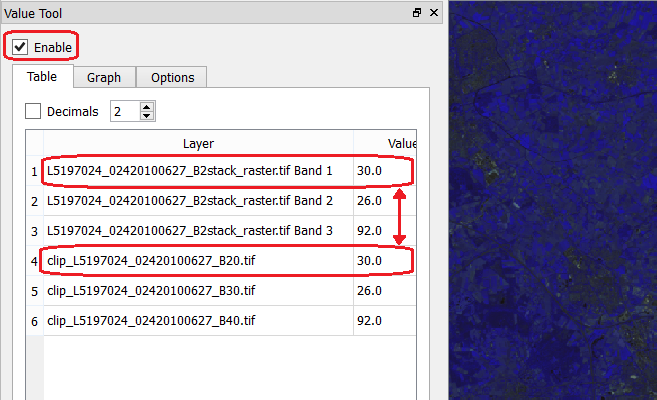
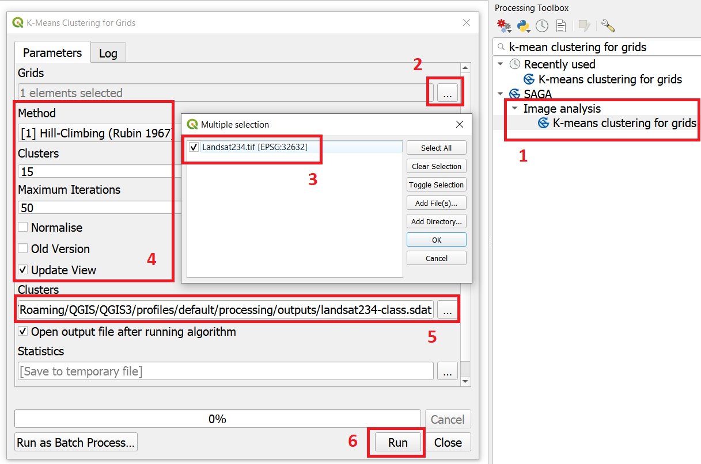
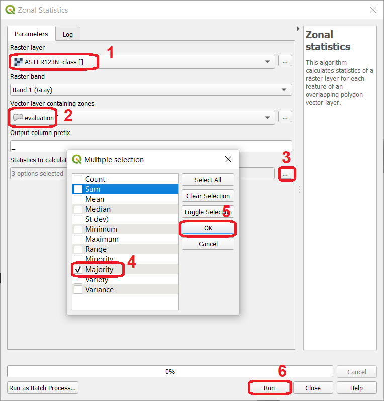

Mono and Multi-Temporal Classification
=======================================

In section :ref:`sec-dic`, we apply image classification to classify land cover, to a dataset containing images for a single date (mono-temporal). However, no all classes of land cover are equally distinguishable any time of the year. For example, seasonal crops like *maize* can only be distinguished during their growing season. Some types of trees (e.g., deciduous trees) change their spectral reflectance thru the year, because of changes in their foliage. In such cases, we can use images from multiple dates (|ltb| `multi-temporal <Multi concept>`_) to increase the level of information in the classification process.

In this exercise, we demonstrate the advantage of using multi-temporal data in image classification, to increase the separability between classes. We use the case of land cover mapping as an example.

.. important:: 
   **Resources.**
   You will require the latest LTR version of `QGIS (A Coruna 3.10) <https://qgis.org/en/site/forusers/download.html>`_, plus the dataset `mono_bi_temporal_classification.zip <data-mono-multi_>`_ which you can download from CANVAS.  When you unzip the dataset, you will find the following directories and files: 

   + **Landsat** -  Images from the Lansat-TM, from 2010-06-23:

      + ``L5197024_02420100627_B10.tif``
      + ``L5197024_02420100627_B20.tif``
      + ``L5197024_02420100627_B30.tif``
      + ``L5197024_02420100627_B40.tif``
      + ``L5197024_02420100627_B50.tif``
      + ``L5197024_02420100627_B60.tif``
      + ``L5197024_02420100627_B70.tif``

   + **ASTER** - Images from the ASTER, from 2010-04--23:

      + ``VNIR_Swath_1.tif``
      + ``VNIR_Swath_2.tif``
      + ``VNIR_Swath_3B.tif``
      + ``VNIR_Swath_3N.tif``
      + ``SWIR_Swath_4.tif``
      + ``SWIR_Swath_5.tif``
      + ``SWIR_Swath_6.tif``
      + ``SWIR_Swath_7.tif``
      + ``SWIR_Swath_8.tif``
      + ``SWIR_Swath_9.tif``
      + ``TIR_Swath_10.tif``
      + ``TIR_Swath_11.tif``
      + ``TIR_Swath_12.tif``
      + ``TIR_Swath_13.tif``
      + ``TIR_Swath_14.tif``

   + **Shapefiles:**

      + ``Evaluation.shp`` - areas with three distinct land cover classes.
      + ``AreaOfInterest.shp`` - spatial extent for band subsets.

   + **Output:** - An empty directory to store your results.

   + ``mono_bi-temporal_classification.qgs`` - a QGIS project loaded with the files  listed above.

-----------------------------------

Setting Up the Analysis Environment
-------------------------------------

Before starting with the processing and analysis of the data in this exercise, we need to add specific tools for remote sensing to QGIS.

Task 1
   Make sure that the **Semi-automatic Classification** (SCP) and **Value tool** plugins are installed.

Task 2
   Configure QGIS to render layers using multiple CPU cores. Go to 
   :guilabel:`Settings` > :guilabel:`Options` > :guilabel:`Rendering` and make sure the option *Render Layers in parallel using many CPU cores* in on. Set :guilabel:`Max Cores` to the number of CPU cores in your computer, use at least 4 for better performance. See below.

   .. image:: _static/img/qgis-rendering-options.png 
      :align: center

In the following sections, we will conduct data analysis to compare the differences between mono-temporal and bi-temporal digital image classifications. The workflow in :numref:`fig-bi-class-workflow` shows the steps (operations) for such data analysis.

.. _fig-bi-class-workflow:

   A flowchart for the comparison of 'mono' and 'bi' temporal image classification

---------------------------

Data Preparation
-----------------

Band Subsetting
^^^^^^^^^^^^^^^^^^

You will start by stacking bands in three different combinations. One stack will combine three bands from Landsat-TM from the 23-Apr-2010. Another stack will combine three bands from ASTER, taken on the 23-Jun-2010. Finally, the last stack will combine all the bands in the previous two stacks: three Landsat bands and three ASTER bands. 

Task 3
   Start by learning about the characteristics of the Landsat TM and the ASTER sensors. Put special attention to the wavelengths of the different bands. Note that *the SWIR bands are not available in the ASTER images since 2008 due to the deterioration of the cooling system of the sensor.*

   Use the **ITC Sensor Repository** for this task:

   + https://www.itc.nl/Pub/sensordb/getsen.aspx?name=ASTER 
   + https://www.itc.nl/Pub/sensordb/getsen.aspx?name=TM 

.. attention:: 
   **Question.**
   Which three bands of Landsat TM and ASTER are very similar? 

Now that you known which bands are are identical. We will create a subset for the area in the  ``AreaOfInteres.shp``. That is, we will clip each band to the extent of the polygon in such file.

Task  4
   Open the QGIS project ``mono_bi-temporal_classification.qgs``. Go to :guilabel:`SCP` >  :guilabel:`Band set`. Many of the operation available in **SCP** required to define a *band set* in advance. Then, the operation will be applied to all the bands in a set. **SCP** uses numbers to differentiate between band set. The current project already contains a band set **(1)** listing the all the bands we will need in this exercise. See :numref:`fig-scp-band-set2` 

.. _fig-scp-band-set2:

   Band set 1 in the 'mono_bi_temporal_classification' project

\

   Go to :guilabel:`Preprocessing` > :guilabel:`Clip multiple rasters`. For :guilabel:`Select input band set` select **1**.   Then, make sure the :guilabel:`Output name prefix` is set to ``clip``.
   Tick :guilabel:`Use shapefile for clipping` and select the *'AreaOfInterest'* layer. See :numref:`fig-scp-clip-multiple-raster` 
   Finally, click on |runSCP|. 

   The tool will ask you to provide a directory to store the output files. For convenience, use the empty  *Output* folder inside root directory for this exercise.

.. _fig-scp-clip-multiple-raster:

   The 'Clip multiple rasters' tool in the SCP plugin

.. note:: 
   **Reflection.**
   Keep your QGIS project organised. The *'mono_bi-temporal_classification'* project has a *layer group* named **“Outputs”**. Place the outputs of this exercise under this group.  Alternatively, you can create more groups to keep the project even more organised.  

   .. image:: _static/img/keep-project-organized.png
      :align: center

   \

   Moreover, *avoid having all the layers turned on.* Especially the original Landsat and ASTER layers; they will consume resources every time you zoom or pan over the map view.

Band Stacking
^^^^^^^^^^^^^^^^^^

As a next step, you will create three band stacks using the subsets created above:

+ The first stack with Landsat bands :math:`2, 3` and :math:`4`
+ The second stack with ASTER bands :math:`1, 2` and :math:`3N`
+ The third stack, a multi-spectral and multi-temporal stack with Landsat bands :math:`2, 3, 4`  and ASTER bands :math:`1, 2, 3N`

Task 5
   Create a new band stack for Lansat. Go to :guilabel:`SCP` > :guilabel:`Band set`. Then :guilabel:`Add a new band set` > :guilabel:`Select` bands :math:`2,3,4` from Landsat (**clip version**) > :guilabel:`Add band to Band set` > **check that bands are in the correct oder** > tick :guilabel:`Create raster or band set` > :guilabel:`Run`. See :numref:`fig-scp-band-stack`. Save the stack to the **Output** directory.

.. _fig-scp-band-stack:

   Creating a new `band stack`  in the SCP plugin

\

.. note:: 
   **QGIS.**
   The QGIS does not preserve the original numbering of the bands in the new stack. This means you have to keep track of which bands in the *new stack*  correspond to the *original* dataset. 

   For the stack you just created, that means:

   ==============================     =========================
   Original band number (Landsat)     Band number (New Stack)
   ==============================     =========================
   2                                   1 
   3                                   2 
   4                                   3 
   ==============================     =========================

\

You can verify the *new stack*  combined the correct bands and in the right order, using the **Value tool** plugin.

Task 6 
   Open the **Value Tool** panel.  Go to :guilabel:`View` > :guilabel:`Panels` > tick the :guilabel:`Value Tool`. Enable the panel; make sure only active layers are the three Landsat subsets and the *new stack*.  Hover your mouse over the image and check that the pixel values correspond between the subsets and the new stack. See :numref:`fig-stack-values` 

.. _fig-stack-values:

   Comparing pixel values between the 'Lansat subsets' and the 'Landsat 2,3,4 stack'.

Task 7 
   Repeat the procedure in the previous Task, and create two more stacks. One for ASTER bands :math:`1, 2,  3N`. And one for the *'multi-spectral and multi-temporal'*, bands Landsat :math:`2, 3, 4`  and ASTER :math:`1, 2,  3N`  *Remember to keep track of the order of the bands in the stacks.* We suggest the following arrangement:

   +-----------------------------+-----------------------------+
   | For ASTER band stack                                      |
   +-----------------------------+-----------------------------+
   |Original band number (ASTER) |  Band number (ASTER stack)  |
   +=============================+=============================+
   | 1                           |        1                    |
   +-----------------------------+-----------------------------+
   | 2                           |        2                    |
   +-----------------------------+-----------------------------+
   | 3N                          |        3                    |
   +-----------------------------+-----------------------------+

   +-----------------------------+-----------------------------+
   | For Multi-spectral and Multi-temporal stack               |
   +-----------------------------+-----------------------------+
   |Original band number (ASTER) |  Band number in Stack       |
   +=============================+=============================+
   | Landsat 2                   |        1                    |
   +-----------------------------+-----------------------------+
   | Landsat 3                   |        2                    |
   +-----------------------------+-----------------------------+
   | Landsat 4                   |        3                    |
   +-----------------------------+-----------------------------+
   | ASTER 1                     |        4                    |
   +-----------------------------+-----------------------------+
   | ASTER 2                     |        5                    |
   +-----------------------------+-----------------------------+
   | ASTER 3N                    |        6                    |
   +-----------------------------+-----------------------------+

   Now, you should have three band stacks in your project. We recommend you rename the stacks in the **Layer panel** so that you can easily distinguish them. See below.

   .. image:: _static/img/renamed-stacks.png 
      :align: center

---------------------------

Classification
----------------

Next, you will perform |ltb| `unsupervised classification <Unsupervised Image Classification Algorithm_>`_ using the band stacks you created. We will use a  *k-means* clustering algorithm to identify different classes of land cover. *For the sake of simplicity, we will name each class of land cover using numbers.*

You will apply unsupervised classification to each band stack: *Landsat stack, ASTER stack,* and m*ulti-spectral and multi-temporal stack*.

Task 8
   Unclutter your project by removing the layers you will not need anymore. Remove the groups *'Landsat'* and *'ASTER'*; keep only the shapefiles and the band stacks.

Task 9 
   From the **Processing** toolbox, open the tool **K-means clustering for grids**, and provide the following parameters (:numref:`fig-unsupervised-classification`): 

   + For :guilabel:`Grids` select the *'Landsat234'* stack;

   + For :guilabel:`Method` keep ``Hill-Climbing``, set :guilabel:`Clusters` to :math:`15`, and :guilabel:`Maximun Iterations` to  :math:`50`.

   + Save the classification results to a file named *'Landsat234_class'*, in the *'Output'* folder; 

   + Click :guilabel:`Run` to execute the classification.

.. _fig-unsupervised-classification:

   Unsupervised classification using the 'K-Means clustering' tool

Task 10
   Repeat the *Unsupervised classification* for the *'ASTER123N'* and the *'Landsat234_+_ASTER123N'* stack.
   Name the resulting files as *ASTER123N_class* and *Landsat234_ASTER123N_class*, respectively.

   You should now have three distinct Classifications. 

----------------------

Analysis
------------

At this point, you have results of the *unsupervised classification* for three band stacks. Namely,

#. **Landsat234_class** - a mono-temporal and multi-spectral classification map, using Landsat bands from April 2010.
#. **ASTER123N_class**  - a mono-temporal and multi-spectral classification map, using ASTER bands from June 2010.
#. **Landsat234_ASTER123N_class** - a multi-temporal and multi-spectral classification map, using bands from Lansat and ASTER for April and June 2010.

In this part of the exercise, we answer the question: **Which of the 'classification maps' distinguishes better between classes of land cover?** 

Calculating Basic Statistics
^^^^^^^^^^^^^^^^^^^^^^^^^^^^^

**Zonal statistics** will help us to know what is the predominant pixel value (i.e. class) within for a specific area.
We will use the polygons in the *'evaluation'* layer to compute *zonal statistics* and find out the predominant class for each polygon.

Task 11
   From the **Processing toolbox**, open the  **Zonal Statistics** tool. 
   Compute *zonal statistics* for each of the classification maps. For :guilabel:`Statistics to calculate` select only ``majority``. Type a meaningful and *distinct* prefix in :guilabel:`Output column prefix` each time. See :numref:`fig-zonal-statistics` *The tool will create columns with names that start with such prefixes.*

.. _fig-zonal-statistics:

   Computing zonal statistics for the classification maps

\

   The statistics (majority) should now be in the attribute table of the *'evaluation'* layer:

   .. image:: _static/img/evaluation-attribute-table.png 
      :align: center

Comparison of Classification Results
^^^^^^^^^^^^^^^^^^^^^^^^^^^^^^^^^^^^^^

Task 12
   Open the attribute of the *'evaluation'* layer and examine the columns containing the result of *zonal statistics*. Remember, that such columns show the predominant class for each evaluation polygon (e.i., the class with more pixels inside each polygon) and each polygon in the *'evaluation'* layer represent a distinct class of land cover.

   Write in the table below, the total number of **distinct classes** that were identified in each *classification map*.

   ==============================        ==========================
   Classification Map                     Number distinct Classes 
   ==============================        ==========================
   Landsat234_class
   ASTER123N_class  
   Landsat234_ASTER123N_class
   ==============================        ==========================

.. attention:: 
   **Question.**
   Which 'classification map' provided a better separation between classes? Why?

.. sectionauthor:: Zoltán Vekerdy, André Mano & Manuel Garcia Alvarez