Network Analysis
================

This exercise will guide you through examples of |ltb| `network analysis <Network Analysis_>`_, specifically |ltb| `optimal path analysis <Optimal Path Finding_>`_, |ltb| `network allocation <Network Allocation_>`_, and |ltb| `Trace analysis <Trace analysis_>`_.
Before proceeding with the exercise, it is advisable to read the Living Textbook entries on what is a |ltb| `network <Network_>`_ and understand the role |ltb| `cost functions <Cost function_>`_ play when performing any kind of network analysis.

.. important::
   **Resources.**
   You will require the latest LTR version of LTR version of `QGIS <https://qgis.org/en/site/forusers/download.html>`_, plus the dataset `network_analysis.zip <network_analysis_>`_.  In it, you will need the following files:

    + ``Network_analsysis.qgs`` – a QGIS project preloaded and pre styled with Open Street Map datasets[1]_ from the central district of Jebel Awlia, in Khartoum, capital of the Republic of Sudan. These include:

      + ``school.gpgk`` – point features representing schools;
      + ``post_box.gpgk`` – point features representing post mail boxes;
      + ``hospital.gpgk`` – point features representing hospitals;
      + ``fire_station.gpgk`` – point features representing firefighters headquarters;
      + ``bus_stop.gpgk`` – point features representing bus stops;
      + ``building.gpgk`` – polygon features representing buildings;
      + ``road_netowork.gpgk`` – line features forming a topologically consistent network of roads;
      + ``demand_points.gpgk`` – point features used for the challenge (optional) exercise.
    |
    + ``Trace_analysis.qgs`` – a QGIS project preloaded and pre styled with the following datasets depicting the county of Armagh, Northern Ireland:

      + ``armagh_rivers.gpgk`` - line rivers representing the main rivers [2]_;
      + ``dem.tif`` - a digital elevation model extracted from SRTM data [3]_;
      + ``hillshade.tif`` - a hillshade raster used in conjuction with the dem to enhance topographical features.

Optimal path analysis
---------------------

Optimal path, also known as ‘shortest path’ analysis, seeks to find the most efficient route over a network given an origin and a destination. Within this general definition, there are some variants to this problem but at its simplest form the Optimal path analysis operates over a starting point and an ending point.

Task 1
   From the **Processing Toolbox**, filter the tools by **Shortest Path (Point to Point)** and open the tool. Make sure the :guilabel:`path type` to calculate is set to *Shortest* and then select a :guilabel:`Start point` somewhere in the bottom southeast corner of the network and an :guilabel:`End point` somewhere in the northwest corner. Hit the :guilabel:`run` button but **DO NOT** dismiss the tool dialog :numref:`fig-net-point-to-point`.

.. _fig-net-point-to-point:
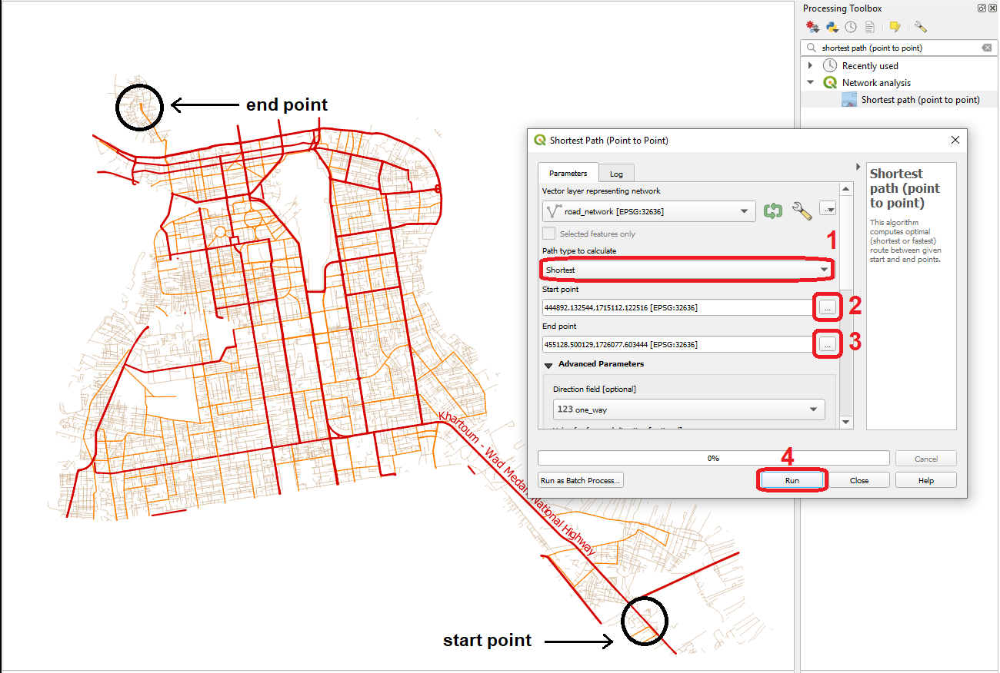

   Shortest path (Point to point) using shortest distance

Task 2 (optional)
   You may want to rename the output to something like *shortest_path_simple*. Also, consider changing the style (colour and/or width) This may become handy if you want to compare some of the outputs you obtain along this exercise.

Task 3
   Repeat the analysis described in Task 1, but this time using *Fastest* as the :guilabel:`Path type`, and making sure that under the :guilabel:`Advanced settings`, you indicate the field *max_speed* as the attribute to be used to calculate travel times. Just like before, **DO NOT** dismiss the tool dialog :numref:`shortest-path`.

.. _shortest-path:
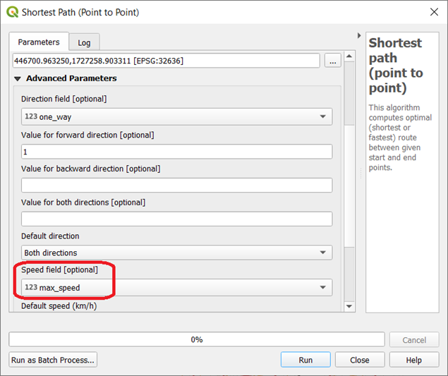

   The speed field option

Task 4 (optional)
   Consider to change the name and style of the output. For name, we suggest *fastest_path_simple*.

.. attention::
   **Question 1**
   You should now have two different routes showing the most efficient path :numref:`net-compare-short-fast-simpler`. You probably realized the cost functions used are different and therefore the results are not quite the same. On what are these cost functions based on? *[hint: check the values of  the ‘cost’ attribute of the two outputs]*

.. _net-compare-short-fast-simpler:
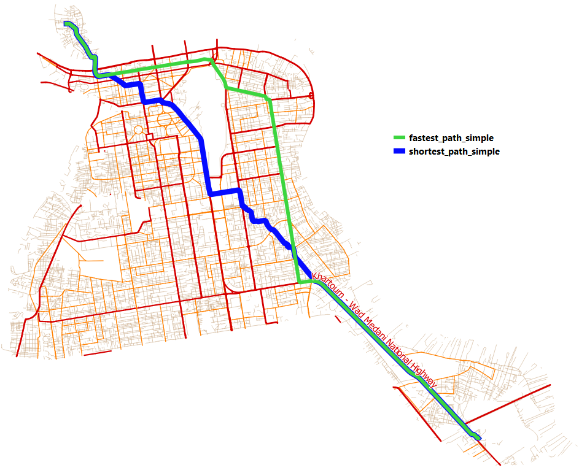

   Comparing the shortest with the fastest route

The results of a network analysis depend not only on the cost function but also on any restrictions that may apply. These restrictions take the form of obstacles that force the network analysis algorithm to look for an alternative.

What constitutes an obstacle greatly depends on the use case and travel modality you are analyzing. For example, in the case of road networks, what constitutes an obstacle depends on whether you are traveling by bicycle, car or even public transportation only. The classic example of a restriction are one-way roads. Let us look at an example.

Task 5
   Repeat the analysis described in Task 3. Make sure that under the Advanced settings you keep field *max_speed* as the attribute to be used to calculate travel times, adding the *one_way* attribute as the input for the :guilabel:`Direction field` and entering *1* under the :guilabel:`Value for forward direction` parameter :numref:`speed-field-oneway`.

.. _speed-field-oneway:
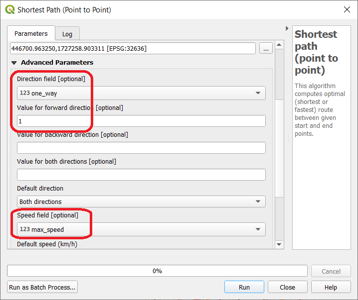

   Setting one way restrictions

Task 6 (optional)
   Consider to change the name and style of the output. For name, we suggest *fastest_path_restricted*.

Depending on what start and end points you are using, you might have sections of your route that take different roads due to the one way restriction, like in the example below, where the suggested route, when considering the one way restriction, takes a detour :numref:`net-fastest_restricted`.

.. _net-fastest_restricted:
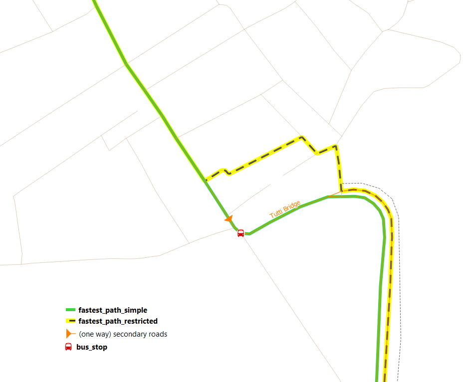

   Comparing fastest routes with and without one way restrictions

Advanced optimal path analysis
------------------------------

The previous section introduced the essential elements of optimal path analysis: cost functions and restrictions. We that understanding, we can extend the scope of our analysis and generate a collection of shortest paths from one origin to N destinations (or from N origins to one destination) in one go.

Task 7
   From the **Processing Toolbox**, filter the tools by **Shortest Path (Point to Layer)** and open the tool. For :guilabel:`Start point`, choose any building you wish, and for :guilabel:`Vector layer with end points` choose the layer *hospital*. Choose one of the cost functions and work on the remaining parameters as you prefer and click on **Run** button :numref:`net-point-to-layer`.

.. _net-point-to-layer:
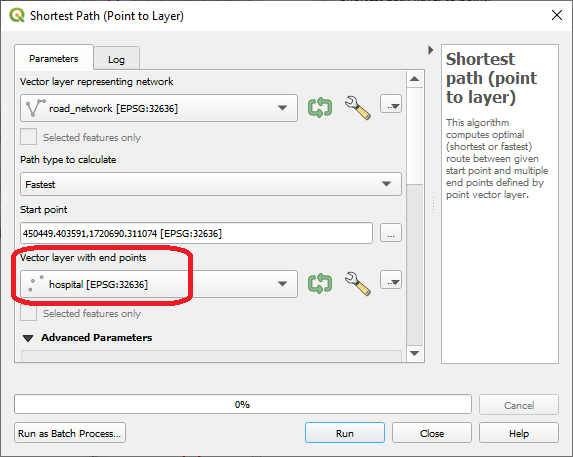

   The point to layer tool

The output will consist of a layer with a number of linestrings representing the most efficient route (according to the optimal path settings you chose) from the start point to the N destinations of the layer hospital :numref:`point-to-hospital`.

.. attention::
   **Question 2**
   If you invert the operation (i.e. if you use the **Shortest Path (Layer to point)** tool), will you get the same routes and the same costs?

.. _point-to-hospital:
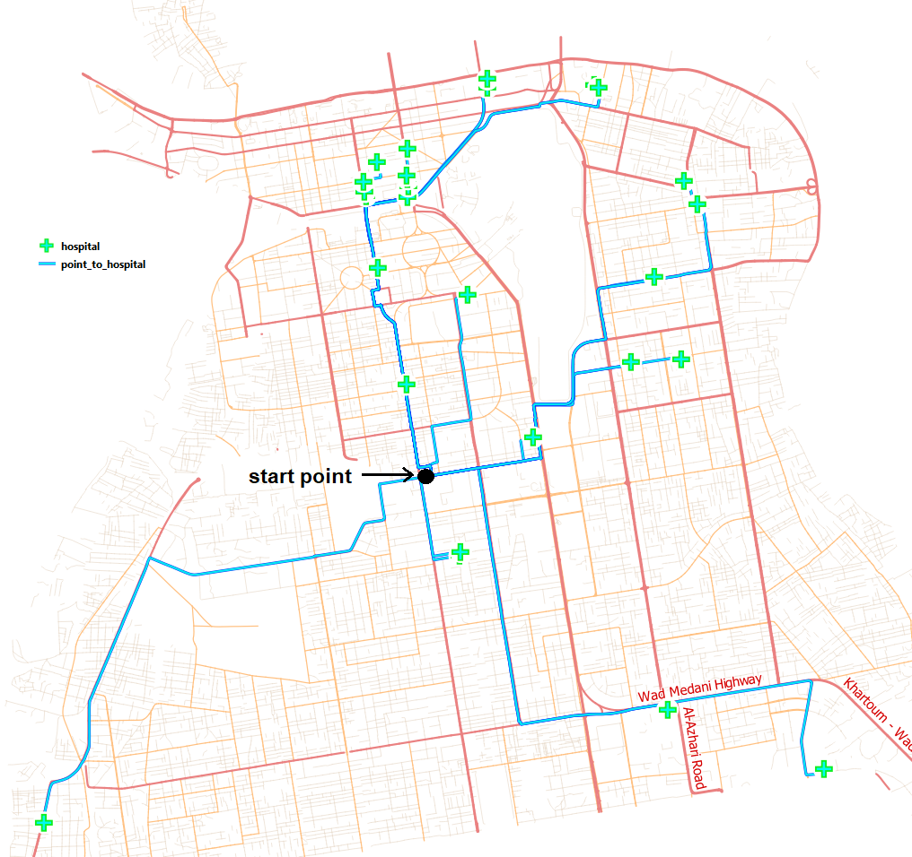

   Optimal paths from a start point to every hospital

We can also use the optimal path analysis to determine the best routes between N origins and N destinations. To demonstrate this, imagine a situation where for every school you need to determine what the closest bus stop is.

Task 8
   To conduct this analysis, you will need to install the **QNEAT plugin**. This plugin provides additional network analysis capabilities to QGIS. Once you install it, QNEAT tools will appear under the processing toolbox.

 For task 8, you may want to watch the video tutorial on `installing plugins in QGIS <https://vimeo.com/showcase/4389527/video/201997421>`_.

.. raw:: html

   
<iframe src="https://player.vimeo.com/video/201997421?color=007e83&portrait=0" style="position:absolute;top:0;left:0;width:100%;height:100%;" frameborder="0" allow="autoplay; fullscreen" allowfullscreen></iframe>

|
Task 9
   From the **Processing Toolbox**, search for **OD matrix from layer as lines (n:m)** and open the tool. Make sure you provide the *road_network* as the :guilabel:`Network`, *school* as the :guilabel:`From-Point Layer` and *bus_stop* as the :guilabel:`From-Point Layer`. For both point layers, indicate the attribute *fid* as the :guilabel:`Unique Point ID Field`. Finally, as for the :guilabel:`Optimization Criterion` (i.e. the cost function), choose *Shortest Path* :numref:`od-matrix-layers`.

.. _od-matrix-layers:
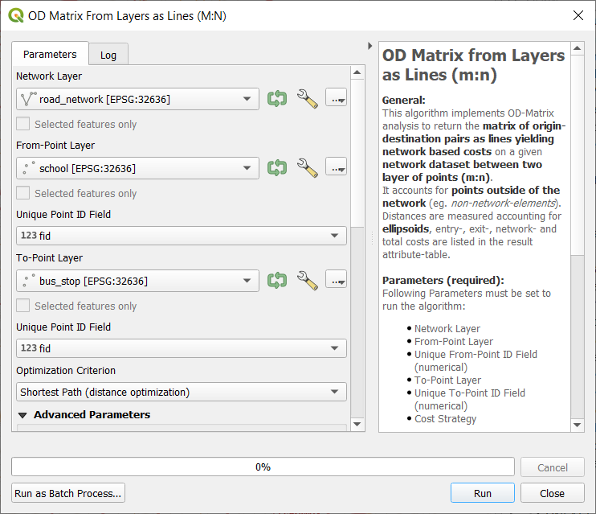

   The OD matrix from layer as lines tool dialog

The result might not be what you are expecting. The tool returns a Cartesian product where each combination is represented by a straight line and not the actually route :numref:`net-od-matrix-output`. However if you examine the attribute table the cost values you see are calculated over the network. In other words, the costs are not based on Euclidian distances as the straight-line representation might suggest.

.. _net-od-matrix-output:
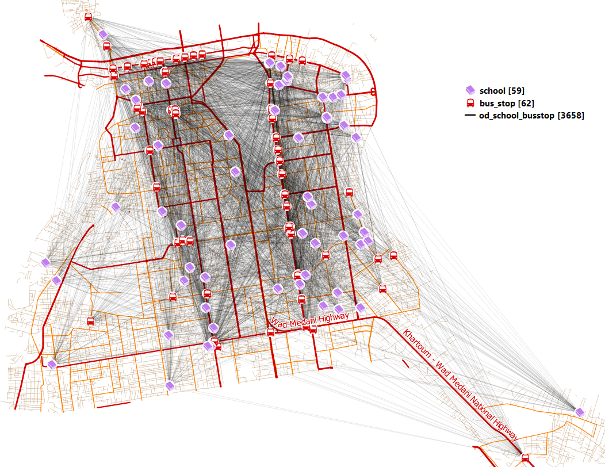

   The output of the OD matrix between schools and bus stops

If you want to obtain only the lines linking the schools to the closest bus stop, you can build a simple SQL query.

Task 10 (optional)
   From the **Processing Toolbox**, search for the tool **Execute SQL** :numref:`execute-sql`. Indicate the layer over which the SQL query will operate (that  will be the layer obtained from Task 9), and use the query below:

.. note::
   **SELECT** origin_id, destination_id, min(total_cost), geometry
   **FROM** *[name of the layer generated by Task 9]*
   **GROUP BY** origin_id

.. _execute-sql:
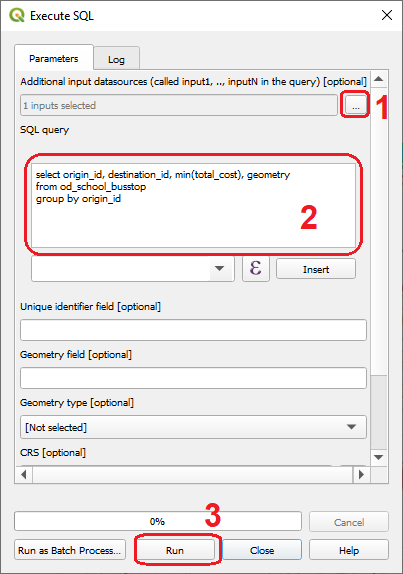

   Execute SQL

Depending on the style you apply to the output layer, you may see something like this :numref:`net-nearest-busstop` – a direct link between a schools and the nearest bus stop.

.. _net-nearest-busstop:
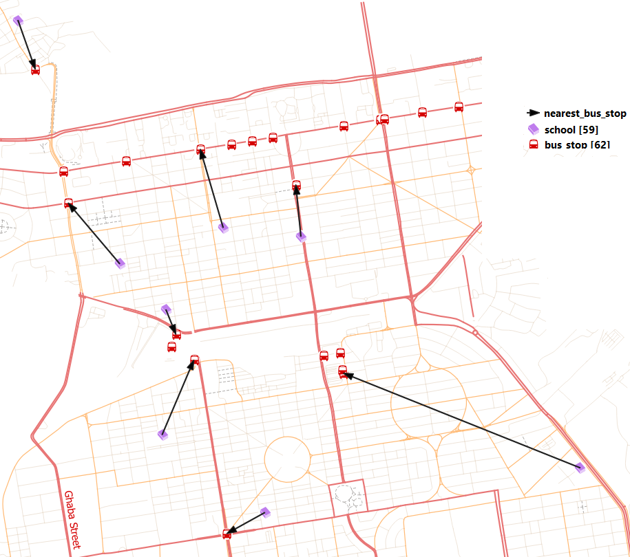

   Nearest bus stop

Network allocation
------------------

From the Living Textbook, you can read the following definition: *In **network allocation**, we have a number of target locations that function as resource centres, and the problem is which part of the network to exclusively assign to which service centre.*

Task 11
    From the **Processing Toolbox**, search for **v.net.alloc** and open the tool. Make sure you provide the *road_network* as the :guilabel:`Input vector line layer`, *hospital* as the :guilabel:`Centers Point layer Layer`. Leave the other paramters with their default values and hit **Run** :numref:`v-net-alloc`.

.. _v-net-alloc:
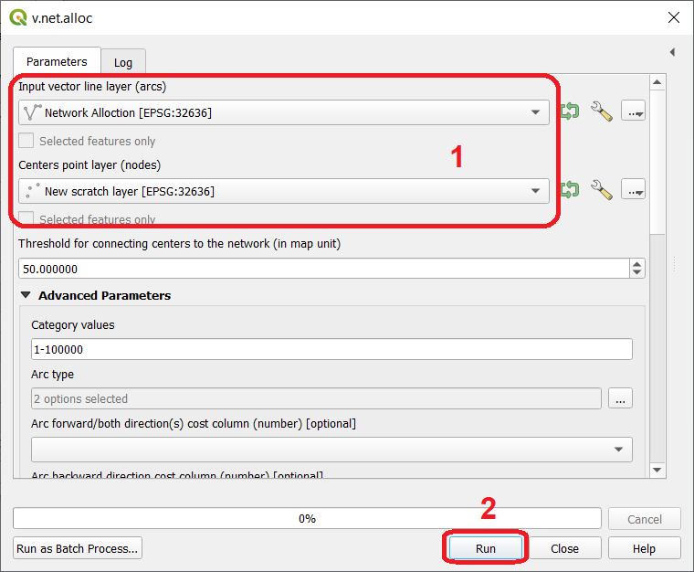

   The v.net.alloc dialog

Task 12
   Apply a categorized style to the output to better visualize the output :numref:`allocated-network`. Another option is to use the style file *network-allocation.qml* we provide along with the data for this exercise.

.. _allocated-network:
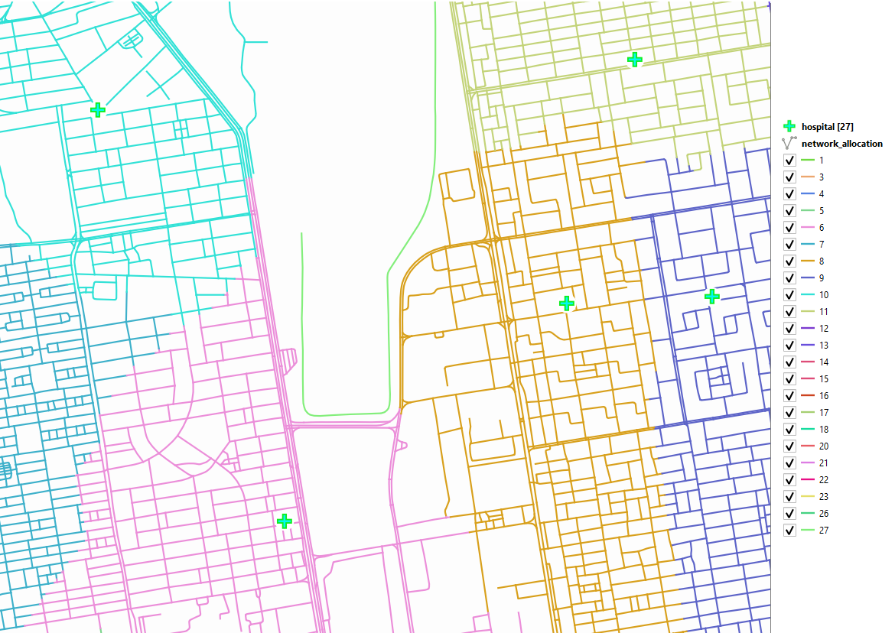

   The output of the v.net.alloc tool

The result is a partitioned network where each segment/line is assigned to the center whose cost to go to is lower than to any other center.

.. attention::
   **Question 2**
   What cost function did the v.net.alloc tool use?

A common form of network allocation is a service area. It uses network partitioning to determine which network elements are within a certain threshold from a center in order to determine a service area.

An important characteristic of service area analysis is that the underlying network allocation is not necessarily mutually exclusive. This means the resulting service area may be within the threshold of more than one service center.

To demonstrate this concept we will look at an example of a service area defined as time zones. The situation is as follows: you want to have an estimation of fire emergency response times, and for that, you want to know what areas are within 5, 10 and 15 minutes from a firefighter brigade.

Task 13
   From the **Processing Toolbox**, filter the tools by **Iso-Area as Polygons (From Layer)** and open the tool. Indicate the *road_network* as the Vector layer representing the network, the layer *fire_station* as the :guilabel:`Start points`, and the *fid* field as the :guilabel:`Unique Point ID Field`. Then provide the parameters of the analysis: *Fastest Path* as the :guilabel:`Path type to calculate`, *900* seconds (i.e. 15 minutes) will be the maximum :guilabel:`Size of Iso-Area`, with a : guilabel:`Contour Interval` of *300* seconds (i.e. 5 minutes). Finally, assume a :guilabel:`Default speed` of *15* km/H :numref:`iso-area-dialog`.

.. _allocated-network:
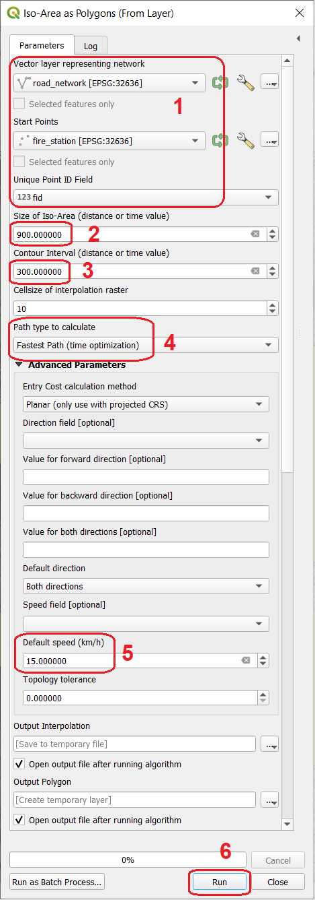

   The Iso-Area as Polygon dialog

As you can observe, the results show the areas that are within a certain distance but there is no indication of what is the closest fire station :numref:`service-area-firestations`.

.. _service-area-firestations:
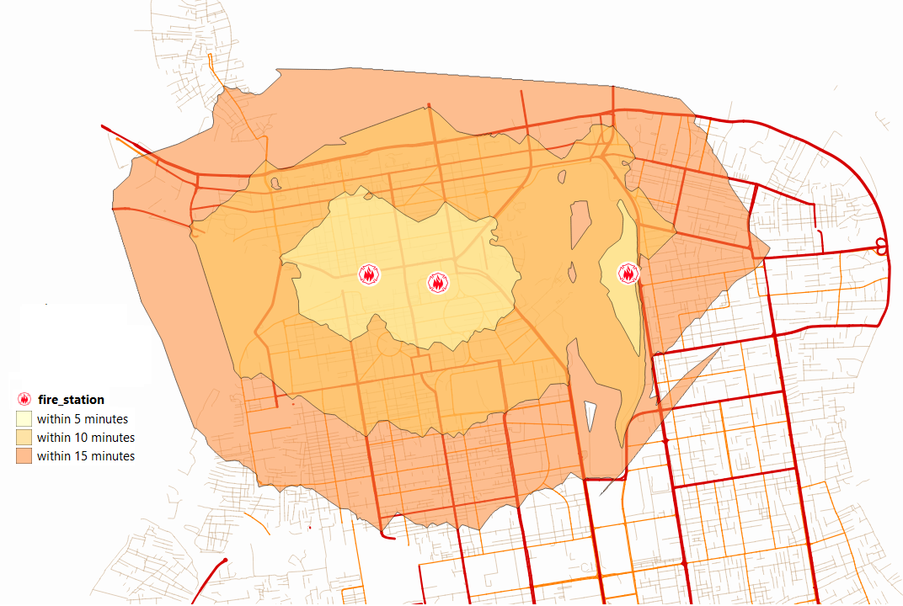

   Service area for fire stations based on time intervals

.. attention::
   **Question 2**
   The analysis you conducted in Task 12 has a few conceptual shortcomings. Can you name a few and discuss their impact in current analysis?

Trace analysis
--------------

Trace analysis is a type of network analysis that focus not only on connectivity – an essential topological characteristic of a network, but also on direction. To demonstrate the idea we will use the same type of example depicted in the Living Textbook – the case of hydrological networks.

In this type of networks, and assuming the network is topologically consistent, it is often useful to identify streams upstream or downstream in relation to a given point.

Task 14
   To conduct this analysis, you will need to install the **Flow Trace plugin**. Once you install it, a new button |flowtrace| will be added to the plugin toolbar – simply click on it to use the Flow Trace

Task 15
   Using the *Select feature tool*, select any network segment you wish. Then open the *Flow Trace* plugin and choose the :guilabel:`Direction` you want to do the tracing – *Upstream* or *Downstream* :numref:`net-flow-analysis`.

.. _net-flow-analysis:
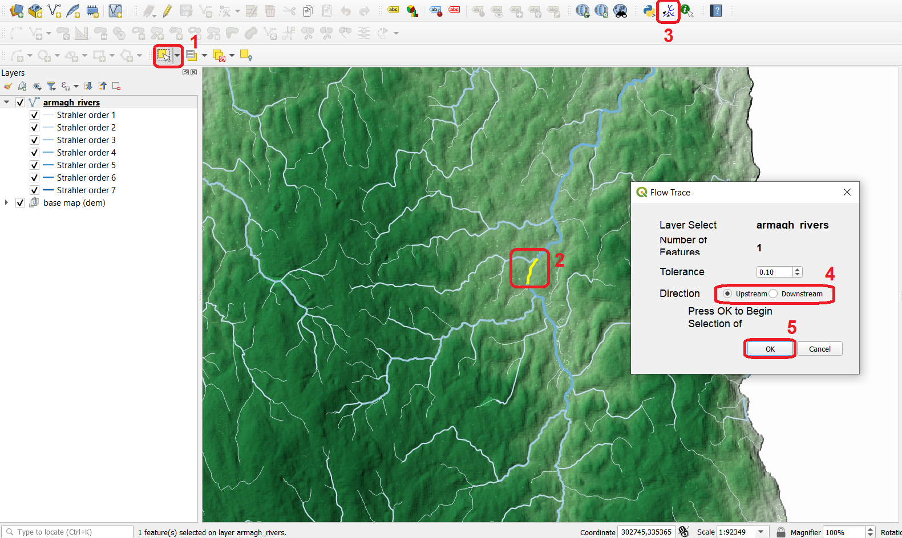

   Using the Flow Trace plugin

The result will be the selection of all the lines upstream, downstream or even both depending on what you do. :numref:`net-flow-analysis-output`.

.. _net-flow-analysis:
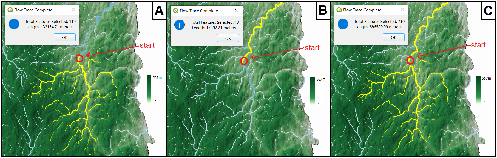

   Trace analysis example. [A] – upstream selection; [B] – downstream selection; [C] up and downstream selection

.. attention::
   **Question 2**
   What is the essential characteristic a network has to have – besides having all the lines connected - in order for trace analysis to be able to operate?

Challenge
---------

In the examples of network allocation, the problem was to know which network segments or which locations within the network, are closer or within a certain distance to certain number of centers.

What if the location of those centers is not yet decided? How to choose the candidate location for a center **in order to maximize the coverage of the service area?**

In your dataset you have three candidate locations for post boxes but they are still under discussion - You can only install one of them. Which of the three locations should be chosen considering:

A.	Demand is assumed to be coming from the buildings – that is where residents, services and industry are located. For the sake of simplification we aggregated buildings by `city blocks <https://en.wikipedia.org/wiki/City_block>`_  where **one city block = one demand point**; The demand is provided as a dataset named `demand_points.gpkg` – add it to your QGIS project.

B.	The chosen location should be the one that **serves at least 100 demand points**;

C.	The chosen location should have the **least aggregated travel cost** (the average of all the travel times from the candidate location to the demand points);

D.	People should not travel more than **2000m** to reach the post box;

E.	The analysis should be **based on distance only** as it is assumed most people within the 2000m.

.. sectionauthor:: André Mano

.. [1] Map data copyrighted OpenStreetMap contributors and available from https://www.openstreetmap.org on 11th February 2021
.. [2] https://data.gov.uk/dataset/c734ecd3-7603-4397-8da9-57e79e398599/northern-ireland-river-segments
.. [3] https://www2.jpl.nasa.gov/srtm/