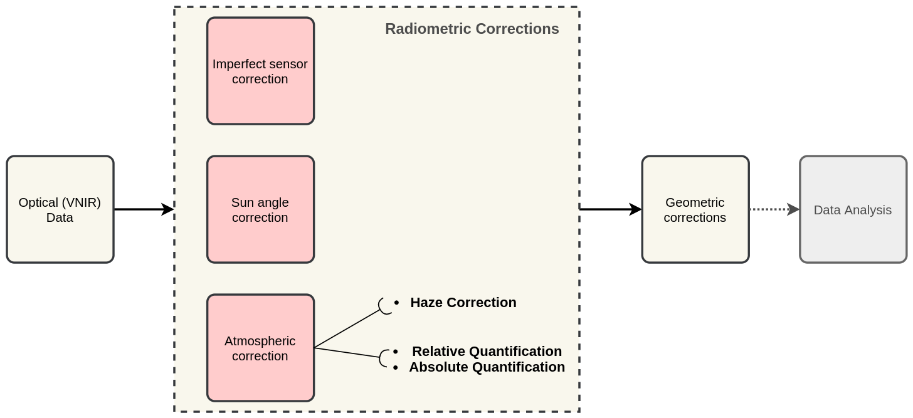

Radiometric Corrections
=======================

.. TODO: Looks ok to me even though you could use some filter kernels for imperfect sensor calibration and noise suppression (which is in your classification ‘correction’).

The procedures described in this section fall within the group of “pre-processing” techniques in image processing. They focus on correcting artefacts originated from atmospheric disturbances. 

As shown in :numref:`fig-corrections-wkf`, *radiometric correction* techniques are applied to Remote Sensing data before any *geometric correction*, and before performing the main *data analysis*. Radiometric corrections fall within three groups: |ltb| `Imperfect sensor correction <Correction of imperfections of a sensor_>`_, |ltb| `Sun angle correction`_ and |ltb| `Atmospheric correction`_.   
Atmospheric corrections are needed to “clean” the images from disturbances produced by water vapor, aerosols and gases in the atmosphere, and retrieve pure radiances from a target on the ground. A common technique for atmospheric correction is |ltb| `Haze correction`_.

.. _fig-corrections-wkf:

   A sequence of pre-processing steps to apply radiometric corrections on optical imagery

.. important::
   **Resources.**
   You will require the latest LTR version of `QGIS (A Coruna 3.10) <https://qgis.org/en/site/forusers/download.html>`_, plus the dataset `Data_Atmospheric_Corrections.zip <data_atmospheric_corr_>`_ which you can download from CANVAS.  When you unzip the dataset, you will find the following files inside: 
   
   + ``etm99.img`` – Scene from Landsat Enhanced Thematic Mapper, bands 1 to 4. Wadden islands, 1999.
   + ``pan.img``  – Scene from SPOT, panchromatic band.
   + ``tm89.img`` – Scene from  Landsat Thematic Mapper.

   These three images are provided with almost cloud-free skies, and the coordinate system is **EPSG: 32631**.

Haze correction
---------------

Task 1 
   Use the `Satellite and sensor database <https://webapps.itc.utwente.nl/sensor/default.aspx?view=searchsat>`_ and the file-properties to find information about the spectral specifications of *SPOT PAN, Landsat TM B1 to B4* and *Landsat ETM B1 to B4*. Then, complete the table below.

=====================       ============    ===========    ==============
Satellite/sensor            Filename(s)     Date            Resolution GSD
=====================       ============    ===========    ==============
SPOT/HRG panchromatic       PAN             03-Jul-1989
Landsat-5/TM                TM89            21-Dec-1989
Landsat-7/ETM+              ETM99           03-Nov-1999
=====================       ============    ===========    ==============

.. attention:: 
   **Question.**
   Are the spectral characteristics of the TM and ETM sensors different? 

**Haze has an additive effect to the overall image, which results in higher DN values.** Therefore, haze reduces the contrast of the image. Because this effect depends on :math:`\lambda`, its influence differs for each band. 
    
In the following task, we will assume that there is a real *blackbody* present in the images; and do a subtractraction to reduce pixel values to a minimum of zero.

Task 2 
   Open  ``etm99.img``, ``pan.img``, and ``tm89.img`` in QGIS. and take a look at the images. Display all images using **bands 4, 3, 2 for RGB** and *No Stretch*. Open the **Value tool** to explore the pixel values. 
    
   Assume that the blackbody in these images is *deep, clear and unpolluted water*. 
   The island in the images is surrounded by a tidal flat, which causes tidal currents with a tidal frequency. It is not easy to locate clear water around the island in such situations. We recommend using a body with following water as assumed-blackbody, for example the small lake on the island.
   
   Follow the steps below to complete the following table. You have to determine the **minimum values** for the assumed-blackbody (lake) on the images. 

   =====   =============   =========   =========   =========   ==============
   Image   Band 1 DN       Band 2 DN   Band 3 DN   Band 4 DN   Pan DN
   =====   =============   =========   =========   =========   ==============
   PAN     **n.a.** [1]_   **n.a.**    **n.a.**    **n.a.**
   TM89                                                        **n.n.** [2]_
   ETM99                                                       **n.n.**            
   =====   =============   =========   =========   =========   ==============

.. [1] Not available
.. [2] Not necessary

\

   1. Use the **Value tool** to read DN values. Note that the tool shows pixel values for all bands of the multispectral image. *Read the value for the proper band!*

   2. Select the *'ETM99'* image, go to Properties and change the symbology to single band grayscale for Band 4. Set minimum to 0 and maximum to around 40 to increase the contrast for the lowest DN values (these are objects with the lowest reflectance properties, which are more likely to be water).

   3. Zoom into the area around :math:`[lat, long] = [53.46145,5.652432 ] or [x, y] = [676191, 5927074]`, for comparison. This location is a small lake on the island and shows much lower values than most of the sea in the image. Search the lake for the lowest DN value. Keep a list of lowest values on scratch paper and copy these to the table.

   4. Repeat steps 2 and 3 for images *'PAN'* and *'TM89'*.

.. attention:: 
   **Question.** Compare the minimal value found in the lake or tidal flat with the minimum value in that band. 
   
   + Why is there a discrepancy between the values? Think about the spectral and spatial characteristics of the band and the spatial dimensions and spectral property of the object.

   + Why are there decreasing values for haze for *'ETM99'* from Band 1 to Band 4?
 
   + How can you explain the difference between the Haze values of the different images?

   +  What about the *'PAN'* image? What range on the spectrum does it cover? Does this relate to the observed difference between *'ETM99'* channels and the panchromatic channel? 

Task 3
   Correct the image for haze by subtraction values using the Raster calculator. In QGIS go to :guilabel:`Raster` > :guilabel:`Raster Calculator`. Specify the formula to subtract the Haze value from Band 4  of the *'ETM99'* image, and specify the name of the output file. 

   Select the newly created *Band 4 with haze correction* on the **Layers Panel**.  Go to  Properties and modify the contrast stretch as follows: **minimum: 0,  maximum: 255**. Do the same for the *Band 4  without haze correction.*

.. attention:: 
   **Question.**
   Compare the two versions of band 4  of the *‘ETM99’* image. Do they look different?

Verify that the histograms of the haze-corrected bands have shifted towards the origin. Both histograms have the same shape before and after haze correction, but a different location. It also shows that there are some pixels with DN values lower than the small lake on the island. These negative values should not exist in EO images, but they are caused by the fact that we use a GIS to do the calculation. Before continuing, we have to correct this artefact.

Task 4
   From the **Processing Toolbox**, use the SAGA module **Reclassify values (simple)** to set all negative values to 0. For :guilabel:`Grid` choose the *'haze-corrected'* layer, and for :guilabel:`Replace Condition` choose   ``[0] Low value <= grid value < high value``. 
   
   Edit the Lookup table; add a row and enter :math:`-255` for *Low Value*, :math:`0` for *High Value* and :math:`0` for *Replace with*. Just like int he table below. Click :guilabel:`OK` > :guilabel:`Run`.   This will replace all values in the range  :math:`[-255,0]` with 0, and produce a new raster layer.

   .. image:: _static/img/task-fix-table.png 
      :width: 360px
      :align: center

Task 5
   Calculate the Haze correction for all bands of *‘ETM99’*, for band 4 of *'TM89*' and the *'Spot PAN'*, including the reclassification.

.. attention:: 
   **Question.**
   Suppose you had a SPOT image with the values for the channels that correspond to R, G, and B. Would the Haze values be different than those in the TM scene? Why or why not?

Sun Angle Correction
--------------------

So far we have corrected for haze by simplifying the illumination formula, such as:

.. math::

   DN = (T\sigma +  T\delta_i)R_i 

The sun angle determines the amount of irradiance per unit area on the ground. We can correct for sun angle attenuation by normalising the sun angle to a zenith situation.  We do this by dividing the image values by the sine of its sun elevation angle (in degrees). This correction will result in slightly higher values: 

.. math::
   DN' = \frac{DN}{sin(\sigma)}

Where :math:`DN` is the input pixel, :math:`DN’` is the output pixel value, and :math:`\sigma` is the sun angle. Note that because the angle is smaller than :math:`90˚` the sine will be smaller than 1 and as a result :math:`DN’ > DN`.

In case you have many images with various sun angles, you can calibrate them to the zenith.  Or you can select one of the images, which serves as a reference for sun angle correction and correct the other to match the reference sun angle.

Absolute Sun Angle Correction
*****************************

Usually, you will find the sun elevation angle :math:` \sigma` in the header file of the images. However, this time, we provide you with the value for the *'SPOT PAN'* image, in the table below.

.. attention:: 
   **Question.**
   What is the sine for the :math:`\sigma`  of the *’SPOT PAN’* image you used  in the previous section
   Write the answer in the table below.

   ======   ======================     ===================
   Scene    :math:`\sigma`             :math:`sin(\sigma)` 
   ======   ======================     ===================
   PAN      :math:`58.9^{\circ}`
   ======   ======================     ===================

Task 6
   Use the **Raster Calculator** to correct for the sun angle on the *’haze-corrected SPOT PAN’* image. 

Task 7
   Locate some particularly dark and bright pixels with the **Value tool** in the *’SPOT PAN’*, and examine the difference between *haze-corrected* and *haze-and-sun-angle-corrected* values.

.. attention:: 
   **Question.**

   + In which way have the values of the *haze-corrected* and *haze-and-sun-angle-corrected* images changed? Are the changes constant, linear, or exponential? Were the changes predictable?
   + Why did we apply haze correction before sun angle correction? Does the other of these corrections make a difference?
   + In case of multiband images, we do not need to calculate the sun-angle separately for each of the bands. Why not?

.. sectionauthor:: Wan Bakx
