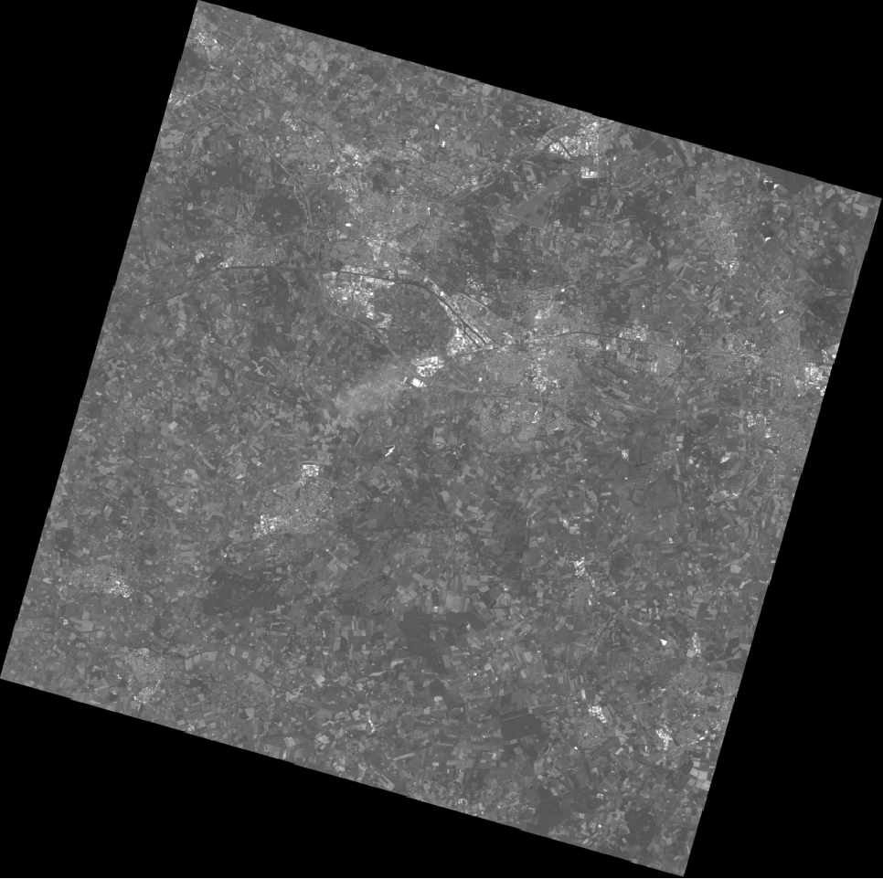
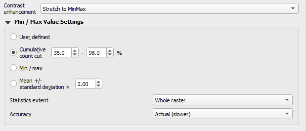
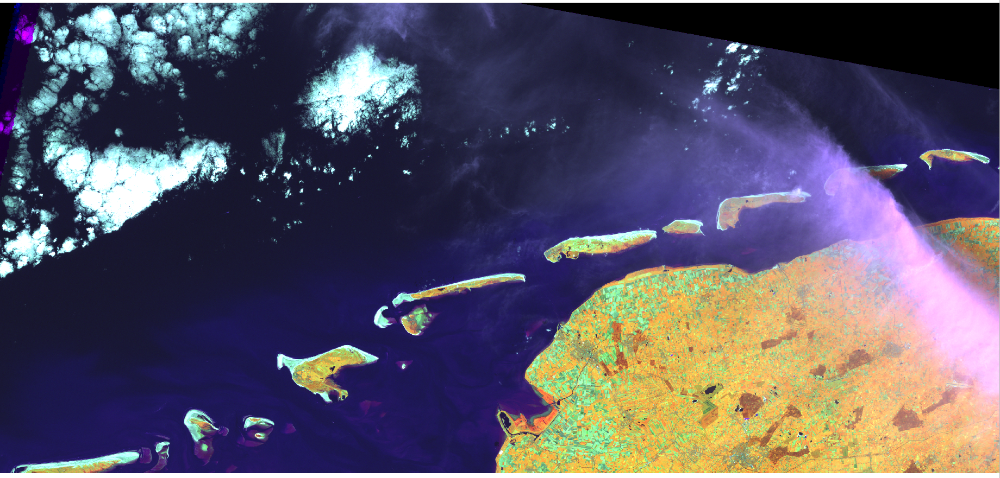
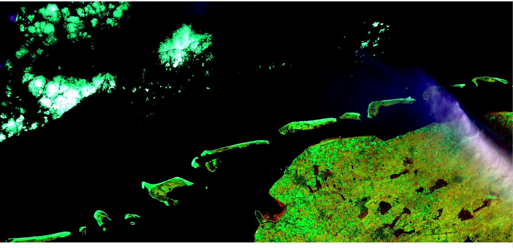
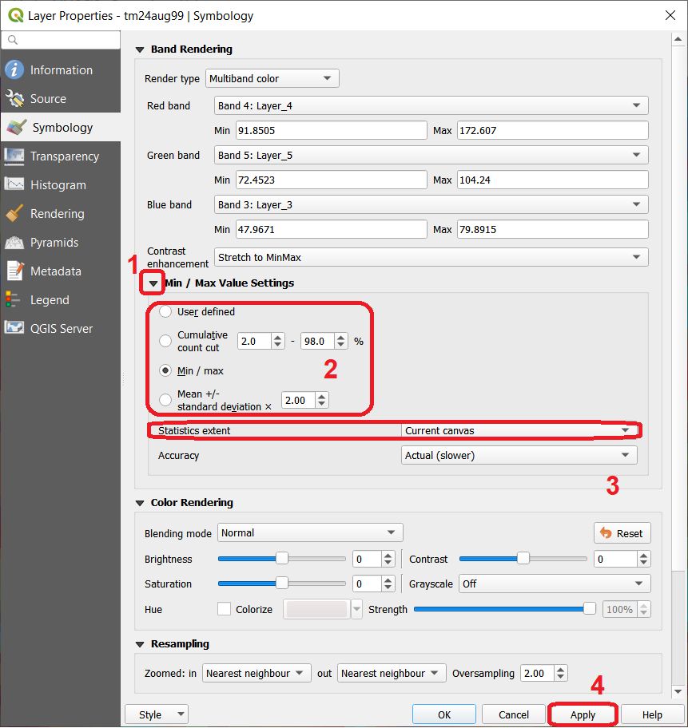
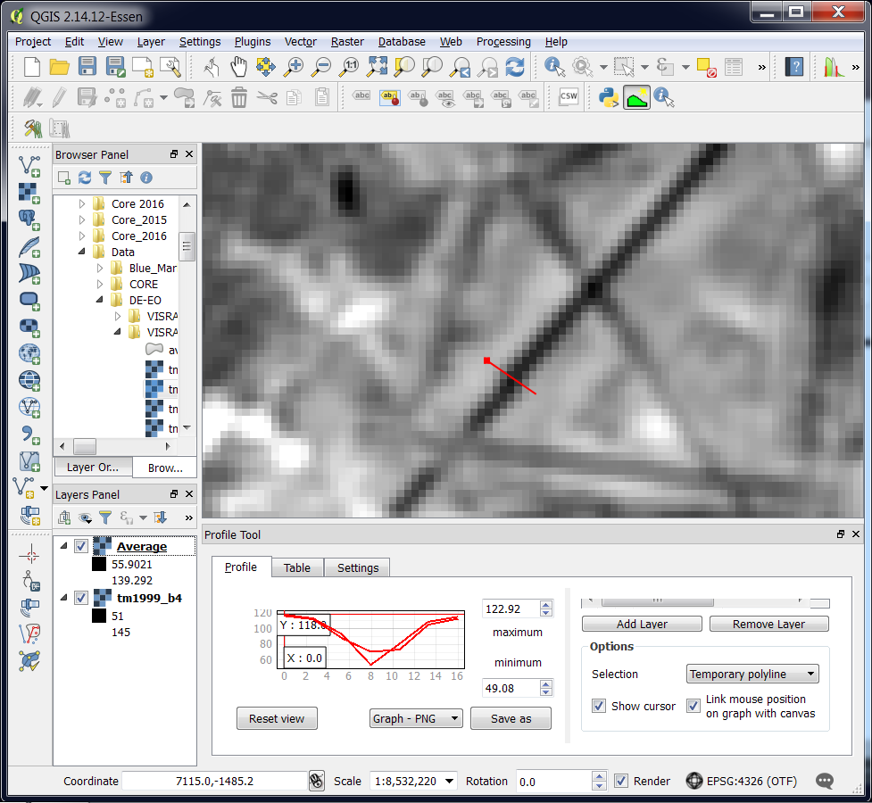
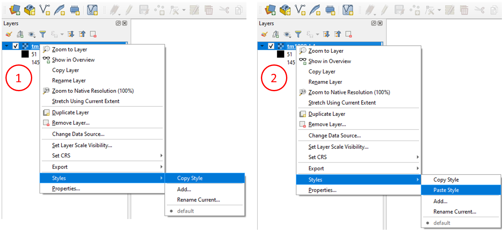

Radiometric Operations
======================

A |ltb| `Radiometric operation`_ uses or changes the values the pixes in an image. In this section, you will apply some of the most common radiometric operations in image processing. But first, you need to get familiar with how sensors capture  |ltb| `Electromagnetic radiation`_ and how we can |ltb| `Display an image <Image display_>`_ based on the |ltb| `Tri-stimuli theory`_. And how we represent colour on paper using the principles of the |ltb| `Subtractive colour system`_.

Image Display
-------------

.. important::
   **Resources.**
   You will require the latest LTR version of `QGIS (A Coruna 3.10) <https://qgis.org/en/site/forusers/download.html>`_, plus the dataset `data_histogram_operations.zip <data_histogram_ops_>`_ which you can download from CANVAS.  When you unzip the dataset, you will find the following files inside: 
   
   + ``SPOT270611.img`` – SPOT 5 image with 4 spectral bands.
   + ``tm24aug99.img``  – TM image of the 24th of august 1999.
   + ``tm24aug99_sub.tif`` –  a subset of tm24aug99.img
   + ``topo34f.img`` – scan of a topographic map in RGB.

We can **enhance** the visualisation of images through well-known plugins and providers available in QGIS. In this exercise, we will make use of some of the QGIS tools. *Note that none of these tools changes the actual values stored in the raster datasets*. They simply change the way the image is displayed to highlight features that are not obvious when using the default visualisation settings.
 

Task 1
   Disable the default contrast stretch. Go to :guilabel:`Settings`  > :guilabel:`Options` > :guilabel:`Rendering` tab and scroll down to Contrast enhancement. 
   
   Set the algorithms  *Single band grey, Multiband colour (byte/band) and Multiband colour (> byte/band)* to **No Stretch**. Set the *Cumulative pixel count cut*  to :math:`2.0` and :math:`98.0\%`. Click :guilabel:`OK` to confirm. See Figure :numref:`fig-set-render` 

.. _fig-set-render:
.. figure:: _static/img/task-set-render.png
   :alt: redering settings
   :figclass: align-center

   Changing the default settings of contrast enhancement to 'No Stretch'

Single Band Display & Relative Brightness
^^^^^^^^^^^^^^^^^^^^^^^^^^^^^^^^^^^^^^^^^

In general, remote sensing images can be displayed using |ltb| `Pseudo colour`_  and |ltb| `Colour composite`_. A common colour composite is the so-called |ltb| `True Colour`_. Single-band display uses **pseudo colour**.

Task 2
   Create a new QGIS project and open the ``topo34f.img``. 
   If required, change the colour composite for this layer such that Hydrographic elements like water bodies display in cyan colours (use the legend in the right down corner as reference). :guilabel:`Right-click` on the layer > :guilabel:`Properties` >  :guilabel:`Symbology`; change the band selection for Red, Green and Blue to *Layer_1,  Layer_2, and Layer_3.*

Task 3
   Add the  ``Spot270611.img`` to the project.   Change the display from the default *Multiband colour* to *Singleband Gray* and select ‘Band 1’ as the *gray band*. :guilabel:`Right-click on the layer` > :guilabel:`Properties` > :guilabel:`Symbology` > :guilabel:`Render type` > :guilabel:`Singleband gray` > :guilabel:`Apply`. The band will be displayed in a greyscale with poor contrast. See Figure :numref:`fig-greyscale`

.. _fig-greyscale:

   Displaying band 1 of ‘Spot270611.img’ as greyscale

\

   Then, set min and max values for the contrast stretch. Set **contrast enhancement** to *Stecht to MinMax*. Select *Cumulative pixel count cut* and set the limits to :math:`35\%` and :math:`98\%`. Set **Accuracy** to  *Actual (slow)*. See Figure :numref:`fig-minmax`. Click :guilabel:`Apply`. This will copy the DN values associated with 35 and 98 cumulative percentages the Min and Max of the contrast, respectively.

.. _fig-minmax:

   Contrast enhancement with ‘Stretch to MinMax’

\

   We chose a :math:`35\%` for the minimum because the raster file does not contain image data values for3 the whole scene. Approximately :math:`35%` of the image includes pixels with a DN Value of 0, which in this case means **No Data**. After applying the settings above, the image will look like this:

   .. image:: _static/img/contrast-minmax-result.png 
      :align: center

\

   Repeat the previous task. This time apply a *MinMax Stretch* to all bands of  ``Spot270611.img``. You can copy a layer by doing right-click on the *’Spot270611.img’* and then choose *Duplicate*.  Rename each layer name such that it includes the band number, see the example below.

   .. image:: _static/img/task-copy-layer.png 
      :align: center

Task 4
   Compare the results of each band by toggling the visibility of the layers off and on.  Give special attention to the comparison of band 3 and band 2. These two bands are displayed with similar composition, and jet they look quite different from the others. This proves that those bands captured different spectral properties.

Task 5
   Use the topographic map ``topo34f.img`` to find areas in the ``Spot270611.img`` with Water (Cyan), Buildings (Purple) and Evergreen Forest (Green with overprinted symbols). Then, identify the relative brightness in each of the four bands associated with the areas listed above. Fill in the table below.

   Do not spend too much time in identifying representative objects and filling the table. Remember that the decision, whether something is grey or light grey is subjective; thus use the same subjectivity when you fill in the table. If you think a class is represented with more than one brightness, you may select more boxes.

   .. image:: _static/img/task-cover-table.png 
      :align: center

.. note:: 
   **Reflection.**
   While working on the previous task, you should have noticed that different classes of land cover may have similar or different brightness within a specific spectral band. Moreover, the same class of land cover may have different brightness in other bands. 

Multiband Display: Colour Composites
^^^^^^^^^^^^^^^^^^^^^^^^^^^^^^^^^^^^

This section will help you to understand the relationship between the spectral property of a class, the selection of spectral bands for visualisation, and the choice of spectral bands in a colour composite. 
Suppose you have a **SPOT XS** image which includes land cover the types: soil, vegetation and water. Such an image will be displayed with a *contrast stretch* with the band combination of 3, 4 and 2 for RGB. 

.. attention:: 
   **Question.**
   Which colours will the land cover types above will have in the colour composite mentioned above? You were introduced in the lecture on how this works for one and two spectral bands. Now it is your turn to predict the case for a 3-bands colour composite.

   Use the reflectance curves below to estimate how much each of the three land cover types will reflect relative to each other, for each of the *’SPOT XS’* bands.
   
   For this, assume that there are no other land cover types in the image; i.e. the land cover with the highest reflectance will have the highest Digital Number in a band. Thus, it will be displayed with the highest brightness (i.e., math:`DN=255`). Likewise, the land cover with the lowest reflectance in a band will be displayed with the lowest brightness (i.e., math:`DN=0`). For the land cover types that fall between reflectance values, use linear interpolation to estimate its brightness value.

   .. image:: _static/img/spectral-curves-bands.png 
      :align: center

Task 6
   Copy RGB brightness values that you estimated into the table.  Then use an  `RGB calculator  <https://www.w3schools.com/colors/colors_rgb.asp>`_ to determine the approximated colour of each land cover type in this colour composite.

   ================  ===============   =================    ================     ===================
   Major land cover  Band 3 (Red)      Band 4 (Green)       Band 2 (Blue)        Colour in composite
   ================  ===============   =================    ================     ===================
   Dry-bare soil
   Vegetation
   Water
   ================  ===============   =================    ================     ===================

.. note:: 
   **Reflection.**
   *Based on only theoretical knowledge, you can predict the colour of a land cover type in a colour composite.* This is assuming there are no other land cover types present in an image, which may have a lower or higher reflectance. Take the time to understand this statement and study the topic once more if necessary. You could also discuss this topic further in the virtual classroom.

In the previous task, you determined the relative brightness for three types of land cover. Then, you determined the theoretical colour in a specific colour composite. In the following task, you will compare the theoretical colour for water and vegetation with the actual colour in the image when using a colour composite.

Task 7
   Open the ``Spot270611.img`` in QGIS and use a band combination of 3, 4 and 2 for Red, Green and Blue. Set the contrast enhancement to :math:`35\%` and :math:`98\%` for all bands. Use **Actual (slower)** for *Accuracy*, as shown below.

   .. image:: _static/img/task-spot-composite.png
      :align: center

\

   Zoom in to the image so that you can easily confirm what colour was assigned to water. Also verify whether the theoretical colours, determined in the previous section, match the colours that you see in this colour composite.

.. attention:: 
   **Question.**
   When comparing the theoretical colours and the result of the colour composite,  you will find out that there are discrepancies. **What could be the courses behind such discrepancies?**

.. note:: 
   **Reflection.**

   You should realise that by knowing the relative **spectral reflectance** of a class in every spectral band helps to understand and interpret images. Such spectral reflectance is visualised as relative brightness. Moreover, you could predict, for a given sensor, the ranges of DN values for a specific object, if you know and understand the spectral properties of such objects.

   Some type of land cover might have similar or the same spectral reflectance property in specific ranges of the Electromagnetic (EM) spectrum. The integration of more bands in the analysis,  and the assessment of the spectral properties in other ranges of the EM spectrum, can result in the successful discrimination of more types of land cover. This is true not only in the case of land cover but also for many other objects in a remote sensing image.

-----------------------------

Image Enhancement by Histogram Operations
-----------------------------------------

|ltb| `Image enhancement`_ describes a set of operations that aim to improve the way certain features in an image are displayed. 
One method to enhance images, for interpretation or analysis, uses |ltb| `Histogram operations <Histogram operation_>`_. These operations use the |ltb| `Histogram`_ of an image to control how it is displayed, and they are usually known as **global contrast enhancement operations**.

.. important::
   **Resources.**
   You will require the same dataset as in the previous section: `data_histogram_operations.zip <data_histogram_ops_>`_. 
   
   + To experiment with contrast enhancement, we will use a TM image of the 24th of august 1999, ``tm24aug99.img``. This image covers a large water body and different types of land cover,  and it has areas covered by clouds. 

Contrast Stretching
^^^^^^^^^^^^^^^^^^^

 Task 8
   Display the  ``tm24aug99.img`` using the band combination 4, 5 and 3. Set the *Stretch to MinMax* to a *Mean +/- standard deviation* of  :math:`2.0`, and the *Accuracy* to **Actual (slower)**; as shown below.

   .. image:: _static/img/task-sdeviation-stretch.png
      :align: center

Task 9
   Zoom in to an area covered by clouds over the mainland (centre right). Go to :guilabel:`Layer Properties` >  :guilabel:`Symbology`. Change the :guilabel:`Statistics extent` to *Current canvas* and :guilabel:`click OK`.

   Click on **Zoom Full** |zoomFullExtent| to zoom out to see the whole image. Instead of seeing clouds in whites and pinks,  you now can see clouds in several colours. 

   

   Top: Image 'tm24aug99' with global contrast enhancement. Bottom: Image 'tm24aug99' with local contrast enhancement for clouds

.. attention:: 
   **Question.**
   Do you also think that the mainland is displayed in a not-so-good way?

Task 10
   Zoom into an area with mostly land and some water,  and re-apply the same  *Contrast enhancement* method as before. You can use the context-sensitive option **Stretch using current extent** as shown below, but verify that it does what you intend.

   .. image:: _static/img/task-apply-stretch.png
      :align: center

You will notice a change in contrast in the image. This is because the part of the image that is currently visible include different types of land cover; thus, different local statistics. The results of a contrast stretch based on local statistics changes when the range of values used in the computation changes.

Task 11
   Set the **Contrast enhancement** back to *Mean +/- standard deviations* and the **Statistics extent** to  *Whole raster*. Then, right-click on the *’ tm24aug99’* layer and do :guilabel:`Export` > :guilabel:`Save as...` For  **Output mode** select *Rendered image* and enter a self-explanatory name for the output file. Save the file to an existing folder. The file will automatically be added to the Map View.

.. attention:: 
   **Question.** 
   Is the exported image different from the original ``tm24aug99.img``? 
   
   Compare the properties of the two files, especially the histograms. Determine whether they only look-alike, or if they are the same. You can use the **Value tool** for the comparison by setting it up in such a way that the tool shows the values of the same band for both images, as shown below.

   .. image:: _static/img/value-tool-byband.png
      :align: center

Choosing Min and Max values
^^^^^^^^^^^^^^^^^^^^^^^^^^^

To choose the *min* and *max* values for a contrast stretch, the user has to consider which areas of an image are of interest, or which types of land cover are relevant for specific purposes.

Task 12
   Remove the exported image from the project; keep only the original image. Zoom into an area on the mainland which is primarily dark orange/brown; they represent areas with forest.
   Then, on Layers Panel, :guilabel:`right-click` the original image > :guilabel:`Properties` > :guilabel:`Symbology` > :guilabel:`Min / Max Value Settings`.  Set the :guilabel:`Statistic extent` to **Canvas extent**. See Figure  :numref:`fig-canvas-extent`. Click :guilabel:`Apply`. This will compute the histogram statistics only of the par to the image that it is visible in the Map View. Notice that there are other options to compute statistics than just *Min/Max*. For example *'Mean +/- standard deviation'*.

.. _fig-canvas-extent:

   Applying local statistics for histogram stretching based on the 'Canvas extent'.

.. note:: **Reflection.**
   To correctly apply contrast enhancement for specific types of land covers, you need to know which are the types of interest. What their spectral signatures are; the specifications of the spectral bands of the sensor which you have chosen; and you need knowledge of additive colour mixture.

Task 13
   Add the ``tm25aug99_sub.img`` to the project, and display it using a band combination 4, 5 and 3. this image covers shallow water and land with various types of land cover. Analyse the histograms of the three bands for this image; :guilabel:`right-click` on the layer > :guilabel:`Properties` > :guilabel:`Histogram`. Compute the histogram if necessary. Then, :guilabel:`Prefs/Actions` > :guilabel:`Show selected band` and choose the band you want to inspect.

.. attention:: 
   **Question.** 
   In which band on display do you expect a significant difference in DN Values between water and land? Use your knowledge on EM radiation. A bi or tri-modal trend in the histogram is an important clue.

Task 14
   Use the histograms to identify approximate values for a *contrast stretch* which will enhance the contrasts between types of coverage on the part of ``tm25aug99_sub.img`` with land. Save the result using :guilabel:`Export As..` > :guilabel:`Rendered image`. Remove the resulting layer from the project.
 
Task 15
   Repeat the previous task. This time use the histograms to set a contrast that will enhance the image for distinguishing shallow water.

.. note:: 
   **Reflection.**
   It should be clear to you that for some contrast enhancement methods,  statistics of the data play an important role, e.g. mean and standard deviation, minimum and maximum. However,  when you know the spectral properties of the objects of interest, the characteristic of the scene, and the sensor; you can interpret the histograms directly and make improvements to make effective use of the brightness values in an image.

------------------------------------

Image Enhancement by Filter Operations
--------------------------------------

|ltb| `Filtering`_ describes a set of radiometric operations used to enhance images.  Filters are applied to images for the sake of |ltb| `Noise reduction`_, |ltb| `Edge Detection`_, and |ltb| `Edge enhancement`_.

.. important::
   **Resources.**

   You will require the latest LTR version of `QGIS (A Coruna 3.10) <https://qgis.org/en/site/forusers/download.html>`_, plus the dataset `Data_Filter_Operations <data_filter_ops_>`_ which you can download from CANVAS.  When you unzip the dataset, you will find the following files inside: 
   
   + ``tm1999_b4.tif`` – A scene from band 4 of the Landsat TM. Enschede in 1999.
   + ``tm1999_xs_ml_classification.tif`` – Classification of the types of land cover in Enschede. From Landsat TM 1999.
   + ``SW-NE_3x3.txt`` – Definition of a custom filter.

QGIS offers the possibility to apply all kind of filter kernels on images which are displayed in a viewer. In this exercise, we will use tools that apply filters and store the output as temporary files. In such a way, we can easily compare different results.

Task 16
   Install the **Profile tool** plugin. Go to :guilabel:`Plugins` > :guilabel:`Manage Install Plugins`, and install the plugin.

Task 17
   Set the default contrast stretch to use the :math:`2 \%` and :math:`98 \%` of  the cumulative pixel count for grayscale images. In the :guilabel:`Settings` menu, go to :guilabel:`Options` > :guilabel:`Rendering` tab. Scroll down to :guilabel:`Contrast enhancement settings`, and set the default value for **Single band gray** to *Stretch To MinMax*. Then, set **Limits (minimum/maximum)** to *Cumulative pixel count cut*. Make sure that the cut limits are set to :math:`2.0 \%` and :math:`98.0 \%`. Click :guilabel:`OK`.

.. note::
   **QGIS.**
   QGIS is not specifically tailored for Remote Sensing and does not provide filter tools directly. Such filtering tools are available through the processing toolbox using external providers like *SAGA* and *GRASS*.

   *For an overview on how to use the Processing Tools in QGIS, watch the* `introduction to processing <https://vimeo.com/album/4389527/video/204013568>`_ video tutorial.

   .. raw:: html

      
<iframe src="https://player.vimeo.com/video/204013568?color=007e83&portrait=0" style="position:absolute;top:0;left:0;width:100%;height:100%;" frameborder="0" allow="autoplay; fullscreen" allowfullscreen></iframe>

Task 18
   In the :guilabel:`Settings` menu, go to :guilabel:`Options` > :guilabel:`Processing` and check that you have the SAGA and GRASS providers enabled.

Linear Filters 
^^^^^^^^^^^^^^

Smoothing Filter
****************

 Task 19
   Apply a linear filter to the *’tm1999_b4’* image. In QGIS, open the  ``tm1999_b4.tif``. Your project should assume the same Spatial Reference System as the image (*EPSG:32632 WGS84/UTM zone 32N*). In the **Processing Toolbox**, open the SAGA tool called **User defined filter**. 

   Confirm that *’tm1999_b4’* is the input and click **Default filter matrix (3x3)** to open an empty filter kernel. Enter the weights of an *average filter kernel*. Ensure that the sum of weights is equal to 1. Confirm with OK. In the **User defined filter dialogue** execute the kernel by clicking OK. The output is added to the Map View as a temporary file. 

   In the **Layers panel** right-click the *’Filtered Grid’* layer and rename to *’Average’*.

.. attention:: 
   **Question.** 
   Which kernel weights did you use in the previous task? Write them down.
   
   .. image:: _static/img/3by3.png
      :width: 160px
      :align: center

Task 20
   Explore the filter results around the Twente Airport. Reset the zoom to fit the image to the **Map View**. Next, change the scale, in the box at the bottom of the Map View, to :math:`1:75,000`.  
   
   Zoom in to the major runway of the *Twente Airport*. See Figure :numref:`fig-smoothing`.

   We will use the **Profile tool** to compare the results of the average filter and original image. If you do not know how to install the *Profile Tool* plugin, watch the video tutorial on `installing plugins in QGIS <https://vimeo.com/showcase/4389527/video/201997421>`_.

.. raw:: html

   
<iframe src="https://player.vimeo.com/video/201997421?color=007e83&portrait=0" style="position:absolute;top:0;left:0;width:100%;height:100%;" frameborder="0" allow="autoplay; fullscreen" allowfullscreen></iframe>

\

   Start the Profile tool. Select one of the layers in the **Layer Panel**. Zoom into the centre of the image and draw a profile (line) across the major runway. Click on **Add Layer**. Select the other layer in the **Layers panel** and click on *Add Layer* again.

.. _fig-smoothing:

   Comparison of the result of a smoothing filter to 'tm1999_b4.img'  using the 'Profile tool'

.. attention:: 
   **Question.**
   Just by looking at the graph of the Profile tool,  can you tell which profile belongs to the layer with the average filter?

Task 21
   Draw profiles at different locations, and confirm your knowledge of the effects of applying an average filter (smoothing) to the image.
  
Gradient Filter
***************

Task 22
   Use the **User defined filter** tool to apply a filter using the weights in the figure below, to the original *'tm1999_b4'* layer. Rename the resulting layer to *'Laplace'*.

   .. image:: _static/img/laplace-kernel.png
      :width: 160px
      :align: center

.. error:: 
   You will notice that the output of the Laplace filter contains many pixes with *No Data* (hollow pixels). Possibly, you also noticed an error message when executing the filter. This is an issue with the tool itself, possibly a bug. Please, ignore the *No Data* pixels this time and concentrate on the outcome in the rest of the image.

.. attention:: 
   **Question.**
   
   + Is the kernel above a detection kernel? If yes, what does it detect?
   + Does the layer resulting from the previous task contain the same brightness as the original image for area objects?

Task 23
   Examine the result of the Laplace filter. Toggle on and off the visibility of the *'Laplace'* layer to check what has happened. Zoom in to the edge of the image until you see individual pixels.  Toggle the visibility of the *'Laplace'* layer again.

.. attention:: 
   **Question.**
   What phenomena do you observe? Can you explain it?

Task 24
   Open the histogram of the ‘*Laplace’* layer. Go to :guilabel:`Properties` > :guilabel:`Histogram`; check the values in the image.

.. attention:: 
   **Question.**
   Around which value does the histogram has its centre?

Task 25
   In the **Profile** tool add the *’Laplace’* layer and toggle the visibility for the other layers. Confirm that the filter kernel detected two edges, i.e. both sides of the runway.

The *’Laplace’* layer looks rather artificial. The brightness of the original image is gone; the lighter and darker areas in the original have now a common grey tone and high contrasting pixels at the edges. This filter has detected the changes (edges) between local lighter and darker pixels. The circular build of the kernel that you applied, i.e. all negative weights around the centre with positive weight,  detected changes in all directions.

.. note:: 
   **Reflection.**
   We can use the output values of an edge detection kernel to discriminate **edges with high contrast** and **edges with low contrast**. For example,  a field with relatively low values and a neighbouring field with relatively high values will result in edges with high contrast. In comparison, edges with low contrast may be the result of adjacent pixels which have a slightly different value. You could use a threshold to select only edges with high contrast and delimit the edges between areas or fields.

   Directional filter kernels have **positive** and **negative** weights, and their output values could be positive or negative. Positive values represent edges which correlate positively with the kernel, negative values represent edges which correlate negatively – ‘ they are opposite to’ –. We can also use the sign of the values to discriminate different classes or types of edges. 
   
   If you do not understand these statements, review the lecture material once more.

Edge Enhancement
****************

Task 26
   Repeat the steps of the previous task, but this time use kernels with the following values for the centre: 12, 16 and 200. Increasing the centre value will increase the weight of the centre pixel in the original image. When using a value of about 16 for the centre pixel; the kernel will calculate the Laplace enhancement of the image. Then, the resulting layer will look like the original image.

Custom Filters
**************

The Laplace kernel detects edges in all directions. We can also define kernels which detect edges in specific directions. In the next task, you will use a costume filter defined in a text file. Check the content of  ``SW-NE_3x3.txt`` by opening in a text editor.

.. attention:: 
   **Question.**
   Which are the weight of the filter define in ``SW-NE_3x3.txt``?  Write them down.

   .. image:: _static/img/3by3.png
      :width: 160px
      :align: center

Task 27 
   In the Processing Toolbox, use the **r.mfilter** tool of GRASS  to detect edges in a specific direction.  Use the file ``SW-NE_3x3.txt`` as *Filter file*.  

   Check the results and confirm that one of the runways of the *Twente Airport*  was not detected at all! Also, ensure that the edges of the main runway were detected. The result should show positive values on one side of the runway and a negative on the other. This is because of the correlation of the results with the positive and negative weights in the kernel. 

   Notice also, that the edges in the resulting layer have a slope and a direction. In this case, the kernel has detected edges in the SW-NE direction. 

Enhancement using Non-linear Filters
^^^^^^^^^^^^^^^^^^^^^^^^^^^^^^^^^^^^

Rank-Order Filter
*****************

Task 28  
   In the Processing Tools, look for the SAGA  **Rank filter**.  Select the *’tm1999_b4’* layer as the input grid. Set the *Search Mode* to *Square* and a Radius of 1. Use a *Rank (Percent)* of 50. This settings essentially define a **median filter**. Execute the filter.
   
   Use the **Profile tool** to inspect the results and confirm the difference between the original image and the result of the *Average and Median* filters. Pay special attention to locations where you expect variations, for instance, around the edges between areas. 

Majority Filter 
***************

Task 29 
   Add the ``tm1999_tm_xs_ml_classification.tif`` into the Map View; this layer contains a set of classes representing land cover. You will notice that there are many isolated pixels inside some homogeneous areas. For example, the yellow pixels identify maise, which usually does not grow in such small parcels.
 
   In the **Processing Toolbox**, open the **r.neighbors** tool. Select *’tm1999_xs_ml_classifciation’* as input raster and set the neighbourhood operation as *’mode’* (also known as **majority filter**).
   
   The results will be shown as greyscale or black and white. You can apply a pseudocolour to visualise the results properly. Copy the style of the  *’tm1999_xs_ml_classifciation’* into the result of the majority filter layer. See :numref:`fig-copy-style`  

   In the **Layer panel**, right-click on the *’tm1999_xs_ml_classifciation’*  layer and copy the style. Then, right-click on the majority filter layer and paste the style. 

.. _fig-copy-style:

   Copying the style between two raster layers in QGIS

Task 30
   Toggle the visibility of the filtered result and compare it with the original landcover layer. Confirm that most isolated pixels have disappeared, and that thin lines of pixels surrounded by homogeneous areas also disappeared (e.g. a runway in the Twente Airport). The main runway should still be distinguishable.
 
.. attention:: 
   **Question.**
   Can you explain why one of the small runways of the Twente Airport disappeared after applying a majority filter?

Task 31
   Use the **r.neighbor** to compute another mode filter on the *’tm1999_xs_ml_classifciation’* layer. This time use a neighbourhood of size :math:`5`; which is to apply a :math:`5 \times 5` kernel. Compare the result of this filter with the :math:`3 \times 3` majority filter.

.. attention:: 
   **Question.**
   What do you observe when comparing results of  :math:`3 \times 3` and  :math:`5 \times 5` majority filters around the main runway of the Twente Airport?

Task 32
   Experiment with the application of consecutive filters. Apply a :math:`3 ~\times~ 3` majority filter to the results of the already existing *'3x3 majority'* filter layer. Compare these results with the result of applying a single :math:`5 \times 5` majority filter. You should see that the results are not the same.

.. note:: 
   **Reflection.**
   In summary. You should acknowledge that in the case of neighbour operations, such as the majority filter. The results change depending on the size of the kernel, and the number of times a filter is applied to a dataset.

.. sectionauthor:: Wan Bakx, André Mano & Manuel Garcia Alvarez