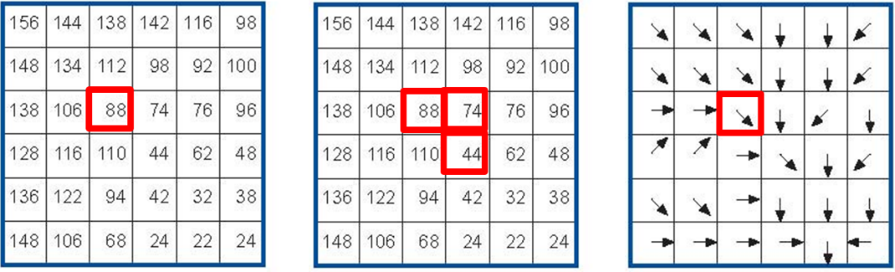

Raster Analysis
===============

.. _sec-reclass:

Reclassification
----------------

Start this section by reading about the general aspect of |ltb| `Reclassification`_.

.. attention:: 
   **Question.**
    
   + Explain in your own words, which are the differences and similarities between classification and reclassification? 
   + What is the difference between reclassification of vector data and reclassification of raster data?

When applying a reclassification to a raster layer, you often reduce the number of different cell values and group them into class values. Through reclassification, the level of detail in a raster input layer can be reduced and reveal general patterns in a dataset. 
There are different classification methods for raster datasets, two of those are |ltb| `User controlled classification`_ and |ltb| `Automatic reclassification`_. 

.. attention:: 
   **Question.**
   
   + In which type of classification is post-processing relevant?
   + How does post-processing relate to the concepts of aggregation, merging, and dissolving?

Automatic Classification
------------------------

.. important:: 
   **Resources.**
   You will require the latest LTR version of `QGIS (A Coruna 3.10) <https://qgis.org/en/site/forusers/download.html>`_, plus the dataset `raster-analysis.zip <raster_analysis_>`_ which you can download from CANVAS.  For this section, you will need the following files: 

    + ``classification.qgs`` – a QGIS project preloaded with the datasets described below;

        + ``classes.tif``

Task 1
    Below, you see a raster layer represented as an array of values. Classify the values by applying the *equal interval* and *equal frequency* techniques. Use five classes and write down the classified values in the boxes below. A good approach is to draw a raster attribute table first, which indicates the values and their frequencies, and then determine the new class values. 

    .. image:: _static/img/task-reclass.png
       :align: center

Task 2 
    The input layer mentioned in the previous task, it is also provided in the exercise’s dataset. Open the project *'Classification'*,  then from the :guilabel:`Layers panel`, right-click over the layer classes, and apply a symbology using an **equal interval** classifier, :numref:`fig-auto-class`. Repeat the previous steps, and this time apply a **quantile classifier**. Compare the results.

    .. _fig-auto-class:
    .. figure:: _static/img/task-auto-class.png
       :alt: automatic classification
       :figclass: align-center

       Step to perform automatic classification via the symbology window.

----------------------------------

Manual Classification
---------------------

You can also manually control the number of classes and the ranges of values belonging to each class. You can do this using the controls in the same menu as before, and for example, change the **mode** or the number of **classes**. You can directly type different values for each class. :numref:`fig-manual-class`.  Additionally, you could define reclassification rules that will create a new raster.

.. _fig-manual-class:

   Manual classification using the symbology window.

.. note:: 
   **QGIS.**
   When You classify a raster using the symbology menu, you are not changing the pixel values; you are merely grouping the pixels for visualisation purposes. If you want to generate a raster whose pixel values are actually overwritten according to whatever rules you decide, then you have to create a new raster using the steps in the next task.

Task 3 
   Say you want to create a new raster which group values (reclassify) according to what we shown in :numref:`fig-manual-class`. That is 3 classes ( :math:`class1 =1,  class2 = 2 \ to \ 6,` and :math:`class3 = 7 \ to \ 9`). Go to :guilabel:`Processing toolbox` > :guilabel:`Classify by table` and write down the reclassification rules as shown in :numref:`fig-class-table`.

.. _fig-class-table:

   Steps for creating a raster using Reclassify by table

.. note:: 
   **QGIS.**
   We highly recommend that at this point you install the **Value Tool Plugin**. It allows you to see the pixel values of all the active raster at the current location of the mouse pointer. :numref:`fig-result-reclass`

   .. _fig-result-reclass:
   .. figure:: _static/img/result-reclass.png
      :alt: result reclassify by table
      :figclass: align-center

      Result of applying a manual classification using Reclassify by table

   Please refer to the QGIS training manual, section `Installing Plugins <https://docs.qgis.org/3.10/en/docs/training_manual/qgis_plugins/fetching_plugins.html>`_, or watch to the video tutorial on `Installing Plugin in QGIS <https://vimeo.com/showcase/5716094/video/201997421>`_.

   .. raw:: html

      
<iframe src="https://player.vimeo.com/video/201997421?color=007e83&portrait=0" style="position:absolute;top:0;left:0;width:100%;height:100%;" frameborder="0" allow="autoplay; fullscreen" allowfullscreen></iframe>

\

.. attention:: 
   **Question.**

   + If we have pixels whose values are not covered by any reclassification rule, what value will it be assigned to those pixels in the new raster?  
   + Will the new raster delete those pixels (i.e. null), assign a random value, preserve the original value, or something else?

   + To test your understanding on classification techniques; imagine you are going to make a map showing the “happiness” of the countries of the world, as of 2012. You want to reclassify the data on happiness. Below you see a map and a scatter plot of the data. What reclassification technique would you apply and why?

   .. image:: _static/img/happiness-map.png
      :align: center
    
   \

   .. image:: _static/img/happiness-plot.png
      :align: center

-----------------------------------------------

Raster Overlay
--------------

During the vector exercise, you were already introduced to the concept of overlaying. In case you need to refresh your memory, check |ltb| `Overlay Analysis`_.

|ltb| `Raster Overlay`_ operations can be classified into four groups: **Arithmetic, Boolean and Logical, Conditional,** and **Decision tables**. All of these methods are cell by cell operations. 

.. important:: 
   **Resources.**
   You will require the latest LTR version of `QGIS (A Coruna 3.10) <https://qgis.org/en/site/forusers/download.html>`_, plus the dataset `raster-analysis.zip <raster_analysis_>`_ which you can download from CANVAS.  For this section, you will need the following files: 

   + ``overlay.qgs`` – a QGIS project preloaded with the datasets described below;
      
      + ``suit1.tif``
      + ``suit2.tif``

Arithmetic operators
^^^^^^^^^^^^^^^^^^^^

Imagine you want to find a location for a new house. You have two criteria: close to a school and in a safe neighbourhood. You prepared two input layers;  *'suit1'*  contains information about the closeness to schools, and *'suit2'*  contains information about the safety of neighbourhoods. 

When using arithmetic operators to combine multiple raster layers, it is imperative to evaluate the input values of the layers. In case the layers represent suitability indicated as *zero=”not suitable”* and *one=”suitable”*, arithmetic operators can be used to combine these input layers via raster overlay; :numref:`fig-suit12`. You may wonder how you would get such a binary input layer. A suitable method is to use a :ref:`sec-reclass`   to convert your input layer into a suitability layer with only relevant classes.

.. _fig-suit12:
.. figure:: _static/img/suit1-suit2.png
   :alt: suit1 suit2
   :figclass: align-center

   Values of two suitability layers for the location of a new house. Left: 'suit1'. Right: 'suit2'

.. attention:: 
   **Question.**

   + Which arithmetic operators can you use to combine these layers and obtain a suitable location for the new house?
   + How many different output values will you get in your out layer?
   + What would be the total suitable area in your output layer?

Task 4 
   The layers shown  in :numref:`fig-suit12`  are also available as raster layers in the exercise’s dataset. Open the project ``Overlay.qgs`` and conduct an arithmetic overlay using *'Suit1'* and *'Suit2'* as input layers.  You will need the **Raster Calculator** :numref:`fig-raster-calc` Then check the results. 

.. _fig-raster-calc:

   The Raster Calculator

Comparison and Logical Operators
^^^^^^^^^^^^^^^^^^^^^^^^^^^^^^^^

You may already be familiar with both Comparison (e.g. ``=, >, <=``) and Logical operators (e.g. ``AND, OR, NOT``). They were introduced as part of attribute selection using SQL. 

Assume that the input layers for a raster overlay, have not been classified as suitable or unsuitable yet, rather they contain other values. In the example of the location of a new house. The values might represent the perception of safety in each neighbourhood,  and the distance to schools. 
Then, values of distance would be continuous (floating point), and values of safety would be discrete (integer). See :numref:`fig-safety-school`.

.. _fig-safety-school:
.. figure:: _static/img/ras-safety-school2.png
   :alt: safety school rasters
   :figclass: align-center

   Raster layers representing safety of neighbourhoods (left), and distance to schools (right)

Task 5
   Write down an expression to combine the raster layers in :numref:`fig-safety-school`, using comparison and logical operators. Note that the size of these layers is not the same, but they do overlap. Assume that for the raster on the left (safety), pixels with values of 3 and 7 are suitable. For the raster on the right (distance to schools), pixels with values below :math:`1000` are suitable.

Task 6
   The layers are available in the exercise’s dataset: ``classes.tif`` (safety) and ``dist2.tif`` (distance to schools). Try out your expression in the **Raster Calculator.**

.. attention:: 
   **Question.**
   
   + How many output cells are suitable?
   + What is the extent of the output raster layer? 
   + What is the range of output values?

Conditional Operators and Decision Tables
^^^^^^^^^^^^^^^^^^^^^^^^^^^^^^^^^^^^^^^^^

In the previous type of overlay, the output value was always either zero (un-suitable) or one (suitable). Yet sometimes, you would like to generate values expressing the degree of suitability. For example,  where one is not so suitable, three is reasonably suitable, and ten is perfectly suitable. Such a thing is not possible using the type of analysis discussed in the previous section. We achieve such analysis by using **conditional statements** and **decision tables**.

.. note:: 
   **QGIS.**
   In the **Raster Calculator**, conditional statements are implicit in the output of other operators. For example, if given two raster, *'raster1'* and *'raster2'*, we want as output the sum of  pixel values of *'raster1'* and *'raster2'*, whenever the value of a pixel in *'raster1'* is more than then 5.  We can use the follow expression:

   .. code-block:: prolog
      :linenos:

      (( raster1@1 > 5) * raster1@1 + raster2@1)

   **Explanation.** 
   ``(raster1@1 > 5)`` states a condition that will return 1 (*True*) when a pixel in *'raster1'* is more than 5, and 0 (*False*) otherwise. Then, we retrieve the original pixel values in *'raster1'* by using a multiplication  ``( raster1@1 > 5) * raster1@1``. If the pixel in *'raster1'* is more than 5, it will return a 1, and 1 multiplied by any number will always return that number. 

   Finally, ``+ raster2@1``  adds values in *'raster2'* to the values of *'raster1'*, after applying the condition stated by the comparison operator.
   You can see more examples in the `QGIS documentation <https://docs.qgis.org/3.10/en/docs/user_manual/working_with_raster/raster_analysis.html#raster-calculator>`_. 

Task 7
   Using the case explained in :numref:`fig-safety-school`, write down an expression for the raster calculator that uses conditional statements to produce an output raster with different levels of suitability. Define at least three suitability levels.

An alternative to conditional statements is using decision tables. Decision tables are often used when there are many input raster or when the output raster contains classes with a value that are the result of meeting different conditions. See an example in the bottom of the explanation on |ltb| `Raster Overlay`_.

Task 8
   Rewrite the conditional statement from the previous task using a decision table.

.. attention:: 
   **Question.**
   What is the difference between reclassification based on an input table and the Decision Tables discussed above? 

---------------------------------------------------

Raster Measurements & Computations
----------------------------------

There are several questions related to |ltb| `Raster Measurements`_ that can be answered using raster analysis. For example.

+ How far are two locations?
+ How long is this line?
+ What is the distance to the nearest point?
+ What is the area closed to this point?

.. important:: 
   **Resources.**
   You will require the latest LTR version of `QGIS (A Coruna 3.10) <https://qgis.org/en/site/forusers/download.html>`_, plus the dataset `raster-analysis.zip <raster_analysis_>`_ which you can download from CANVAS.  For this section, you will need the following files: 

   + ``distance.qgs`` – a QGIS project preloaded with the datasets described below;

      + ``raster_points.tif``
   
   + ``surface_analysis.qgs`` – a QGIS project preloaded with the datasets described below;
   
      + ``mount_etna_dem.tif`` – a Digital Elevation Model

Distance
^^^^^^^^

Distance, in a raster layer, can be measured as **“Euclidean”** or **“cell centre to cell centre”**. Euclidean distance is measured from the cell centre of the origin-cell to the cell centre of the destination-cell in a straight line. However, for some operations, we use a distance measured from the cell centre of the origin-cell to the cell centre of an adjacent cell until reaching the cell centre of the destination-cell. 

Task 9
   Below you see two pictures. In each picture, two marked cells. Draw a line to represent the distance between the two cells. For the one *on the left*, use the concept of Euclidean distance. For the one *on the right*, use the concept of 'cell centre to cell centre".

   .. image:: _static/img/task-ras-dist.png 
      :align: center

.. attention:: 
   **Question.**
   How far are the two cells, from the previous task, when the size of a  cell (resolution) is :math:`10 \times 10 \ m`? 

Task 10
   Compute the distance over a raster layer. Open the project ``distance.qgs`` You will see a layer named *'raster_points'*. Go to :guilabel:`Raster` > :guilabel:`Analysis` > :guilabel:`Proximity` and generate a raster distance map. Answer the following questions:

   + Is it possible to select which type of distance you want to measure? 
   + Is the **Proximity** tool calculating the Euclidean distance or cell centre distance?

   Make sure the *'raster_points'* layer is on top and use the **Value tool** to inspect the pixel values; :numref:`fig-ras-dist` . It will make it easier to interpret the data.

.. _fig-ras-dist:

   Inspecting the distance raster

Computation of Diffusion
^^^^^^^^^^^^^^^^^^^^^^^^

The computation of |ltb| `Diffusion`_ differs from distance computation in the sense that diffusion takes into account both distance and **resistance**. Diffusion is also referred to as the least accumulated cost distance, where cost refers to the resistance factor.

The following elements are essential to understand diffusion:

+ It requires two inputs. One input contains the source(s) cells layer, and the other contains the *resistance or cost* layer.
+ Distance is calculated from *cell centre to cell centre*. Because there is a difference between distances between the cell centres of the neighbouring cells,  i.e. the distance of diagonally adjacent cells is longer, we have to take this into account. 
+ It determines the minimal cost of arriving at a particular cell. If there are multiple paths to reach a cell, diffusion calculates the value for each cell, but it will assign the lowest value.

Below you see an explanation of the computation of diffusion.

   .. image:: _static/img/diff-1.png 
      :align: center

   .. image:: _static/img/diff-2.png 
      :align: center

Task 11
   The best way to learn how the computation of diffusion works is by doing it manually. Use pencil and paper to compute the diffusion on the raster layers represented below. 

   .. image:: _static/img/task-diffusion.png 
      :align: center

Task 12
   You can also experiment with the computation of diffusion in QGIS. In a previous task, you created a distance layer using the *'raster_points'* layer. Here, you will use that distance layer as a *resistance layer* (In QGIS this is called 'cost layer'). Go to :guilabel:`Processing Toolbox` > :guilabel:`r.cost`, and provide the inputs as depicted in the screenshot below; :numref:`fig-rcost` The tool will generate more than one output, ignore all of them except for the *'cumulative cost'* layer.

   With the help of the **Value tool**, inspect the values of the pixels of the proximity map and of the *'cumulative cost'* layers. Make sure you understand what those values represent.

.. _fig-rcost:

   Calculation of diffusion using the 'r.cost' tool

.. attention:: 
   **Question.**
   Can you give some examples of applications that might use the computation of diffusion?

Flow Computation
^^^^^^^^^^^^^^^^

Flow computation calculates the flow along the least-cost path for each cell. Contrary to diffusion, which computes the spread of some material in all directions, flow computation is suitable to calculate the path that water will take when flowing downhill.
The procedure consists of two steps: 
   
   1. Calculation of the flow direction raster
   2. Calculation of the accumulated flow

The input for flow computation is a continuous field (raster), e.g. a DEM. The computation of the **flow direction** goes as follows. See :numref:`fig-flow-comp` 

   For each cell in the input raster layer (e.g.,  cell 88), we determine the smallest direct neighbour (cell 74) and the smallest diagonal neighbour (cell 44). Then, we calculate the difference between the target cell and the neighbours, such as :math:`88  - 74  =   14 \ m` and :math:`88  –  44  = 44 \ m`. Then, we calculate the steepness of the neighbours. For this, we take into account the distance between the cell centres. If the resolution is :math:`10 \times 10  \ m`, we can calculate the steepness as :math:`14/10  =   1.4` for the direct neighbour, and as :math:`44/10  * \sqrt{2}  =  3.11` for the diagonal neighbour. Now, we know to which cell some material in the target cell (cell 88) will flow. *This is to cell 44 because it is the cell where the steepness is the highest.* 

To compute the **flow accumulation**, we count for any given cell, how many other cells flow into it for the whole extent of the flow direction raster. For the target cell in :numref:`fig-flow-comp` , the flow accumulation is 7. Read a more detailed explanation on |ltb| `flow computation <Flow_>`_.

.. _fig-flow-comp:

   An illustration of the flow computation in a DEM

Task 13
   Compute the flow direction and flow accumulation for the elevation raster below. Use a pencil and paper.

   .. image:: _static/img/task-flow.png 
      :align: center

-------------------------------

Surface Analysis
----------------

|ltb| `Surface Analysis`_ consists of computations such as Slope angle, Slope aspect, Hillshading, etc. A common factor among these computations is they require continuous input surfaces (e.g., elevation), and they can tell the user something about the change or shape of this surface. 

Task 14
   Open the project ``surface_analysis.qgis`` and use your software to compute the *slope angle, slope aspect and hillshade* of the elevation raster *'mount_etna_dem'*. We recently updated the dataset, *if you cannot find this file download the dataset* `raster-analysis.zip <raster_analysis_>`_ *again*.  Use the tools under **Raster terrain analysis** in the Processing toolbox, :numref:`fig-ras-terrain`. Once you have the outputs, use the **Value Tool** to analyse the results.

.. _fig-ras-terrain:

   The raster terrain analysis tools

.. sectionauthor:: Ellen-Wien Augustijn, André da Silva Mano
