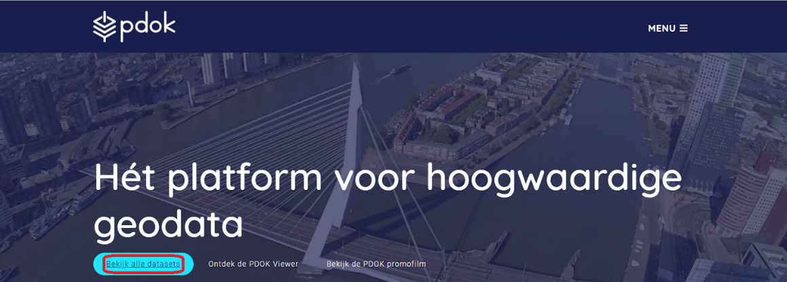
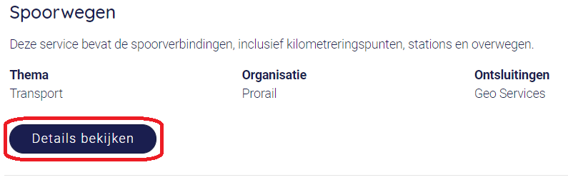
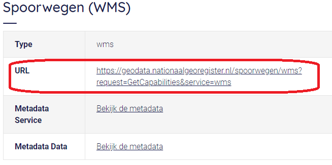

Spatial Data Infrastructure
============================

A |ltb| `Spatial Data Infrastructure`_ (SDI) refers to the collection of technologies and policies to make geospatial data accessible across institutions and countries.  

An SDI aims to coordinate the collection of various geospatial data, and to foster their integrated use at different spatial levels: *local, regional or global.* 

It is essential to realise that implementing an SDIs is not just a matter of technological requirements. The societal dimension is equally important, such as making geospatial data accessible to the general public so that everyone can benefit from it.

**Geoportals**  are a key component of SDIs; they provide a way to find and access geospatial data via the Internet.

------------------------

The PDOK Geoportal
------------------

In this section, we will explore the *Publiek Dienstverlening Op de Kaart* (PDOK). These geoportals provide access to geospatial data in the Netherlands. The datasets available through these geoportals can be accessed mostly as OGC-based services (Open Geospatial Consortium) services, but sometimes also as direct data downloads.  

The PDOK integrates the metadata from the `National Registry <https://www.nationaalgeoregister.nl/geonetwork/srv/dut/catalog.search#/home>`_ (NGR), and several tools and web services that easier to find and use geospatial data from many government agencies in the Netherlands.

For a quick overview on the PDOK geoportal, you may want to watch the `PDOK video <https://www.youtube-nocookie.com/embed/ssPsUnVfHMc>`_ (audio in Dutch). Activate the subtitles :guilabel:`CC`. Then, enable auto translation: :guilabel:`Settings` > :guilabel:`Subtitles/CC` > :guilabel:`Auto-translate` > :guilabel:`English`. 

.. raw:: html

   

   <iframe style="position:absolute;top:0;left:0;width:100%;height:100%;" src="https://www.youtube-nocookie.com/embed/ssPsUnVfHMc" frameborder="0" allow="accelerometer; autoplay; clipboard-write; encrypted-media; gyroscope; picture-in-picture" allowfullscreen></iframe>
   

\

.. important:: 
   **Resources.**
   You will require the latest LTR version of `QGIS (A Coruna 3.10) <https://qgis.org/en/site/forusers/download.html>`_. 

   This exercise does not require any data files. However, you need a web browser. We recommend **Google Chrome** because you will need to translate some webpages to English.

Task 1
   Start a web browser and navigate to the `PDOK website <https://www.pdok.nl/>`_ and explore its contents. Take some time to explore the website’s interface.

Task 2
   In the PDOK home page, click on :guilabel:`Bekijk alle dataset` or :guilabel:`See all datasets`. See :numref:`fig-pdok-homepage`  This will take you to a webpage where you can search the NGR metadata repository.

.. _fig-pdok-homepage:

   The PDOK home-page

Task 3
   Suppose we need data about the  *railroad network* in the Netherlands. Then, we can use the search bar to find all available datasets. 

   .. note:: 
      **Reflection.**
      Any good search starts with the right choice of keywords. For this task, it is very relevant to know that, the railroad datasets are part of the Dutch national transport database, called *“Nationaal Wegenbestand”*; abbreviated as *'nwb'*. The Dutch word for railroads is *'spoorwegen'*.

\

   Type **spoorwegen** in the search bar and press :guilabel:`Enter`. 

   .. image:: _static/img/pdok-search.png 
      :align: center

\

   **You should see the result of the search below the search bar.** 
   Whenever relevant, translate the pages to English. In Chrome, look for the **translate** icon, then :guilabel:`translate to English`.

Task 4 
   Under  :guilabel:`Spoorwegen`. Click on  :guilabel:`Details bekijken` or :guilabel:`View details`, to see detailed information about the dataset. See :numref:`fig-pdok-results` 

.. _fig-pdok-results:

   Search result for 'spoorwegen'

.. attention:: 
   **Question.**
   Why do you think the description of dataset (*Omschrijving*) is only available in  Dutch?

Task 5 
   Click on the   :guilabel:`Geo Services` tab.  You will see a list of geo-services available for this dataset. Every geo-service mentioned a **URL**. See :numref:`fig-service-url`. This is the most important piece of information you will need. You can use such URL to access the data using several tools: a *web browser*, a *GIS software*, or a *program* that you code yourself.

   For example, if you want to see the description of one of the geo-service in the web browser. You can simply copy and paste the URL in a new tab and hit :guilabel:`Enter`.  

.. _fig-service-url:

   Geo-service of the 'Spoorwegen' dataset in the PDOK geoportal

\

Task 6 
   :guilabel:`Open` a new tab in your web browser, :guilabel:`Copy` the URL for the Spoorwegen (WMS) service, :guilabel:`Paste` the URL in the :guilabel:`Address bar` and hit :guilabel:`Enter`. A page containing a description of the geo-service will appear.  What you see is a description of **capabilities** of the geo-service in XML (*Extensible Markup Language*). See :numref:`fig-get-capabilities-request`  

   Do not worry if you do not understand what you see. The *capabilities document* is not meant to be read by humans; rather it should be understood by computers across the Internet.
   
   .. _fig-get-capabilities-request:
   .. figure::  _static/img/get-capabilities-request.png 
      :alt: get capabilies spoorwegen
      :figclass: align-center

      'Get-capabilies' XML document for the 'Spoorwegen' dataset

.. note:: 
   **Reflection.**
   The eXtensible Markup Language (XML) is used to transfer information in the web. Such information is organised using **tags**. In XML, opening tags are declared using ``< >``, and closing tags using ``</ >``.  
   
   Information is enclosed between tags, such as ``<TagName>info to be transfer</TagName>``. For example, if we were to write the name of this course in XML, we would do something like this:

   .. code-block:: xml

      <CourseName>
         Data Integration: Principles, Approaches and User Perspectives
      </CourseName>

.. attention:: 
   **Question.**
   Check the information in the *get capabilities* document for the *'spoorwegen'* and answer the following questions:

   + In which CRSs (Coordinate Reference Systems) can this be retrieved?

   + What is the spatial extend (i.e. *Bounding Box*) of the data available in EPSG:28992?

   + How many layers can this service provide? What are the names of such layers?

We visualise the data available in this geo service, by using adding additional parameters to the root URL, such that the web browser requests the data in the proper format.

Task 7
   Paste the following  URL (an HTTP request) in the web browser and hit :guilabel:`Enter`. 

   .. code-block:: ruby
      :linenos:
      :emphasize-lines: 4,7
   
      https://geodata.nationaalgeoregister.nl/spoorwegen/ows?
      SERVICE=WMS&&SERVICE=WMS&VERSION=1.3.0&
      REQUEST=GetMap&FORMAT=image%2Fpng&TRANSPARENT=false&
      LAYERS=spooras&STYLES=spoorwegen%3ASpooras&
      CRS=EPSG%3A28992&
      WIDTH=1020&HEIGHT=866&
      BBOX=113541.12%2C487085.75999999995%2C120395.51999999999%2C492905.27999999997

\

   The web browser should show you the following map:

   .. image:: _static/img/get-map-request.png 
      :align: center
      :width: 400px

\

   The request above retrieves the railways from an area in The Hague. 
   The ``LAYERS`` parameter defines the name of the data layer that is displayed, here **spooras**. The extend of the map is controlled by the ``BBOX`` parameter, which is declared by defining an extent such as :math:`min(x), min(y), max(x), max(y)`. For example:
   
   .. code-block:: ruby
      
      BBOX=113541.12%2C487085.75999999995%2C120395.51999999999%2C492905.27999999997

   The ``%2C`` in this case means a ``,``.

   If you change the values of the parameters in the request, you will get a visualisation for a different part of the dataset. 

   Change the value for the parameter ``LAYERS``, for another one. Use the *get capabilities* document to find a valid name and see what happens. You can also try to modify the extent of the ``BBOX``. If you do so, remember to keep the ratio between the coordinates to avoid deforming the image.

 Task 8 
   Use QGIS to visualise the data provided by this WMS service. To do so, watch the video tutorial on `Using WMS Services <https://vimeo.com/showcase/4709163/video/228940872>`_.

.. raw:: html

   
<iframe src="https://player.vimeo.com/video/228940872?color=007e83&portrait=0" style="position:absolute;top:0;left:0;width:100%;height:100%;" frameborder="0" allow="autoplay; fullscreen" allowfullscreen></iframe>

\

.. attention:: 
   **Question.**
   Go back to the PDOK geoportal and answer the following questions.

   +  What is the purpose of the PDOK facility? 
   +  Who are the targeted user groups? 
   +  Which organisation is ultimately responsible for the Portal? 
   +  What services can PDOK provide for your discipline? Explain. 

.. sectionauthor:: André Mano & Manuel Garcia Alvarez