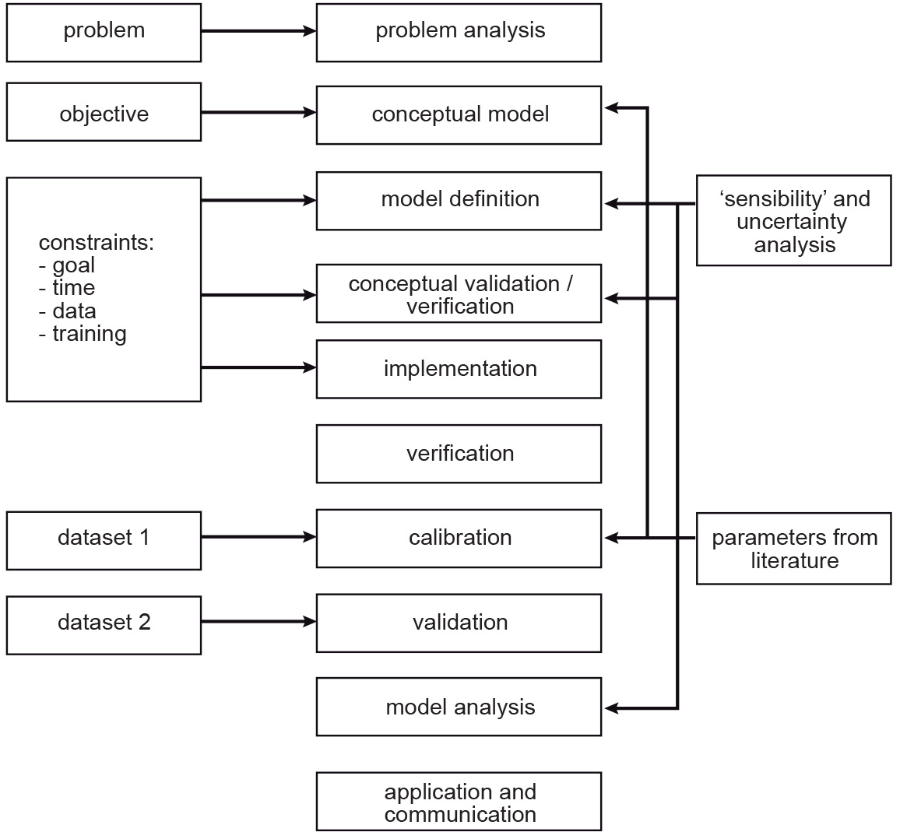
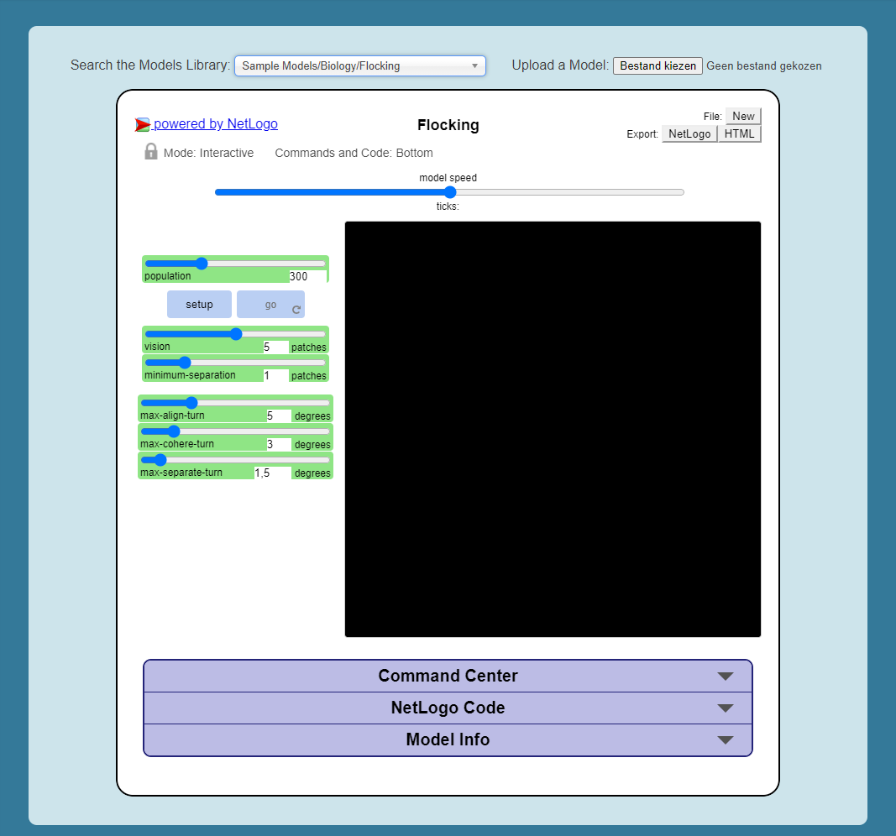
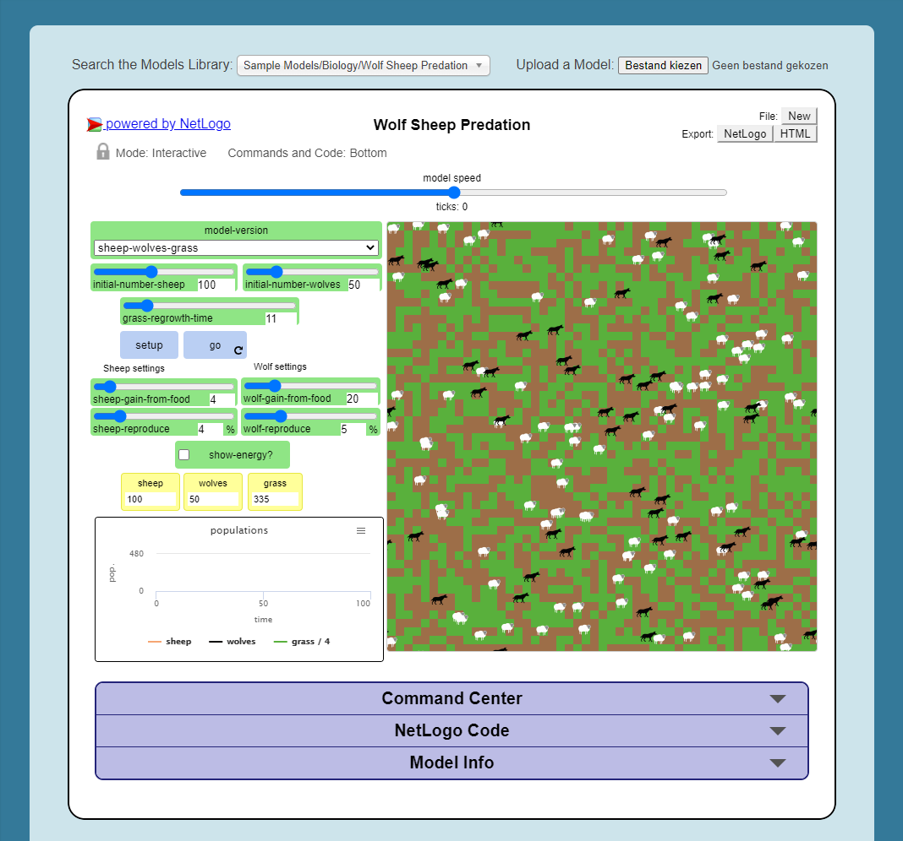
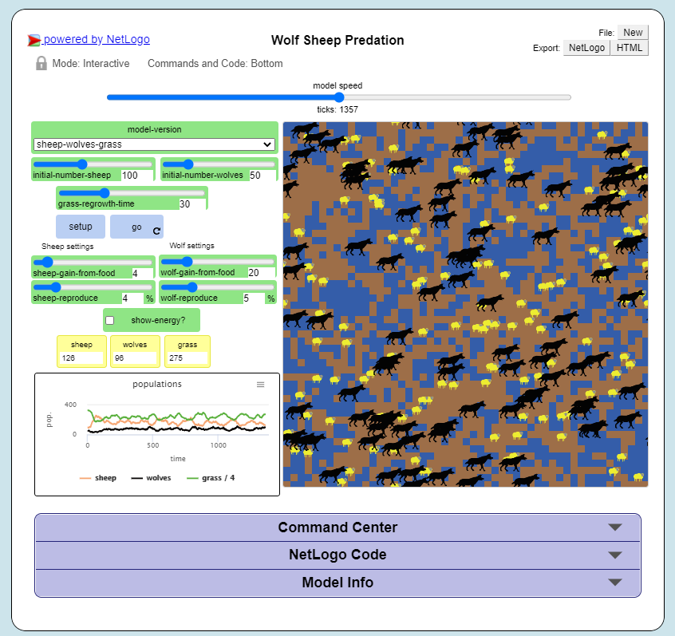

Systems and Models
==================

In this section, you will get familiar with some of the basic concept of |ltb| `Systems Modelling <Systems model_>`_. 

---------------------

Systems
---------

A |ltb| `System`_ is defined as *"a combination of parts that interact and produce some new quality or function in their interaction."*

A System consists of:

+ Parts or elements
+ Interaction between these elements
+ Emergent properties

.. attention:: 
   **Question.**
   Think about an example of a *system* and answer the following questions:

   + What are the **elements** in your example of a system?
   + Give some examples of **interactions** in your system. Then,  identify if the interactions are related to a *flow of material* or a *flow of information.*

|ltb| `Interactions <Interaction_>`_ between elements can have many different forms. Interactions may form loops. When :math:`A` impacts  :math:`B`, while at the same time :math:`B` impacts :math:`A`, we say that there is a |ltb| `feedback in the system <System feedback_>`_. We distinguish **positive** and **negative** feedback loops. 

An example of a *positive feedback* is population growth. The larger the population, the more people are born; the more people are born, the larger the population. In a *negative feedback* loop the system stabilises itself according to the rule: *the larger something is, the smaller something becomes.* For the population example, if there is a limited supply of food, and the population grows, there is less food for each individual. 

Task 1
   The table below contains a few examples of *interactions*. Identify if such interactions result in *positive* or *negative* feedback.

   +--------------------------------------------------------------------+---------------------+
   | Example                                                            |  Type of Feedback   |
   +====================================================================+=====================+
   | | The more we study, the more tired we get, and the more difficult |                     | 
   | | it is for us to understand the content of the course, therefore  |                     |
   | | the more we have to study because we learn less.                 |                     |
   +--------------------------------------------------------------------+---------------------+
   |  | The more sheep we have, the more wolves we get because they have|                     |
   |  | more food; the more wolves we get, the more sheep are eaten     |                     |
   |  | which means there is less food for each wolf and wolf           |                     |
   |  | population decreases.                                           |                     |
   +--------------------------------------------------------------------+---------------------+
   
Systems and their elements do not always change immediately in reaction to internal or external influences. When the effects of changes in some of the elements of a system, do not affect other elements immediately, we referred to them as the *delayed effects*.

.. attention:: 
   **Question.**
   Can you think of an example of a delayed effect in a system?

Although thinking about the different elements and interactions of a system may seem very abstract. Such activity provides the starting point for building models, and models help us to gain understanding about the world we live in.

---------------

Models
-------

Modelling is a very broadly used term, which may cause “confusion”. It can be used at different abstraction levels, and it may refer to modelling different types of information or systems. Many things we do or products we produce can be regarded as a model. If we take a picture of a landscape, this can be regarded as a model. A printed map is also a model. In the exercise on *Data Modelling*, you created a model of reality as a  point-vector layer or a continuous raster. 

The models we refer to, in this section, describe processes that happen on the Earth's surface at various scales. Such models aim to represent systems. Modelling the Earth as a system may require to capture its natural components.  For example, we could portrait the system Earth as the combination of four subsystems: *atmosphere (air), lithosphere (land), hydrosphere (water) and biosphere (life)*. However, we may also model the Earth as human-induced systems, such as *urbanisation, human health and agriculture.*

.. attention:: 
   **Question.**

   +  Can you define a system that takes place on the Earth's surface, and it is interesting for studying during your MSc research project?. 
   +  What makes such a system relevant or interesting?

Many modelling processes start with a conceptual |ltb| `Model`_. A conceptual model is often written on a piece of paper, but it can also be a mental picture of some phenomenon.

You can create a conceptual model by following these steps:

   1. Define the goal (write it on the bottom of the page)
   2. Describe the input of your model (write it on the top of the page)
   3. Fill in all the steps (processes) needed to go from input (top) to goal (bottom)

Task 2  
   In many universities, they teach conceptual modelling by asking the students to create a conceptual model for making a cup of tea or coffee. 
   *Create a conceptual model for making tea or coffee.*

A conceptual model serves as the first step towards creating such a computer model. A  conceptual model for making tea represents a non-spatial model. However, as a geo-scientist are interested in spatial and temporal models. You are also interested in implementing your model using modelling software, using your spatial data.

When |ltb| `modelling a system <System Modelling_>`_, the components of a conceptual model includes three elements: *boundaries, variables and parameters*. 

.. attention:: 
   **Question.**
   For the conceptual model, you created in Task 2.

   + Can you define the boundary of the model, a variable and a parameter? 
   + Is the variable you defined, a state variable?

---------------------------

The Purpose of a Model 
-----------------------------

Models are used in many application, and they can be classified in various ways. Here, we recognise five ways of classifying models in  GIS-based applications based on their characteristics:

   + Purpose of the model
   + The methodology underlying the model
   + Scale
   + Dimensionality
   + Implementation logic

The *purpose* of the model refers to whether the model is **descriptive, prescriptive or predictive** in nature. The *methodology* underlying the model refers to its operational components. Here, we have two groups: **stochastic** models and **deterministic** models. Read about models according to *scale, dimensionality,* and *implementation logic* in  |ltb| `System Modelling`_.

.. attention:: 
   **Question.**
   
   + An example of a deterministic model could be the hydrological flow in a watershed. **Why do you think hydrological models are deterministic?**

   + When a model is stochastic, we usually run such model many times with the same input parameters, and present then present the average or a range of the modelling results. **Why is this necessary in stochastic models?**

------------------------

Modelling Processes
------------------------------

The process of building models is more complicated than defining their elements and relationships, capturing them in a conceptual model, and implementing such conceptual model in software, see :numref:`fig-modelling-process`  The |ltb| `Modelling`_ is an **iterative** process. 

.. _fig-modelling-process:

   A summary of the steps in the modelling process

Task 3
   Define in your own words, why the modelling process is iterative? and what will induce you to make another iteration? or when would you stop iterating a model)?

Four  of the steps in :numref:`fig-modelling-process` deserve some attention:

   + Verification
   + Calibration
   + Validation
   + Sensitivity analysis

**Verification**, in the context of computer simulation,  is the process of confirming if the conceptual model was implemented correctly. It may seem obvious that when you made the conceptual model, you know how to implement it. Yet, a lot of things can go wrong; therefore, we need verification. **Calibration** is the process of adjusting the model parameters. 

Task 4
   Give an example of a problem during the implementation of a model that can be detected during verification.

When you look at  :numref:`fig-modelling-process` you see that there is a line between calibration and model definition. **Validation** is the most challenging task; validation is the process of proving that the model is a good representation of reality. Many models are not fully validated. Note that the diagram shows that calibration and validation use two different datasets.

.. attention:: 
   **Question.**
   Why it is a good idea to use different datasets for calibration and validation?

Task 5
   Below you see a table with examples of models. Indicate if they are *static* or *dynamic*.

   =========================================       =======================
   Example                                          Static or Dynamic?
   =========================================       =======================
   An animated map                                    \
   A film                                             \
   A simulation model                                 \
   The implementation of the tea model                \
   A model of the evacuation of a building            \
   =========================================       =======================

The |ltb| `Implementation logic`_ of a model refers to two groups of approaches: *deductive* approaches and *inductive* approaches. To explain the difference between those groups, we will use an example from education. The concepts 'deductive' and 'inductive' can also be applied to learning and teaching.  In a *deductive approach,* the teacher presents students a new concept, explains how it works, and then makes the students practice using the concept.
In an *inductive approach,* the teacher presents students many examples that show how the concept is used; the students should 'notice and realise', by way of the examples, how the concept works [OB2009]_.

The table below shows some differences and examples for inductive and deductive approaches.

=============================================    ====================================================
Deductive Modelling                              Inductive modelling
=============================================    ====================================================
For the Verification of hypothesis (top-down)    Is bottom-up – hypothesis are developed from the data
Hypothesis is defined by the researcher          E.g., machine learning
Common in models used for description            Can be used for prediction
=============================================    ====================================================

.. [OB2009] Olenka Bilash. (2009, June). Best of Bilash. Improving second language education. Retrieved October 7, 2020, from https://bestofbilash.ualberta.ca/inductivedeductive.html

.. attention:: 
   **Question.**
   When would you prefer to use an inductive over a deductive approach? 

---------------------------

Evaluating Systems Models
--------------------------

The best way to learn about systems modelling is to experiment with a number of existing models and determine which characteristics they replicate. In this section,  you will use the web version of  Netlogo. Netlogo is a software designed to create agent-based simulation models and Cellular Automata (CA) models. You will see some examples and then reflect on their similarities and differences.

Task 6
   Open the web-version of `NetLogo <https://www.netlogoweb.org/>`_. Then, click on :guilabel:`NetLogo Web`.
   You can load an existing model by selecting it from :guilabel:`Search the Models Library` dropdown list. See :numref:`fig-netlogo-gui`

.. _fig-netlogo-gui:

   The NetLogo web interface

Now, we will experiment with the following models: 

+ Flocking (Sample Models - biology), 
+ Wolf Sheep Predation (Sample models - biology), and  
+ The CA 1D Rule 30 (Sample Models- Computer Science)

Task 7
   We will start with the Flocking. This model demonstrates how spatial patterns (Flocks) emerge based on three simple behavioural rules: *alignment, separation and cohesion*.  Go to :guilabel:`Seach the Models Library` > search for :guilabel:`Sample Models/Biology/Flocking` > click :guilabel:`setup` > :guilabel:`go`.    
   
   .. note:: 
      **Reflection.**
      The Flocking model is an |ltb| `agent-based model <Agent-Based_>`_. Agent-based models consist of three components: *agents* (with behaviour), the *environment* in which these agents exist and *time*. 

.. attention:: 
   **Question.**
   Open the :guilabel:`Model Info` tab underneath the model window.  Answer the following questions regarding the Flocking model:

   + Is this a spatial model? Explain your answer.
   + Do you think this model contains any agents? If so, which agents and how are they represented in the model?
   + What happens when you change the :guilabel:`minimum-separation` from :math:`1` to :math:`2` patches?
   + If you were to calibrate this model, which elements would you calibrate?

The second type of model we will evaluate is a CA model. Before we open the example model in Netlogo, you will first practice how this type of model works via a pencil and paper exercise. 

Task 8
   Below you see a lattice (raster) where each cell has a value. This raster represents the starting values of a CA model simulation. With each iteration of the model, the value of the cells will be determined by considering their :math:`8` neighbouring cells, and applying the following rules:

   + If the current value is :math:`1`. Change to :math:`0` if less than four neighbours are :math:`1`
   + If the current value is :math:`0`. Change to :math:`1` if less than four neighbours are :math:`0`

   For the raster on the left, *compute the values for the next iteration of the model. Follow the rules listed above.* Write down the values on the raster on the right.

   .. image:: _static/img/lattice-raster.png 
      :align: center

.. attention:: 
   **Question.**
   One of the items of CA models is the *state variable*. 

   +  Do you think the model presented in the previous task has a state variable? 
   +  Do you think the model presented in the previous task will ever reach a *steady-state*, where the output does no longer change?

Now that you have gained some understanding of how a CA model works, it is time to experiment with a CA model in NetLogo.

Task 9
   :guilabel:`Open` the model  :guilabel:`CA 1D Rule 30`, check the :guilabel:`Model Info`,  and run the model. Then, describe how this model differs from the pencil and paper model above.  

   .. _fig-netlogo-camodel:
   .. figure:: _static/img/netlogo-camodel.png
      :alt: modelling process
      :figclass: align-center

      The 'CA 1D Rule 30' in NetLogo

.. attention:: 
   **Question.**
   This *'CA 1D Rule 30'* model represents a very “synthetic” implementation of a CA model. 
   **Can you think of an example of a CA model that is more realistic and aligns with your interests?**

Task 10
   Finally, we will explore  *'Wolf Sheep Predation'* model. Go to NetLogo and load :guilabel:`Wolf Sheep Predation` > :guilabel:`model-version`, choose ``sheep-wolves-grass``. Run the model, and put attention to the simulation.
   
.. _fig-wolf-sheep-model:

   The 'Wolf Sheep Predation' model, version sheep-wolves-grass 

In this model, you see some similarities with an agent-based model, the *'Flocking'* model; it has agents: wolf and sheep. You also see some similarities with a CA model. The grass has two states: *grass or no-grass*, and the way the grass regrows is triggered by rules that are similar to the transition rules typical of a CA model. 

Task 11
   Open the :guilabel:`NetLogo Code` tab,  read the code and to determine how the grass regrows in the *'Wolf Sheep Predation'* model.

.. attention:: 
   **Question.**
   Run the *'Wolf Sheep Predation'* model once more and answer the following questions:

   +  Why is this model an example of a model with *delayed effects*?  
   +  Is this model descriptive, prescriptive or predictive? Explain your answer.
   +  What happens when you increase the energy the sheep gain from eating grass?
   +  Explain why this model is an example of *counter-intuitive effects*? For example, what happens when you double the number of wolves at the beginning of the model? Does such change improve their chances of survival?

Task 12
   Open the :guilabel:`NetLogo Code` tab again and make changes to the model. To apply the changes to the model, click on :guilabel:`Recompile Code` > :guilabel:`model-version` choose ``sheep-wolves-grass`` >   :guilabel:`setup` > :guilabel:`Go`. Try to make the following changes one at the time.
   
   + Change the colour of sheep to *yellow*.
   + Make the wolf *twice as big*.
   + Make the grass *blue*. You will have to change the code in multiple places.

   After all the changes, the *'Wolf Sheep Predation'* model should look like this:

.. _fig-wolf-sheep-model-blue:

   The 'Wolf Sheep Predation' model showing yellow sheep, bigger wolves, and blue grass

.. sectionauthor:: Ellen-Wien Augustjin, André Mano & Manuel Garcia Alvarez

