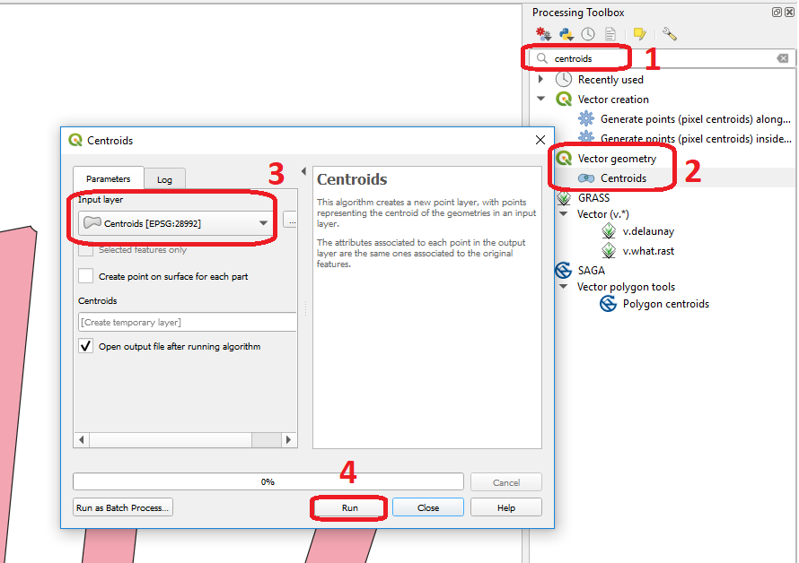
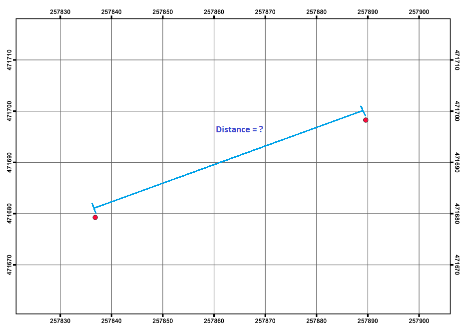
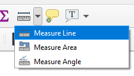
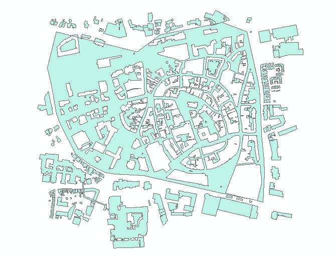
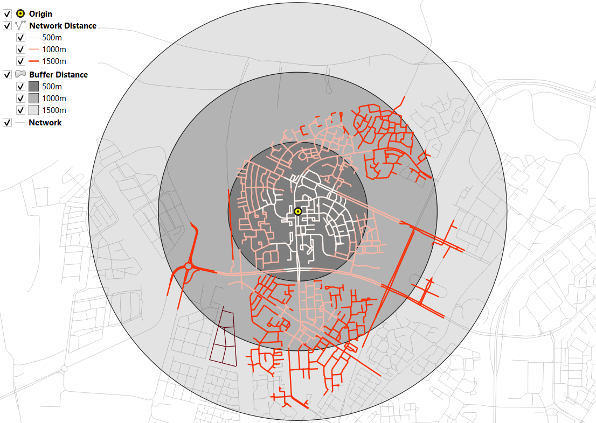

Vector Analysis
===============

Geometric Measures
------------------

The term "geometric measurements" describes measurements on the spatial features themselves, and not on their attribute values. Geometric Measurements include:

+ location.
+ distance (distance between two features)
+ length (length of a line segment or boundary of a polygon)
+ area (of polygon features)

In this exercise, we will discuss all these measurements. A general overview of |ltb| `measurement operations <Vector Measurements_>`_ on vector data is provided in your Living Textbook.

.. important:: 
   **Resources.**
   You will require the latest LTR version of `QGIS (A Coruna 3.10) <https://qgis.org/en/site/forusers/download.html>`_, plus the dataset `vector-analys.zip <vector_analysis_>`_ which you can download from CANVAS.  When you unzip the dataset, you will find the following files inside: 

   + ``Vector_analysis.qgs`` – a QGIS project preloaded with the datasets below;
   
      + ``Centroids.gpkg``
      + ``DistancePoints.gpkg``
      + ``Linebuf.gpkg``
      + ``Thiessenpoints.gpkg``
      + ``Overlay1.gpkg``
      + ``Overlay2.gpkg``

Location
^^^^^^^^

The GIS always stores the location of the vector features. For point features the :math:`x`  and :math:`y`  coordinates are stored. For lines, the start node, end node and internal vertices are stored, and sometimes the length of the line segment. For polygons, it stores the line segments that define the boundaries, including the perimeter, and the area of the polygon. However, sometimes we also store the centroid of line or polygon features.

Task 1
   In your dataset, you find a Shapefile called *'Centroids'*. Compute the centroids for the features in that layer in QGIS. Then, check if the centroids are inside or outside the original polygons. :numref:`fig-centroids` 

.. _fig-centroids:

   Computing centroids in QGIS

.. attention:: 
   **Question.**
   Can you give an example of a situation when computing the centroid is useful?

Distance
^^^^^^^^

Another geometric measurement is distance. Computing the distance between two points in a straight line is a basic operation that you can solve using basic math.

Task 2
   Open QGIS and use the **Add Geometry attributes** tool to find the exact coordinates of the poings in the *'DistancePoints'* layer. :guilabel:`Processing toolbox` > :guilabel:`Vector geometry` > :guilabel:`Add geometry attributes`. *The* :math:`x` *and* :math:`y` *coordinates will be added to the attribute table.*     

Task 3
   Using the :math:`x,y` coordinates from the previous task, calculate  **manually** the distance between the two points in meters. See :numref:`fig-comp-dist` 

.. _fig-comp-dist:

   Straight distance between points in the 'DistancePoints' layer

Task 4 
   Using the **Measure Line** tool |measure|, measure the distance between the points in the *'DistancePoints'* layer. :numref:`fig-measure-tool`

.. _fig-measure-tool:

   Using the Measure Line Tool

.. attention:: 
   **Question.**

   + Measuring between two points is simple, especially when you use a measurement tool and draw the line you want to measure. However, in GIS software, some tools measure the distance from all features in one layer to the nearest feature in another layer. But, what would be the distance between a point and a line, or between a line and a polygon? 

   + The minimum distance between the features?
   + The distance between the centroids of the features? or
   + The distance between the two closest vertices?

Another type of geometric measurement discussed is the *minimal bounding box* of a feature.

Task 5 
   Use the **Bounding boxes** tool from the **Processing Toolbox** to visualise the minimal bounding boxes of the features of the *'overlay2'* layer.

-----------------------------------------

Overlays
--------

|ltb| `Vector Overlay`_ operations combine two input layers (be it a point, line or polygon layers) into a new data layer. Vector overlay operations apply combinations of the following:

+ Intersection of the geometry
+ Spatial join of the attribute tables
+ Definition of the output map extent 

Some overlay operators perform both an intersection of the geometry and a spatial join of the attribute tables in combination with deriving a certain output extent. Still, others only join attribute tables or perform spatial intersections.  

Task 6 
   Using the three polygons overlay operators discussed in the Living Textbook complete the table below.

   =====================  ===============================    ======================  ============== 
   Overlay Operator [#]_  Intersection of the geometry?      Join attribute tables?  Output extent?
   ---------------------  -------------------------------    ----------------------  --------------
   \                      (yes/no/partly)                    (yes/no)                (AND/OR)
   =====================  ===============================    ======================  ============== 
   \                      \                                  \                       \     
   \                      \                                  \                       \      
   \                      \                                  \                       \      
   =====================  ===============================    ======================  ============== 

   .. [#] There are many other vector operators besides the operators discussed in the Living Textbook.

Task 7
   Find the **Union, Intersect** and **Clip** tools in the **Processing Toolbox**, and use them to compute the overlay operations using the *'overlay1'* and *'overlay2'* layers as inputs. Compare the result with the table above.

*"The fundamental operator of all these vector operations is* **polygon intersection**. *All other operators can be defined in terms of polygon intersection, usually in combination with polygon selection and/or classification".* Below, you see the result of an overlay operation called: **Symmetrical Difference** between the *'overlay1'*  and *'overlay2'* data layers. :numref:`fig-symdif` 

.. _fig-symdif:

   Symmetrical difference bertween 'overlay1' and 'overlay2'

.. attention:: 
   **Question.**
   How would you achieve the same results generated by the symmetrical difference tool, using only the *intersect tool* and *selection operators*?

-----------------------------------------

Proximity Operators
-------------------

We will cover two proximity operations: |ltb| `Buffer`_ and |ltb| `Thiessen Polygons`_. 

You create a buffer using point, line and polygon layers as inputs. Buffers can be created for all the features in a layer or for only a few selected features. We can use a **fixed buffer distance**; in which case, a buffer of the same size will be created for all the features in a data layer. However, we can also use a **variable buffer distance** for each feature; in which case such the buffer distances need to be stored in the attribute table of the layer. 

Task 8
   Check the attribute table of the *'linebuf'* layer.  You will find an attribute called **Bufdist**. Use this attribute to generate buffers with different buffer distances. Go to :guilabel:`Processing Toolbox` > :guilabel:`Variable distance buffer`. 

   Then, create a zonated buffer for the *'linebuf'* layer using a fix buffer distance. :guilabel:`Processing Toolbox` > :guilabel:`Multiring buffer (constant distance)`.

.. attention:: 
   **Question.**
   One could argue that the problem with buffers is that they are discrete. Can you explain what that means and give an example in which that is a problem?

Another example of proximity operators is Thiessen Polygons. If you are familiar with the concept of *Voronoi Map*, Thiessen polygons are the same. They identify the areas that are closest (in *Euclidean distance*) to each point in a dataset.

Task 9
   Below you see some points and a corresponding TIN (triangulated irregular network). Select 2 or 3 points and draw their corresponding Thiessen polygon. 

   .. image:: _static/img/task-tin-tp.png 
      :align: center

Task 10
   In the **Processing toolbox** search for a way to generate Thiessen polygons in QGIS.  Remember that Thiessen polygons are also called Voronoi Maps and to find the correct tool in QGIS you might search for this term.

.. note:: 
   **Reflection.**
   This website compares Thiessen Polygons with features in nature like the pattern on a giraffe:  http://forum.woodenboat.com/showthread.php?112363-Voronoi-Diagrams-in-Nature

   **What do Thiessen polygons remind you of?**

---------------------------------------

.. _sec-networks:

Networks
--------

Before moving onto network analysis, we have to understand networks a bit better. This means understanding a network's characteristics and data model. 

Characteristics of Networks
^^^^^^^^^^^^^^^^^^^^^^^^^^^

There are two critical aspects in a |ltb| `Network`_; the directionality of the network and the degree in which the network is planar. When you understand these two concepts you know why different types of networks are modelled in a different way and why not all |ltb| `analysis techniques <Network Analysis_>`_ are relevant for all types of networks. 

Task 11
   Complete the table below to create an overview of the different types of networks.

   ===================    =======================    ======================    ======================
   Example                Planar or Non-planar       Directed or Undirected    Type of analysis [#]_ 
   ===================    =======================    ======================    ======================
   River Network           \                          \                          \
   Road Network            \                          \                          \
   Electricity Network     \                          \                          \
   Sewage Network          \                          \                          \
   ===================    =======================    ======================    ======================

   .. [#] Choose from 'optimal pathfinding', 'network allocation', or 'tracing'.

The Network Data Model and Analysis
^^^^^^^^^^^^^^^^^^^^^^^^^^^^^^^^^^^

Networks consist of points (nodes) and lines (edges or segments). What is very important for a network is connectivity. Therefore, the smallest gap between the edges stops the flow over the network. We use line topology to ensure that we end with a network with connected points and lines.

In data modelling, we already learned that a line has a **'start node'** and an **‘end node'**. Because of this, the network segments have direction. When discussing the directionality in a network, we call the start and end nodes **'from node'** and **'to node'**, respectively. In network analysis, we use a **cost function** to represent *'impedance'*;  i.e. *a function that determines the cost of moving from one node to another in the network*. Cost functions are stored as an attribute indicating the cost to travel each edge in the network. |ltb| `Optimal Path Finding`_ is an example of network analysis that uses cost functions.

Task 12
   Determine the optimal path of a network. Below you see a road network (left) with the IDs for each line segment. On the left size, you see an (attribute) table with the cost associated with each line segments. **What is the least cost path from the start-point to the end-point?**

   .. image:: _static/img/task-cost.png 
      :align: center

In the previous task, there was only one cost function, and it was applied in any direction. There are many reasons why the cost might be different for different directions —for example, different speed limits, different number of lanes, or less traffic.

Task 13
   Determine the optimal path of the **directed network** below. This time consider two cost functions; a 'to-from' cost (TF-Cost) when moving on the direction of the arrows, and a 'from-to' cost (FT-Cost) when moving in the opposite direction. *Re-evaluate the route, this time the start and end points are different.*  **What is the least cost path from the start-point to the end-point? Is it the same as the previous one?**

   .. image:: _static/img/task-dir-cost2.png 
      :align: center

.. attention:: 
   **Question.**
   The cost function can be associated with lines (as in the previous tasks), and nodes of a network. When would you apply cost on the nodes?

More advance topics on network analysis are |ltb| `Network Partitioning`_, |ltb| `Network Allocation`_ and |ltb| `Trace Analysis`_. Network partitioning is a group of analytical functions that assigns part of a network to predefined target locations. In network allocation parts of a network are assigned to specific locations defined as service areas. In trace analysis, part of the network is also assigned to particular locations, but its use is restricted to directed networks.

.. attention:: 
   **Question.**
   In your own words, what are the differences and similarities between Thiessen polygons and Network allocation?

Task 14
   :numref:`fig-buffer-network` shows you see the results of applying  two vector analyses:

   1. The result of a zonated (multiring) buffer around a point (yellow dot). Each ring is separated by a distance of :math:`500 \ m`. 
   2. The result of applying network allocation around the same point as in 1. Each coloured section of the road network is separated by also :math:`500 \ m`.

   **Describe the difference between the two analysis and the reasons behind these differences.**

.. _fig-buffer-network:

   Zonated buffer and network allocation around a point

.. attention:: 
   **Question.**

   + On which types of networks can we apply trace analysis? 
   + Which are the characteristics that a network must have to apply trace analysis?

.. sectionauthor:: Ellen-Wien Augustijn, Andre da Silva Mano, Manuel Garcia Alvarez
